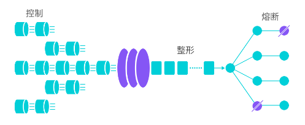

### 什么是 Sentinel

Sentinel 是面向分布式、多语言异构化服务架构的**流量治理组件**，主要以流量为切入点，从流量控制、流量路由、熔断降级、系统自适应保护等多个维度来帮助用户保障微服务的稳定性。

### Sentinel 的主要功能

### 参考资料

[介绍 · alibaba/Sentinel Wiki (github.com)](https://github.com/alibaba/Sentinel/wiki/介绍)