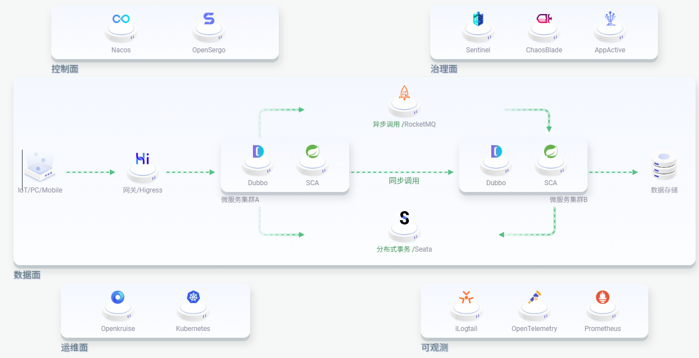

### 什么是 Spring Cloud Alibaba

Spring Cloud Alibaba 是致力于提供微服务开发的一站式解决方案，包含开发分布式应用程序的所需的所有组件，使我们可以轻松地使用 Spring Cloud 微服务框架开发应用程序。

Spring Cloud Alibaba 提供的微服务解决方案主要有：

- Nacos：服务注册，服务发现与配置同步。
- RocketMQ：异步消息调用。
- [Sentinel](https://sentinelguard.io/zh-cn/)： 以流量为切入点，从流量控制、流量路由、熔断降级、系统自适应保护等多个维度来帮助用户保障微服务的稳定性。
- [Seata](https://seata.apache.org/zh-cn/)：提供分布式事务，保证数据一致性。
- OpenFeign/Ribbon/Dubboo: 服务调用，即同步消息调用。
- Spring Scheduling Tasks： 分布式定时任务

### 微服务全景图

### 参考资料

[Spring Cloud Alibaba官网_基于Springboot的微服务教程-阿里云-阿里云Spring Cloud Alibaba官网 (aliyun.com)](https://sca.aliyun.com/)