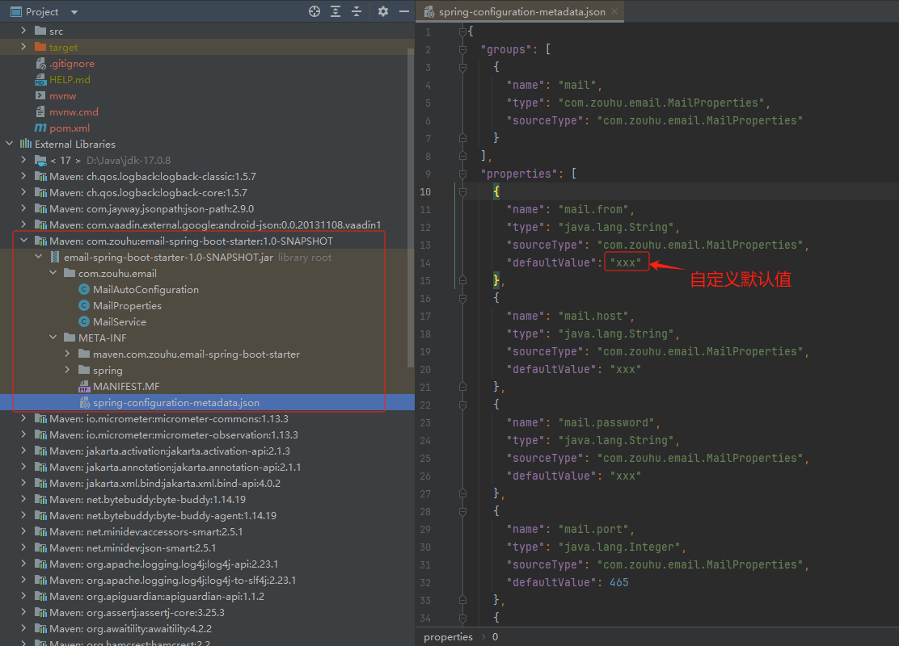
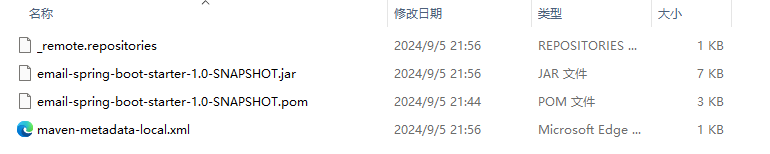

[TOC]

> 本文源码位于 [java-demos/spring-boot-starter at main · idealzouhu/java-demos (github.com)](https://github.com/idealzouhu/java-demos/tree/main/spring-boot-starter)

## 一、自定义 starter

### 1.1 创建 maven 项目

创建 maven 项目 `email-spring-boot-starter`， 并导入以下依赖。

```java
<?xml version="1.0" encoding="UTF-8"?>
<project xmlns="http://maven.apache.org/POM/4.0.0"
         xmlns:xsi="http://www.w3.org/2001/XMLSchema-instance"
         xsi:schemaLocation="http://maven.apache.org/POM/4.0.0 http://maven.apache.org/xsd/maven-4.0.0.xsd">
    <modelVersion>4.0.0</modelVersion>

    <!-- 自定义starter都应该继承自该依赖 -->
    <parent>
        <groupId>org.springframework.boot</groupId>
        <artifactId>spring-boot-starter-parent</artifactId>
        <version>3.3.2</version>
        <relativePath/> <!-- lookup parent from repository -->
    </parent>

    <groupId>com.zouhu</groupId>
    <artifactId>email-spring-boot-starter</artifactId>
    <version>1.0-SNAPSHOT</version>

    <properties>
        <maven.compiler.source>17</maven.compiler.source>
        <maven.compiler.target>17</maven.compiler.target>
        <project.build.sourceEncoding>UTF-8</project.build.sourceEncoding>
    </properties>

    <dependencies>
        <dependency>
            <groupId>org.projectlombok</groupId>
            <artifactId>lombok</artifactId>
            <version>1.18.26</version>
        </dependency>
    </dependencies>

</project>
```


### 1.2 创建邮件配置属性类

定义一个 `@ConfigurationProperties` 注解的类 `com.zouhu.email.MailProperties` ，用于绑定邮件相关的配置属性。

```java
@Data
@ConfigurationProperties(prefix = "mail")  // 自动获取配置文件application.yaml中前缀为mail的配置
public class MailProperties {
    // 如果配置文件中配置了host属性，则该默认属性会被覆盖
    private String host = "xxx";
    private int port = 465;
    private String username = "xxx";
    private String password = "xxx";
    private String from = "xxx";

}
```

事实上，我们如果将其打包成 jar 包，我们可以看到默认配置属性存放到 `spring-configuration-metadata.json` 文件中。




### 1.3 创建模拟邮件发送服务类

创建 `com.zouhu.email.MailService`， 模拟邮件发送。

```java
public class MailService {
    private final MailProperties properties;

    public MailService(MailProperties properties) {
        this.properties = properties;
    }

    public void sendMail(String to, String subject, String text) {
        System.out.println("Sending email...");
        System.out.println("Host: " + properties.getHost());
        System.out.println("Port: " + properties.getPort());
        System.out.println("From: " + properties.getFrom());
        System.out.println("To: " + to);
        System.out.println("Subject: " + subject);
        System.out.println("Text: " + text);
    }
}
```


### 1.4 创建自动配置类

自动配置类 `com.zouhu.email.MailAutoConfiguration` 负责装配 `MailService`，并使用 `MailProperties` 提供的配置。

```java
@AutoConfiguration
@EnableConfigurationProperties(MailProperties.class)  // 启用并注册配置绑定功能
public class MailAutoConfiguration {

    @Bean
    @ConditionalOnMissingBean   // 当容器中未存在指定类型的Bean时，才会创建当前Bean
    public MailService mailService(MailProperties properties) {
        return new MailService(properties);
    }
}
```


### 1.5 spring.factories 相关配置

在 `src/main/resources/META-INF/spring` 目录下，创建 `org.springframework.boot.autoconfigure.AutoConfiguration.imports` 文件。文件内容如下：

```
com.zouhu.email.MailAutoConfiguration
```

通过该文件， Spring Boot 将会自动加载我们的自动配置类。

该文件的具体功能查看  [Creating Your Own Auto-configuration :: Spring Boot](https://docs.spring.io/spring-boot/reference/features/developing-auto-configuration.html#features.developing-auto-configuration.understanding-auto-configured-beans)


### 1.6 打包成依赖

打开 idea 右侧 maven， 依次点击生命周期中的 package 和 install 。其中，

- `package` 命令： 将项目打包为一个可分发的格式（通常是 JAR 或 WAR 文件）
- `install` 命令： 执行所有 `package` 所做的事情，并且还会将生成的 JAR/WAR 文件安装到本地 Maven 仓库中（通常位于 `~/.m2/repository`）


打开本地的 maven 仓库，我们可以找到对应的 jar 包 `C:\Users\zouhu\.m2\repository\com\zouhu\email-spring-boot-starter\1.0-SNAPSHOT`




## 二、测试项目

### 2.1 创建项目

创建 Spring Boot 项目 `spring-boot-test`， 导入以下依赖

```xml
<!-- 自定义的依赖 -->
<dependency>
    <groupId>com.zouhu</groupId>
    <artifactId>email-spring-boot-starter</artifactId>
    <version>1.0-SNAPSHOT</version>
</dependency>
```


### 2.2 application.yml  配置

在 `application.yml` 中,  配置邮件服务的详细信息。这些配置信息将会覆盖 `email-spring-boot-starter` 中的默认配置信息。

```yaml
# 覆盖依赖 email-spring-boot-starter 中的配置信息
mail:
  host: smtp.example.com
  port: 587
  username: user@example.com
  password: password
  from: no-reply@example.com
```


### 2.3 测试应用

创建测试应用，具体内容如下：

```java
import com.zouhu.email.MailService;
import jakarta.annotation.PostConstruct;
import org.springframework.beans.factory.annotation.Autowired;
import org.springframework.boot.SpringApplication;
import org.springframework.boot.autoconfigure.SpringBootApplication;

@SpringBootApplication
public class SpringBootTestApplication {
	@Autowired
	private MailService mailService;

	public static void main(String[] args) {
		SpringApplication.run(SpringBootTestApplication.class, args);
	}

	@PostConstruct	// 表明该方法需要在完成字段的注入后由容器自动调用
	public void sendTestMail() {
		mailService.sendMail("to@example.com", "Test Subject", "This is a test email.");
	}
}
```

运行结果为：

```bash
Sending email...
Host: smtp.example.com
Port: 587
From: no-reply@example.com
To: to@example.com
Subject: Test Subject
Text: This is a test email.
```


## 参考资料

[Creating Your Own Auto-configuration :: Spring Boot](https://docs.spring.io/spring-boot/reference/features/developing-auto-configuration.html#features.developing-auto-configuration.understanding-auto-configured-beans)

[自定义SpringBoot的starter，以及如何导入jar包_spring boot starter是怎么导入包的-CSDN博客](https://blog.csdn.net/qq_40340159/article/details/115063812)

