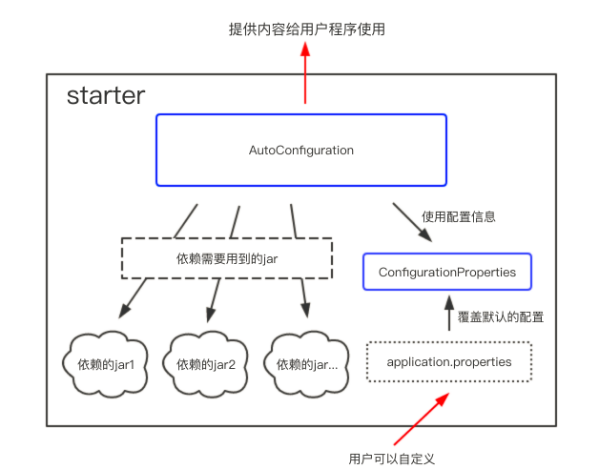

## starter 概述

### 什么是 starter

**Starter** 是一组预定义的依赖集合，它们可以帮助开发者快速引入和配置常见的功能模块。starter 也被称为场景启动器。

例如，`spring-boot-starter-web` 会自动引入与 Web 开发相关的库，包括 Spring MVC、内嵌的 Tomcat 服务器、日志记录工具等。


### starter 命令规范

- 官方 starter 命名：`spring-boot-starter-*`

- 自定义 starter 命名： `*-spring-boot-starter`

可以通过 [Build Systems :: Spring Boot ](https://docs.spring.io/spring-boot/reference/using/build-systems.html#using.build-systems.starters) 查看 Spring Boot 提供的所有 starter 


### starter 和 自动装配之间的协同工作

**引入 Starter -> 触发自动装配**： 当你通过 Maven 或 Gradle 引入某个 `starter` 依赖（例如 `spring-boot-starter-web`），这个 Starter 会将所有与 Web 相关的库添加到类路径中。Spring Boot 的自动装配机制会扫描这些依赖，并自动为你配置 Web 开发所需的 Bean（例如 DispatcherServlet、嵌入式 Tomcat 等），因此你不需要手动进行这些配置。

**自动装配基于 Starter 的依赖工作**： 自动装配的行为是依赖于类路径上的依赖来决定的，而 Starter 则提供了这些依赖。没有引入 Starter 的话，自动装配机制就无法工作。因此，Starter 和自动装配是一种协同的关系：Starter 提供依赖，自动装配根据这些依赖完成自动配置。

总的而言，starter 引入相关依赖，自动装配根据这些依赖来完成配置工作。


## starter 整体运行

### starter 的整体运行逻辑

在 Spring Boot 中，`@ConfigurationProperties` 和 `@AutoConfiguration` 是两个核心注解。

- @ConfigurationProperties: 用于读取外部配置。ConfigurationProperties 来保存我们的配置，并且这些配置都可以有一个默认值，即在我们没有主动覆写原始配置的情况下，默认值就会生效。除此之外，starter 的 ConfigurationProperties 还使得所有的配置属性被聚集到一个文件中（一般在 resources 目录下的 application.properties ）。
- @AutoConfiguration: 用于自动装配。

同时，为了保证程序的正常运行，还会使用一些条件注解。



### @ConfigurationProperties 使用方法

在自定义 starter 的过程中，核心注解主要有： 

- [`@ConfigurationProperties` ](https://docs.spring.io/spring-boot/reference/features/profiles.html#features.profiles.adding-active-profiles)  用于单个 Java 类上，用于将外部配置（如 `application.properties` 或 `application.yml` 文件中的属性）绑定到 Java 对象中，从而方便地读取和管理应用程序的配置。
- `@EnableConfigurationProperties`：用于在 Spring Boot 应用中启用对带有 `@ConfigurationProperties` 注解类的支持。

举个例子，

```java
@ConfigurationProperties(prefix = "mail")
public class MailProperties {
    private String host;
    private int port;
    private String username;
    private String password;
    
    // getters and setters
}

@AutoConfiguration
@EnableConfigurationProperties(MailProperties.class)  
public class MailAutoConfiguration {
	...
}
```

这将会绑定 `application.yml` 文件中的配置：

```yaml
mail.host=smtp.example.com
mail.port=25
mail.username=user
mail.password=secret
```


### @AutoConfiguration 使用方法

[@AutoConfiguration](https://docs.spring.io/spring-boot/reference/features/developing-auto-configuration.html#features.developing-auto-configuration.understanding-auto-configured-beans) 是用于实现自动装配逻辑的核心注解。

它通过扫描类路径和配置文件，自动配置应用程序所需的各种 Spring 组件，无需开发者手动编写配置代码。自动装配会基于条件判断来配置 Bean，比如类路径中是否存在特定的库，或者配置文件中是否存在某些属性等。

自动装配会基于条件判断来配置 Bean，比如类路径中是否存在特定的库，或者配置文件中是否存在某些属性等。


举个例子，定义 `@AutoConfiguration` 来配置 Bean

```java
@AutoConfiguration
public class MailAutoConfiguration {

    @Bean
    @ConditionalOnMissingBean
    public MailService mailService(MailProperties mailProperties) {
        return new MailService(mailProperties.getHost(), 
                               mailProperties.getPort(), 
                               mailProperties.getUsername(), 
                               mailProperties.getPassword());
    }
}
```


### 参考资料

[Profiles :: Spring Boot](https://docs.spring.io/spring-boot/reference/features/profiles.html#features.profiles.adding-active-profiles)