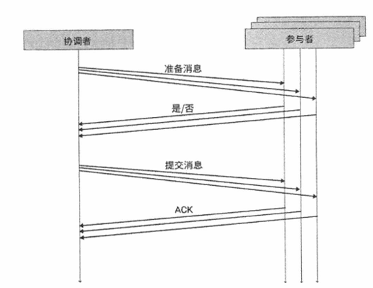

## 一、两阶段提交概述

### 1.1 什么是两阶段提交(Two-Phase Commit, 2PC) 

两阶段提交是用于确保分布式事务一致性的经典协议。

两阶段提交的基本思想是：**先检查每个节点上的状态是否能够满足事务正确性， 再进行事务操作**。

### 1.2 两阶段提交可能存在的问题

两阶段提交（2PC）模型存在以下缺点：

- **同步阻塞问题**：在事务执行过程中，所有参与事务的节点对其占用的公共资源加锁，这可能导致其他进程或线程在访问这些资源时出现阻塞。整个系统的**性能**可能因此受到影响。
- **单点故障问题**：如果协调者发生故障，所有的参与者将会一直处于阻塞状态，等待协调者的恢复或指示。如果参与者在准备阶段回复协调者之前发生故障，协调者会一直等待参与者的回复。这可能导致系统的整体**可用性**下降。
- **数据不一致问题**：在提交阶段，如果由于网络问题或部分参与者故障，某些参与者未能接收到协调者发出的提交消息，这可能导致数据在不同节点之间**不一致**。
- **无法解决的问题**：如果在提交阶段，协调者发出提交消息后发生宕机，并且唯一接收到提交消息的参与者也发生宕机，系统将无法确认事务是否已经成功提交。这种情况下，事务的最终状态可能无法确定，导致**一致性问题**。

## 二、2PC 实现过程

### 2.1 两阶段提交过程中的角色

在两阶段提交协议（2PC）中，主要涉及两个角色：

- 协调者（Coordinator）: 控制整个事务的提交过程，确保所有参与者的操作能够一致地提交或回滚。
- 参与者（Participants）: 参与分布式事务的各个系统或数据库。每个参与者负责执行事务操作，并根据协调者的指示进行提交或回滚。

### 2.2 两阶段提交具体过程

在两阶段提交过程中，主要有以下两个阶段：

- 准备阶段 (Prepare Phase)，也称为投票阶段 (Voting Phase)。
- 提交阶段 (Commit Phase)

其中，**参与者具有一票否决权**，只有全票通过，事务才能提交； 否则事务中止。

**(1) 准备阶段**：

- 协调者发送准备提交请求(准备消息)给所有参与者。
- 参与者处理事务，并**记录日志，但不提交事务**。
- 参与者返回准备状态（“是” 或 “否”）给协调者。
  - 如果参与者发现事务的所有操作都执行成功，则返回 一条“是“消息；
  - 如果参与者发现所需条件和资源检查失败，或者事务操作执行失败，则返回 一条“否“消息。

**(2) 提交阶段**：

- 协调者收到所有参与者的准备状态，发送提交消息给所有参与者，等待所有参与者的响应。
  - 如果所有参与者都返回“Yes”，协调者发送提交指令。
  - 如果有参与者返回“No”，协调者发送回滚指令。
- 参与者根据协调者的指令**执行实际的提交或回滚操作**。

### 参考资料

《深入理解分布式系统  唐伟志》

《深入理解分布式事务：原理与实战 肖宇》

