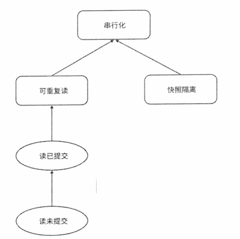

### 什么是隔离级别

由多个操作组成并同时运行的事务常常会有意料之外的行为发生，这取决于它们是如何交错执行的。**隔离级别定义了并行系统中事务的结果何时、以何种方式对其他并发事务可见** 。

### 常见的隔离级别

最初的ANSISQL-92 标准定义了 4 种隔离级别，随着技术的演进，出现了越来越多的隔离级别。

**(1) 读未提交（Read Uncommitted）**

- **描述**: 事务可以读取其他事务尚未提交的修改数据。这种情况下，一个事务可能会读到另一个事务尚未提交的更改（称为脏读）。
- **问题**: 可能会导致脏读、不可重复读、幻读等问题。
- **使用场景**: 很少使用，因为隔离程度最低，存在并发数据不一致的风险。

**(2) 读已提交（Read Committed）**

- **描述**: 事务只能读取其他事务已经提交的数据。事务不会看到未提交的更改，避免了脏读问题。
- **问题**: 仍然可能出现不可重复读和幻读，即同一事务中的两次读取可能返回不同的结果。
- **使用场景**: 很多数据库系统默认采用的隔离级别，如Oracle。这种隔离级别能在保证性能的同时提供一定程度的隔离。

**(3) 可重复读（Repeatable Read）**

- **描述**: 在同一个事务内，读到的数据在整个事务期间不会发生变化，保证了多次读取同一行数据时的结果是一致的。
- **问题**: 能避免脏读和不可重复读，但仍然可能出现幻读（其他事务在该事务期间插入了符合查询条件的新数据）。
- **使用场景**: 比较严格的隔离级别，常用于需要确保数据一致性的场景。

**(4) 快照隔离（Snapshot Isolation, SI）**

- **描述**：快照隔离通过为每个事务提供一个数据库的快照，使得事务可以在并发环境中读取一致的视图。事务在执行期间读取的所有数据都基于这个快照，而不会受到其他并发事务修改的影响。所有的读操作在整个事务期间保持一致，写操作在提交时才会检查冲突。
- **问题**：虽然快照隔离避免了脏读和不可重复读问题，但它并不能完全避免**写-写冲突(更新丢失)**。当两个事务试图同时修改相同的数据时，会在提交时检测到冲突，并回滚其中一个事务。此外，快照隔离需要额外的存储空间来维护多个版本的数据，这可能增加系统的存储负担。
- **使用场景**：快照隔离适用于对并发性要求高且需要保证数据一致性的应用场景，特别是在需要处理大量读操作和少量写操作的环境下。典型应用包括金融系统、在线交易平台等，这些系统需要高并发的读操作，并且不能容忍数据不一致的问题。

**(5) 串行化（Serializable）**

- **描述**: 最严格的隔离级别，它通过强制事务顺序执行，确保事务之间完全隔离，避免了脏读、不可重复读和幻读问题。
- **问题**: 由于强制顺序执行，可能会显著降低并发性，导致性能下降。
- **使用场景**: 在数据一致性要求极高的场景下使用，如金融交易系统。

### 隔离级别分类

隔离级别定义了什么是不可行的， 即在已知的异常中防止哪些异常情况发生。当然， 越强的隔离级别能防止越多的异常，但性能往往也会越低。

图中，箭头表示了包含关系。

### 隔离级别和其所能防止的异常情况

| **隔离级别**               | **脏写（Dirty Write）** | **脏读（Dirty Read）** | **不可重复读（Non-repeatable Read）** | **幻读（Phantom Read）** | **更新丢失（Lost Update）** | **读偏斜（Read Skew）** | **写偏斜（Write Skew）** |
|---------------------------|-------------------------|-----------------------|----------------------------------------|-------------------------|-----------------------------|-------------------------|---------------------------|
| **读未提交（Read Uncommitted）**   | No                    | Yes                 | Yes                                  | Yes                   | Yes                        | Yes                  | Yes                     |
| **读已提交（Read Committed）**     | No                    | No                  | Yes                                  | Yes                   | Yes                        | Yes                   | Yes                     |
| **可重复读（Repeatable Read）**    | No                    | No                  | No                                   | Yes                   | No                         | No                    | Yes                   |
| **快照隔离（Snapshot Isolation）** | No                    | No                  | No                                   | Yes（部分实现避免幻读） | No                         | No                   | No                      |
| **串行化（Serializable）**      | No                    | No                  | No                                   | No                | No                         | No                    | No                      |

### 参考资料

《深入理解分布式系统  唐伟志》