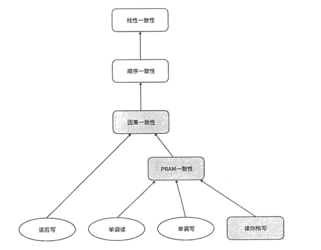

## 一、一致性概述

### 1.1 什么是一致性

我们要根据对象来判别一致性到底是什么。通常而言，我们所认识的一致性主要包括以下两类：

- 事务一致性：事务在执行前后，数据库必须从一个一致状态转换到另一个一致状态。
- 数据一致性：多个副本或节点之间的数据保持一致的特性。具体来说，当多个副本中的数据被同时更新时，它们应该达到相同的状态，以确保系统的正确性。

### 1.2 数据一致性模型

一致性模型就是指，在并发编程中，系统和开发者之间的一种约定，如果开发者遵循某些规则，那么开发者执行读操作或写操作的**结果是可预测的**。一致性模型本质上定义了写操作的顺序和可见性，即并发写操作执行的顺序是怎样的，写操作的结果何时能够被别的进程看见。

## 二、  数据一致性模型

> 具体细节查看 [《深入理解分布式系统  唐伟志》3.4章 ](https://pan.baidu.com/s/1AI3R0kA-5HF29svXXLWwTw)

比较常见的一致性模型分类有：

- 分布式一致性验证框架  Jepsen
- 以数据为中心的一致性模型 (Data-Centric Consistency Models)：考虑系统每个副本的数据是否一致，主要包括线性一致性、顺序一致性、因果一致性、最终一致性这四类一致性模型。
- 以客户端为中心的一致性模型

### 2.1 一致性模型分类

分布式一致性验证框架  Jepsen 对一致性模型的分类如下：

一致性模型根据可用性可以分为三类，白底矩形中的模型的可用性为不可用(Unavailable)，灰底矩形中的模型的可用性为基本可用(Sticky Available)，椭圆中的模型的可用性为高可用(TotalAvailable)。具体来说:

- **Unavailable** 表示,满足这类一致性模型的系统发生网络分区时，为了保证数据一致性和正确性，系统会不可用。用CAP定理来解释，就是典型的CP类系统。这类一致性模型包括线性一致性和顺序一致性。
- **Sticky Available** 表示，满足这类一致性模型的系统可以容忍一部分节点发生故障，还未出现故障的节点仍然可用，但前提是客户端不能将请求发送到不可用的副本节点。这类一致性模型包括因果一致性、PRAM 一致性和读你所写一致性。
- **Total Available** 表示，满足这类一致性模型的系统可用性是最高的，即使网络发生严重分区，在没有发生故障的节点上，仍然保证可用。这类一致性模型包括读后写一致性、单调读一致性和单调写一致性。

另外，一致性模型中的一致性强度从上到下越来越弱。箭头还表示包含关系，例如满足线性一致性必然也满足顺序一致性。

### 2.2 线性一致性

线性一致性的严格定义是，给定一个执行历史，执行历史根据井发操作可以扩展为多个顺序历史(Sequential History)，只要从中找到一个合法的顺序历史，那么该执行历史就是线性一致性的。线性一致性有一个非常重要的约束，就是在将执行历史转变成顺序历史的过程中，**如果两个操作是顺序关系， 那么它们的先后关系必须保持相同**；如果两个操作是并发关系， 则它们可以按任何顺序排列。

实现线性一致性：

- 线性一致性必须强调操作是原子的。
-  分布式系统中的线性一致性最困难的是需要一个**全局时钟**， 这样才能知道每个点事件发生的时间和全局顺序，但分布式系统中准确的全局时钟是非常难以实现的，

### 2.3 顺序一致性

顺序一致性同样允许对并发操作历史进行重新排列，但它的约束比线性一致性要弱，顺序 一致性只要求同一个客户端（或进程）的操作在排序后保持先后顺序不变，但**不同客户端（或 进程）之间的先后顺序是可以任意改变的**。

顺序一致性和线性一致性的主要区别在于**没有全局时间的限制**，顺序一致性不要求不同客户端之间的操作的顺序一致，只关注局部的顺序。

有时顺序一致性往往更实用。例如，在一个社交网络应用中，一个人通常不关心他看到的 所有朋友的帖子的顺序，但对于具体的某个朋友，仍然以正确的顺序显示该朋友发的帖子会更符合逻辑。

### 2.4 因果一致性

因果一致性 (Causal Consistency) 是一种比顺序一致性更弱一些的一致性模型，它与顺序 一致性一样不依赖千全局操作的顺序。因果一致性要求，必须以相同的顺序看到因果相关的操作，而**没有因果关系的并发操作可以被不同的进程以不同的顺序观察到**。

最典型的因果关系就是社交网络中的发帖和评论关系，根据因果关系，必须先有发帖才能有对于该帖子的评论，所以发帖操作必然在评论操作之前。

### 2.5 最终一致性

最终一致性是最弱的一致性模型之一，可以认为是弱一致性的一种特例，但在追求性能的分布式系统中有良好的实践。

在最终一致性模型中，**分布式系统允许在一段时间内出现不一致的状态，但最终会达到一致的状态**。具体解释如下：只要系统最终能够达到一个稳定的状态，在某个阶段，系统各节点处理客户端的操作顺序可以不同， 读操作也不需要返回最新的写操作的结果。在最终的状态下，只要不再执行写操作，读操作将返回相同的、最新的结果。

注意：最终并没有指定系统必须达到稳定状态的硬性时间。

> 由于最终一致性是一个比较笼统的说法，所以并没有具体地归为某一类，也没有在一致性模型  中画出来

## 三、细节补充

### 强一致性和弱一致性

强一致性和弱一致性是分布式系统中的两个基本概念。而最终一致性、读写一致性和单调读等则是更具体或更细分的概念，它们通常是在讨论强一致性和弱一致性的过程中被提及的。

- **强一致性**：复制是同步的。当一个数据被更新后，其他副本中的数据也会实时更新，确保所有副本的数据都是最新的。这种一致性可以保证系统的可靠性和实时性，但实现起来比较复杂。
- **弱一致性**：复制是异步的。当一个数据被更新后，其他副本中的数据可能会延迟更新，但最终会达到一致的状态。这种一致性可以保证系统的可用性和可靠性，但在某些情况下可能会出现数据不一致的情况。

## 参考资料

[大数据 - 图解一致性模型 - Databend - SegmentFault 思否](https://segmentfault.com/a/1190000042413117)