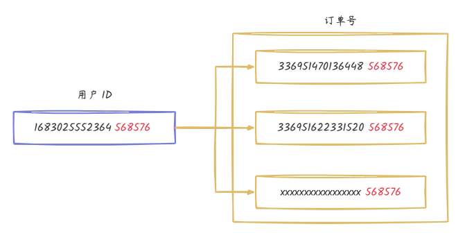

## 一、分片算法

分片算法就是水平分片中的划分规则。

分片算法的评价标准主要有：

- **数据分布均匀**。尽量避免数据倾斜的问题。
- **服务器动态伸缩**。如果节点故障导致服务器缩容，迁移数据较少。如果服务器扩容，迁移数据越少越好。

### 2.1 范围分区

- **定义**：根据某个列(分片键)的值范围将数据分成不同的分区。
- **示例**：假设有一个销售记录表，可以按照销售日期将数据分区，每个月的数据放在一个分区中。
- **优点：**能够对用来进行范围分区的关键字执行范围查询
- **缺点：**可能产生数据分布不均或请求流量不均的问题
- **案例：**使用范围分区的分布式存储系统有 Goog Bigtable、Apache HBase2、PingCAP TiKV

### 2.2 哈希分区

- **定义**：使用哈希函数对某个列(分片键)的值进行哈希运算，将结果映射到不同的分区。
- **示例**：假设有一个订单表，可以对订单ID进行哈希运算，根据哈希值将数据分区。
- **优点**：数据分布相对均匀，能够在一定程度上避免热点问题。
- **缺点：**在不额外存储数据的情况下，无法执行范围查询。
- **案例：**使用一致性哈希的典型的分布式数据存储系统有 Dyamo 和 Apache Cassandra

### 2.3 一致性哈希

在增加或者删除分布式系统中的节点时，**普通的哈希分区算法无法避免大规模数据移动问题**。但是，[一致性哈希分区算法](https://developer.aliyun.com/article/1082388)可以避免这一问题。

- 服务器映射到**哈希环**。当服务器接收到数据请求时，首先需要计算请求 Key 的哈希值；然后将计算的哈希值映射到哈希环上的具体位置；接下来，从这个位置**沿着哈希环顺时针查找，遇到的第一个节点**就是 key 对应的节点；最后，将请求发送到具体的服务器节点执行数据操作。这样能够更好地让服务器自适应地扩容或者缩容。

- **引入虚拟节点机制**。每一个物理服务节点映射多个虚拟节点，将这些虚拟节点计算哈希值并映射到哈希环上，当请求找到某个虚拟节点后，将被重新映射到具体的物理节点。虚拟节点越多，哈希环上的节点就越多，数据分布就越均匀，从而避免了数据倾斜的问题。

### 2.4 基因法

基因法的核心思想是根据多个字段（如用户ID、订单ID等）生成一个编码，决定数据应该存储到哪个表中。

例如，假设有这么一个场景，让同一个用户的所有订单存储到一个表中，并且能够**通过用户ID或订单ID进行精准查询**。这里，我们可以利用基因法，通过用户ID和订单ID的组合生成一个唯一的标识符，并将该标识符映射到指定的表中。

分库分表可能使用的算法：

- 基因法
- 订单号生成：为了保证订单号生成递增，我们参考雪花算法自定义了一个 `DistributedIdGenerator`，生成后的分布式 ID 再拼接上用户的后六位。

自定义分片算法： [手摸手之订单如何分库分表 (yuque.com)](https://www.yuque.com/magestack/12306/dyr1d4r3me19gg7l#wECos)

## 二、如何选择分片键

选择分库分表中的分片键（Sharding Key）是一个关键决策，它直接影响了分库分表的性能和可扩展性。以下是一些选择分片键的关键因素：

1. **访问频率**：选择分片键应考虑数据的访问频率。将经常访问的数据放在同一个分片上，可以提高查询性能和降低跨分片查询的开销。
2. **数据均匀性**：分片键应该保证数据的均匀分布在各个分片上，避免出现热点数据集中在某个分片上的情况。
3. **业务关联性**：分片键应该与业务关联紧密，这样可以避免跨分片查询和跨库事务的复杂性。
4. **数据不可变**：一旦选择了分片键，它应该是不可变的，不能随着业务的变化而频繁修改。

基于以上考虑，我们选择使用 username 作为分片键。

[手摸手之用户如何实现分库分表 (yuque.com)](https://www.yuque.com/magestack/12306/pb98neetmww1rr9y#oSTEl)

## 三、注意事项

在实际使用过程中，我们应该避免常见的错误。

### 4.1 读请求扩散

**读请求扩散**：在分库分表的场景下，如果在查询时没有带上**分片键**，系统无法直接确定数据所在的具体数据库或表。为了解决这一问题，系统只能在**所有的数据库和表中扫描**以查找数据，降低了性能。

举个例子，由于登录时只使用了手机号或者邮箱，没有带用户名（分片键），导致无法确定用户的分片键，使得系统无法直接锁定用户的数据位于哪个数据库或者哪张表中。为了找到用户的数据，只能对全部的数据库和表进行扫描查询。为了解决这个问题，我们引入了两张**路由表**：用户手机号表和用户邮箱表。这些表的核心字段是手机号和邮箱，以及它们对应的用户名。通过这样的设计，我们能够在用户登录时，灵活地使用手机号、邮箱或用户名来进行认证。

