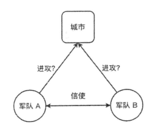
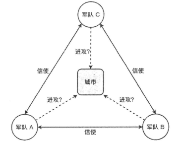

[TOC]

## 一、两将军问题

### 1.1 问题描述

两将军问题描述的是两个将军（或两支军队）通过不可靠的通信渠道（如信使）来协调攻击的情景。

**背景**：两支由不同的将军领导的军队，正准备进攻一座坚固的城市。军队在城市附近的两个山丘扎营，中间有一个山谷将两个山丘隔开，两个将军交流的唯一方法是派遣信使穿越山谷。然而，山谷被城市的守卫者占领，并且途经该山谷传递信息的信使有可能会被俘虏。他们必须同时攻击才能取胜。

**问题**：信使有可能被敌人拦截，导致消息无法到达。即便B收到消息，B回复的确认信息也可能被拦截。这导致将军A无法确定B是否收到了消息并同意攻击，反之亦然。

### 1.2 深入理解两将军问题

这个问题实质上描述的是：

- **通信不可靠**：在不可靠的通信环境下，双方无法确保消息被准确接收。
- **共识难题**：无法保证双方在同一时间达成一致的决策。

**两将军问题**强调了在不可靠通信环境下达成一致的困难，这在分布式系统的消息传递、确认和重试机制中有所体现。

### 1.3 实验结论

**两将军问题被证明无解**，计算机科学家们仍找到了工程上的解决方案，例如传输控制协议(TCP)的“三次握手”机制。

这个思想实验表明，**在分布式系统中，一个节点无法直接确认另一个节点的状态，必须通过发送信息来交流**。类似于人类交流，我们只能通过语言、文字或肢体语言来传达想法。

## 二、拜占庭将军问题

### 2.1 问题描述

拜占庭将军问题是两将军问题的扩展，涉及多个将军（或节点），其中一些可能是恶意的（即“拜占庭将军”）。

**背景**：多个拜占庭将军各率领一支军队，想要占领一座防守坚固的城市，将军们还是只能通过信使进行交流。为了简化问题，将各支军队的行动策略限定为进攻或者撤离两种。因为部分军队进攻、部分军队撤离可能会导致灾难性后果，所以各位将军必须通过投票来达成一致的策略，即所有军队一起进攻或者所有军队一起撤离。但其中一些将军可能是叛徒，会传递虚假信息以扰乱决策。

**问题**：如何确保所有忠诚的将军在存在恶意将军的情况下，能够达成一致的决策。

> 拜占庭将军问题中并不去考虑通信兵是否会被截获或无法传达信息等问题。

### 2.2 深入理解拜占庭将军问题

这个问题实质上描述的是：

- **恶意节点**：系统中存在恶意节点，会故意传递错误信息。
- **共识协议**：需要**设计能够容错的共识协议**，确保即使有恶意节点，也能保证忠诚节点达成一致。

**拜占庭将军问题**则进一步探讨了在存在恶意节点时的容错机制，这对于设计健壮的分布式系统（如区块链和分布式数据库）至关重要。

### 2.3 解决方案

拜占庭将军问题的解决方案主要集中在设计能够容忍拜占庭错误（恶意或故障节点）的共识协议。以下是几种主要的拜占庭容错（Byzantine Fault Tolerance, BFT）协议：

- Practical Byzantine Fault Tolerance (PBFT)
- Paxos
- Raft
- Tendermint

## 三、两将军和拜占庭问题的关系

### 3.1 区别和联系

| 特性         | 两将军问题                         | 拜占庭将军问题                           |
| ------------ | ---------------------------------- | ---------------------------------------- |
| **节点数量** | 两个节点                           | 多个节点                                 |
| **节点类型** | 都是忠诚节点                       | 可能有恶意节点                           |
| **通信问题** | 通信渠道不可靠，消息可能丢失       | 存在恶意节点传递错误信息，消息可能被篡改 |
| **共识难度** | 确保两个节点在不可靠通信下达成一致 | 在存在恶意节点的情况下达成一致           |
| **解决方案** | 没有通用解法（理论上无解）         | 拜占庭容错协议（如Paxos、Raft）          |

> 

### 3.2 应用与现实意义

**两将军问题**强调了在不可靠通信环境下达成一致的困难，这在分布式系统的消息传递、确认和重试机制中有所体现。

**拜占庭将军问题**则进一步探讨了在存在恶意节点时的容错机制，这对于设计健壮的分布式系统（如区块链和分布式数据库）至关重要。

## 参考资料

《深入理解分布式系统 唐伟志》