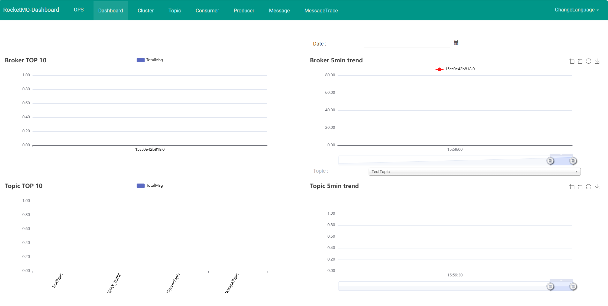
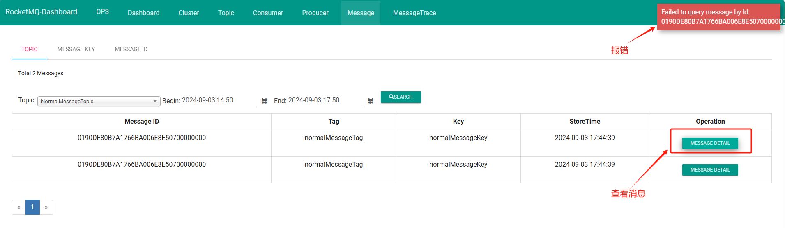
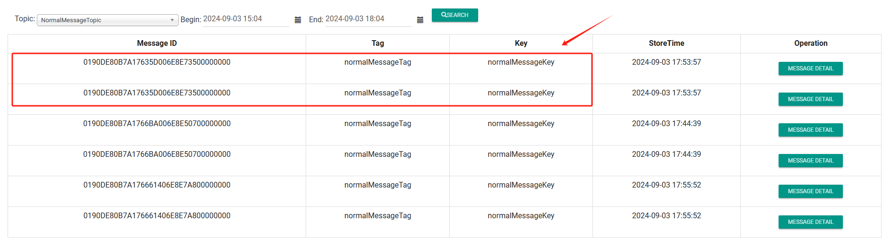

## 一、RocketMQ Dashboard 概述

### 什么是 RocketMQ Dashboard

`RocketMQ Dashboard` 是 RocketMQ 的管控利器，为用户提供客户端和应用程序的各种事件、性能的统计信息，支持以可视化工具代替 Topic 配置、Broker 管理等命令行操作。

注意：`RocketMQ Dashboard` 工具存在一些问题。


### RocketMQ Dashboard 安装

（1）官方镜像

① 安装docker，拉取 `rocketmq-dashboard` 镜像

```bash
# 拉取 rocketmq-dashboard 镜像
$ docker pull apacherocketmq/rocketmq-dashboard:latest
```

② docker 容器中运行 `rocketmq-dashboard`

```bash
# 运行 Dashboard ，连接到运行在 127.0.0.1:9876 的 NameServer
$ docker run -d --name rocketmq-dashboard -e "JAVA_OPTS=-Drocketmq.namesrv.addr=127.0.0.1:9876" -p 8082:8080 -t apacherocketmq/rocketmq-dashboard:latest

# 运行 Dashboard ，连接到名称为 rmqnamesrv 的 Docker 容器的 NameServer
$ docker run -d --name rocketmq-dashboard -e "JAVA_OPTS=-Drocketmq.namesrv.addr=rmqnamesrv:9876" -p 8082:8080 -t apacherocketmq/rocketmq-dashboard:latest
```

注意：`127.0.0.1` 是本地回环地址，通常表示在同一台机器上进行通信。<font color="red">**如果 RocketMQ NameServer 不在同一台机器上，或在 Docker 容器中运行，使用 `127.0.0.1` 将导致连接失败**</font>。


（2）第三方镜像

由于官方的 RocketMQ 存在一些问题，使用别人修改的。

```bash
docker run -d ^
--name rmqconsole ^
--network rockermq_project_rocketmq ^
--link rmqnamesrv:namesrv ^
-e "JAVA_OPTS=-Drocketmq.config.namesrvAddr=namesrv:9876 -Drocketmq.config.isVIPChannel=false" ^
-p 8088:8080 ^
-t pangliang/rocketmq-console-ng
```


### RocketMQ Dashboard 运行

在运行 Dashboard 容器后，输入网址 [localhost:8082](http://localhost:8082/#/) 打开 `RocketMQ Dashboard`




### 使用教程

[RocketMQ Dashboard 使用教程 | RocketMQ (apache.org)](https://rocketmq.apache.org/zh/docs/deploymentOperations/04Dashboard#使用教程)


## 二、可能存在的问题

### 问题描述

在 输入网址 [localhost:8082](http://localhost:8082/#/) 打开 `RocketMQ Dashboard`时，界面上报错

`org.apache.rocketmq.remoting.execption.connect to [rmqnamesrv:9876] failed` 和 `org.apache.rocketmq.remoting.exception.RemotingConnectException: connect to null failed`


### 容器启动命令

Dashborad 镜像运行命令：

```bash
# 运行 Dashboard ，连接到名称为 rmqnamesrv 的 Docker 容器的 NameServer
$ docker run -d --name rocketmq-dashboard -e "JAVA_OPTS=-Drocketmq.namesrv.addr=rmqnamesrv:9876" -p 8082:8080 -t apacherocketmq/rocketmq-dashboard:latest
```

注意：`127.0.0.1` 是本地回环地址，通常表示在同一台机器上进行通信。<font color="red">**如果 RocketMQ NameServer 不在同一台机器上，或在 Docker 容器中运行，使用 `127.0.0.1` 将导致连接失败**</font>。


NameServer 镜像运行命令：

```bash
# 定义该文件的格式版本
version: '3.8'

# 定义一组服务，这些服务构成一个RocketMQ集群
services:
 # NameServer服务，负责管理和发现RocketMQ集群中的其他组件
  namesrv:
    # 指定NameServer服务所使用的镜像
    image: apache/rocketmq:5.3.0
    # 定义容器的名称
    container_name: rmqnamesrv
    # 将容器的9876端口映射到主机的9876端口
    ports:
      - 9876:9876
    # 将NameServer服务加入到名为rocketmq的网络中
    networks:
      - rocketmq
    # 启动时执行的命令
    command: sh mqnamesrv
    
    # Broker服务和 Proxy 服务配置
    ...
    
# 定义网络，用于这些服务之间的通信
networks:
  rocketmq:
    # 指定网络的驱动类型为bridge
    driver: bridge
```

可以看出，`rmqnamesrv` 使用自定义的网络 `rocketmq`。


### 原因分析

首先，我们得简单了解 Docker 网络。

- 在 Docker 中，网络地址 `127.0.0.1` 代表的是容器自身的回环接口，也就是说，当你在容器内使用 `127.0.0.1` 时，它指向的是该容器本身，而不是宿主机或其他容器。

- 在同一个桥接( bridge )网络中的容器可以通过容器名互相通信，但**不同网络中的容器默认无法直接通信**。

因此，原因大概率是  <font color="red">**`rmqnamesrv` 容器和 `rocketmq-dashboard` 容器处于两个不同的网络中，无法直接通信**</font> 。


### 解决步骤

**（1）进入 Dashboard 容器检查网络通信**

```bash
# 进入名为 rmqbroker 的容器，并启动一个交互式的Bash shell
$ docker exec -it rmqbroker bash

# 进入名为 rocketmq-dashboard 的容器，检查网络通信
$ curl http://rmqnamesrv:9876                          
curl: (6) Could not resolve host: rmqnamesrv
```

**（2）查看 rmqnameserver 的网络配置**

检查 `rmqnamesrv` 的网络信息 ，其使用自定义网络 `rockermq_project_rocketmq` 通信。

```bash
$ docker inspect rmqnamesrv --format '{{json .NetworkSettings.Networks}}'
{"rockermq_project_rocketmq":{"IPAMConfig":null,"Links":null,"Aliases":["rmqnamesrv","namesrv","34d9371af8d2"],"NetworkID":"61e0977ad36db6ed2af0ff3ef5c889c9e1941f52ea933d06606d04522f2bc461","EndpointID":"ca1a45352f5612d5acae0057cc3cd01fdcd1862fde3bcbc413977fb11aa40562","Gateway":"172.18.0.1","IPAddress":"172.18.0.2","IPPrefixLen":16,"IPv6Gateway":"","GlobalIPv6Address":"","GlobalIPv6PrefixLen":0,"MacAddress":"02:42:ac:12:00:02","DriverOpts":null}}
```

检查 `rocketmq-dashboard` 容器，**其使用默认网络 `bridge` 通信，并没有使用rockermq_project_rocketmq` 网络**。

```bash
$  docker inspect rocketmq-dashboard --format '{{json .NetworkSettings.Networks}}'
{"bridge":{"IPAMConfig":null,"Links":null,"Aliases":null,"NetworkID":"aa53583a9475afa560a68070913b94dd85132c8af3bf5a7ca2a813f82d00030f","EndpointID":"786d4e1026debc2034374d512f9d35767a1838a62019df929128b7b49fb5718c","Gateway":"172.17.0.1","IPAddress":"172.17.0.2","IPPrefixLen":16,"IPv6Gateway":"","GlobalIPv6Address":"","GlobalIPv6PrefixLen":0,"MacAddress":"02:42:ac:11:00:02","DriverOpts":null}}

```

我们也可以直接查看 Docker 中使用的网络，进而查看使用该网络的容器。

```bash
# 查看当前存在网络
$ docker network ls
NETWORK ID     NAME                        DRIVER    SCOPE
aa53583a9475   bridge                      bridge    local
41c563d5fe68   host                        host      local
ebae6105a278   none                        null      local
61e0977ad36d   rockermq_project_rocketmq   bridge    local

# 查看 rockermq_project_rocketmq 更详细的信息，比如多少个容器使用该网络
$ docker network inspect rockermq_project_rocketmq
```


**（3）修改网络连接**

将 Dashboard 容器 `rocketmq-dashboard` 连接到 `rockermq_project_rocketmq` 网络：

```shell
# 修改  rocketmq-dashboard 容器的网络连接
$ docker network connect rockermq_project_rocketmq rocketmq-dashboard

# 重新查看 rocketmq-dashboard 的网络信息
$ docker inspect rocketmq-dashboard --format '{{json .NetworkSettings.Networks}}'
{"bridge":{"IPAMConfig":null,"Links":null,"Aliases":null,"NetworkID":"aa53583a9475afa560a68070913b94dd85132c8af3bf5a7ca2a813f82d00030f","EndpointID":"786d4e1026debc2034374d512f9d35767a1838a62019df929128b7b49fb5718c","Gateway":"172.17.0.1","IPAddress":"172.17.0.2","IPPrefixLen":16,"IPv6Gateway":"","GlobalIPv6Address":"","GlobalIPv6PrefixLen":0,"MacAddress":"02:42:ac:11:00:02","DriverOpts":null},"rockermq_project_rocketmq":{"IPAMConfig":{},"Links":null,"Aliases":["cc28df0b15b0"],"NetworkID":"61e0977ad36db6ed2af0ff3ef5c889c9e1941f52ea933d06606d04522f2bc461","EndpointID":"9316bb56fb5c9973d457bc24a45039763a709853b6987f4c955c90e40bb1b459","Gateway":"172.18.0.1","IPAddress":"172.18.0.5","IPPrefixLen":16,"IPv6Gateway":"","GlobalIPv6Address":"","GlobalIPv6PrefixLen":0,"MacAddress":"02:42:ac:12:00:05","DriverOpts":{}}}
```

可以看出，`rocketmq-dashboard` 容器被连接到了两个不同的网络：`bridge` 网络和 `rockermq_project_rocketmq` 网络,  可以和这两个网络中的容器通信。


## 三、细节补充

### 查看消息失败

问题描述：Failed to query message by Id: 0190DE80B7A1766BA006E8E50700000000



可能原因：

- 消息已经被消费，不存在于消息队列中。
- dashboard 本身的问题

[Failed to query message by Id · Issue #572 · apache/rocketmq-externals (github.com)](https://github.com/apache/rocketmq-externals/issues/572)

[Rocketmq Dashboard 查看消息详情异常。 · Issue #7114 · apache/rocketmq (github.com)](https://github.com/apache/rocketmq/issues/7114)：当客户端生产者在使用proxy代理的情况下，发送的消息。想通过Rocketmq Dashboard查看消息的消费情况，会出现”ERROR Occur service exception: Failed to query message by Id: 0108719066FF9A489C04DB99CA00000003“的异常错误。但是**如果客户端生产者不指向proxy，而是直接向namesrv发送的消息，这种情况下是可以正常查看消息的消费情况的**。


### 消息重复

查询到两条一模一样的消息。



[RocketMQ查询出重复数据，两条MessageID一样的解决办法如下_rocketmq 控制台查询重复消息-CSDN博客](https://blog.csdn.net/weixin_44853310/article/details/139594123)


## 参考资料

[RocketMQ Dashboard | RocketMQ (apache.org)](https://rocketmq.apache.org/zh/docs/deploymentOperations/04Dashboard)