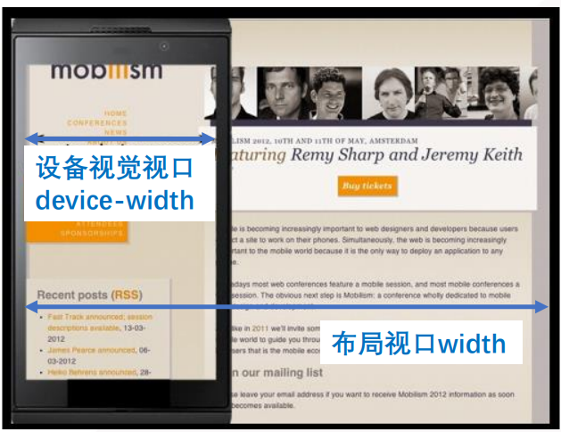
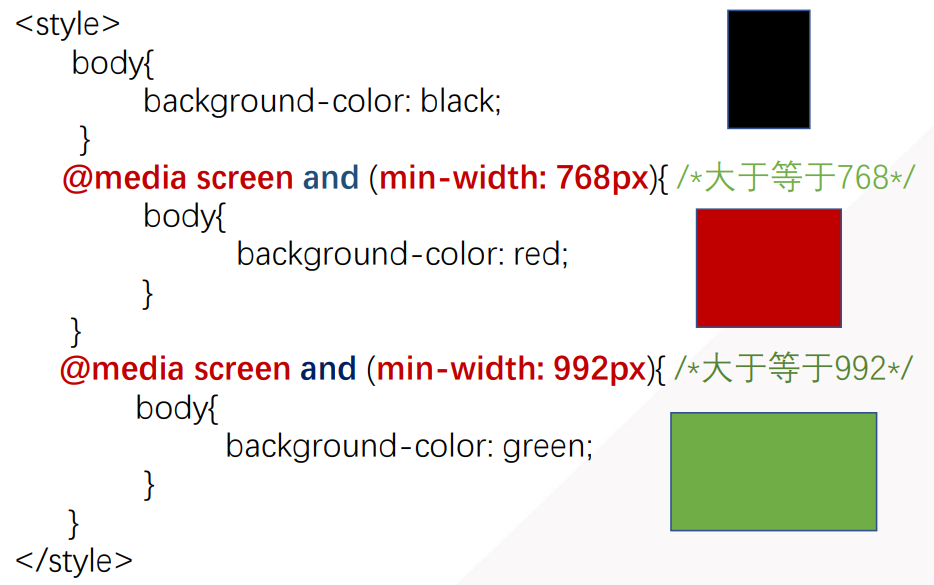

# 响应式布局

响应式布局使用方式主要包括：

- CSS3的媒体查询（Media Query）
- 第三方开源框架，例如Bootstap


## 视口Viewport和布局方式

**视口：**显示网页的区域

**视口规定：**

- 布局视口=设备视觉视口 
- 不可缩放




视口设置代码如下：

```html
<!--width=device-width讲布局视口和设备视口统一，user-scalable=no表示用户不能进行缩放  -->
<meta name="viewport" content="width=device-width, user-scalable=no, initial-scale=1.0, maximum-scale=1.0, minimum-scale=1.0">
```

该段代码可以利用**meta:vp**扩展


## 媒体查询

检查设备宽度，根据宽度设置CSS样式

| 设备屏幕          | 尺寸px |
| ----------------- | ------ |
| 超小屏extra small | <768   |
| 小屏small         | ≥768   |
| 中等medium        | ≥992   |
| 大屏large         | ≥1200  |


媒体查询的属性如下：

| 属性       | 含义         |
| ---------- | ------------ |
| min-height | 页面最小高度 |
| min-width  | 页面最小宽度 |
| max-height | 页面最大高度 |
| max-width  | 页面最大宽度 |


使用例子如下：




