## CSS概述

层叠样式表CSS （Cascading Style Sheets）主要作用是：**内容和样式相分离，便于修改样式**

## CSS 规则组成

CSS 规则由两个主要的部分构成：

- **选择器** ： 选择器通常是前端程序员需要改变样式的 HTML 元素。
- **一条或多条声明**：每条声明由一个属性和一个值组成。属性（property）是您希望设置的样式属性（style attribute）。每个属性有一个值。属性和值被冒号分开。

**基本语法**如下：

在基本语法里，需要注意的是：

- 最后一条声明可以没有分号，但是为了以后修改 方便，一般也加上分号。
- 为了使用样式更加容易阅读，可以将每条代码写 在一个新行内

## CSS样式

| 单   位 |                             描述                             |
| :-----: | :----------------------------------------------------------: |
|   px    |                    绝对长度单位 像素                    |
|   em    | 相对长度单位 1em —— 1个字符             2em —— 2个字符                  自动适应用户所使用的字体 |
|    %    |                            百分比                            |

|      颜色       | 描述                                                         |
| :-------------: | :----------------------------------------------------------- |
| red,blue,green  | 颜色名     http://www.w3school.com.cn/ cssref/css_colors_legal.asp |
|   rgb(x,x,x)    | RGB 值    每个颜色分量取值**0-255**   红色：rgb(255,0,0)  灰色：rgb(66,66,66) |
| rgb(x%, x%, x%) | RGB 百分比值 **0%-100%**  红色：rgb(100%,0%,0%)         |
|  rgba(x,x,x,x)  | RGB 值，透明度  a值：0.0（完全透明）与 1.0（完全不透明）  红色半透明：rgba(255,0,0,0.5) |
|    \#rrggbb     | 十六进制数  红色： #ff0000  红色： #f00 去掉重复位 |

em的值并不是固定的，会继承父级元素的字体大小（参考物是父元素的font-size）

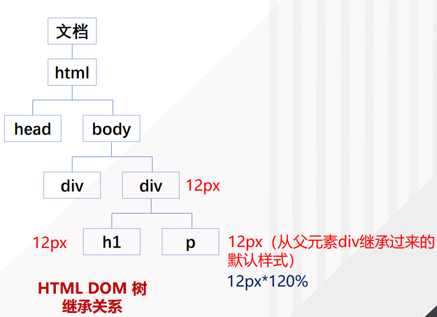

### 文本样式

| 属性            |   描述   | 取值                                                 |
| :-------------- | :------: | ---------------------------------------------------- |
| color           | 文本颜色 | red #f00    rgb(255,0,0)                        |
| letter-spacing  | 字符间距 | 2px    -3px                                          |
| line-height     |   行高   | 14px   1.5em   120%                                  |
| text-align      |   对齐   | center left right   justify                          |
| text-decoration |  装饰线  | none       overline  underline     line-through |
| text-indent     | 首行缩进 | 2em                                                  |

**行高line-height**

line-height是行高的意思，它决定了**元素中文本内容的高度**，height则是定义**元素自身的高度**。

- **height：行高**。“行高”顾名思意指一行文字的高度。具体来说是指两行文字间基线之间的距离。
- **line-height：表示  每行文字所占的高度** 

**把line-height值设置为height一样大小的值可以实现单行文字的垂直居中**

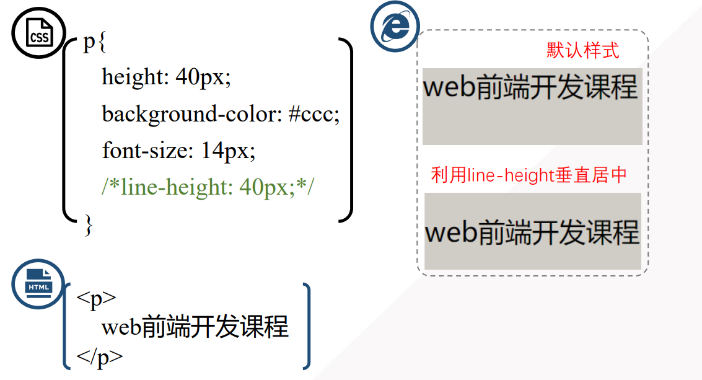

**装饰线text-decoration**

去掉超链接下划线

淘宝购物图片中的删除线

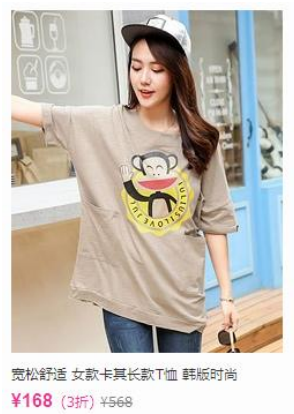

### 字体样式

| 属性        | 描述                           | 取值                                                         |
| ----------- | ------------------------------ | ------------------------------------------------------------ |
| font        | 在一个声明中设置所有的字体属性 | font: bold 18px '幼圆'                                       |
| font-family | 字体系列                       | 网页安全字体  font-family: "Hiragino Sans GB", "Microsoft  YaHei", sans-serif; |
| font-size   | 字号                           | 14px 120%                                                    |
| font-style  | 斜体                           | italic                                                       |
| font-weight | 粗体                           | bold                                                         |

**font属性简化的使用方法**

- font: 斜体 粗体 字号/行高 字体
- font: italic bold 16px/1.5em '宋体'；

### 背景

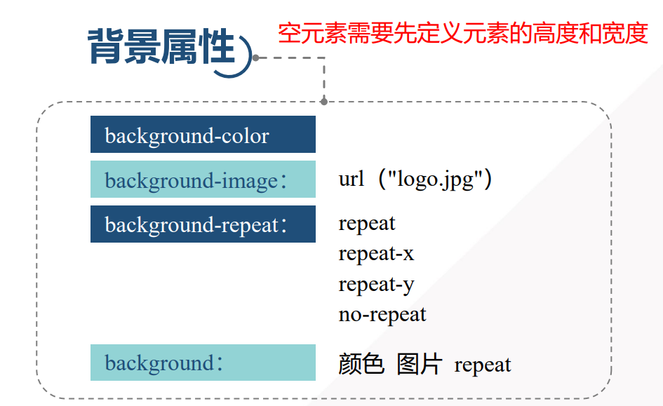

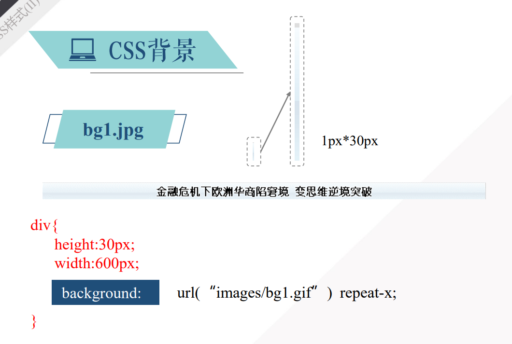

### CSS超链接

**链接的四种状态**

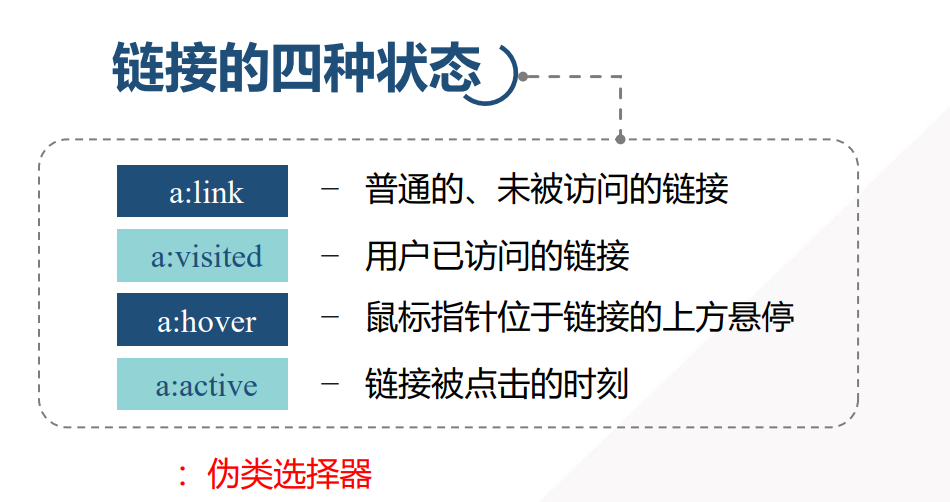

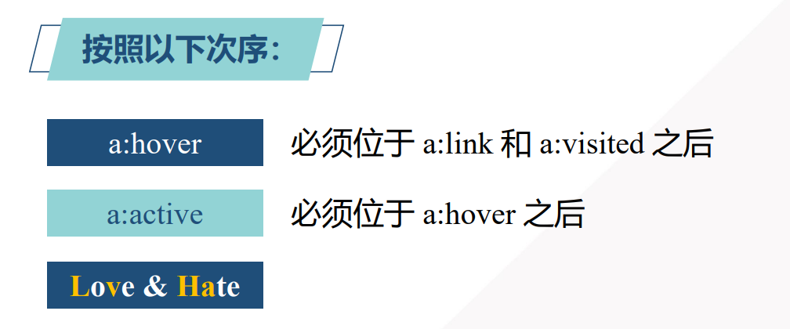

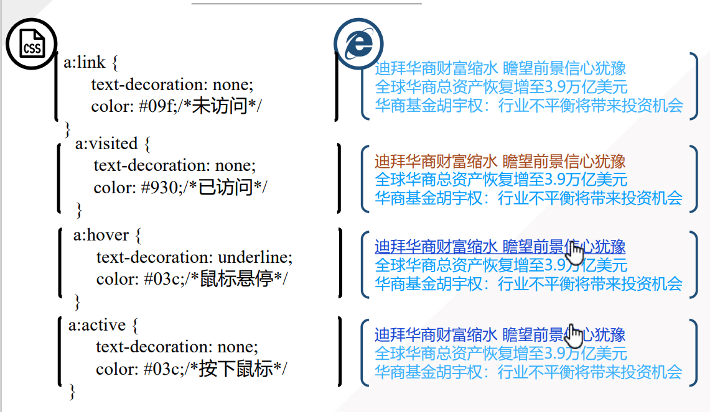

**鼠标悬停放大字体（动画效果）**

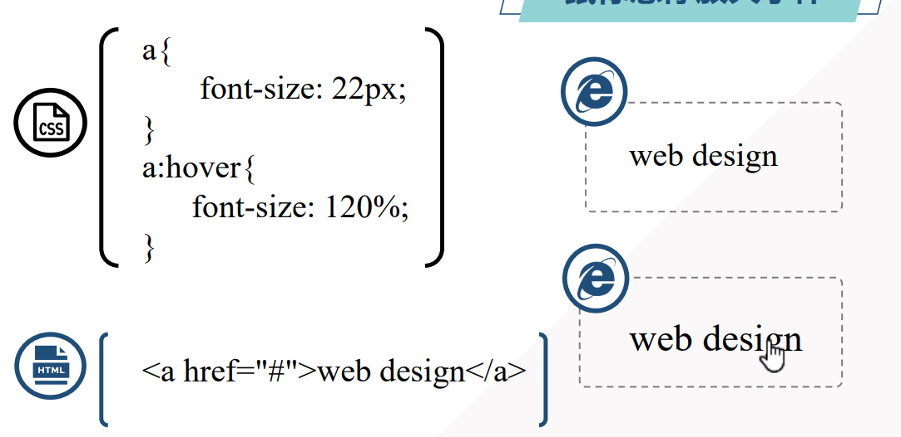

### 列表

| 属性                | 描述                                |
| ------------------- | ----------------------------------- |
| list-style          | 所有用于列表的属性 设置于一个声明中 |
| list-style-image    | 为列表项标志设置图像                |
| list-style-position | 标志的位置                          |
| list-style-type     | 标志的类型                          |

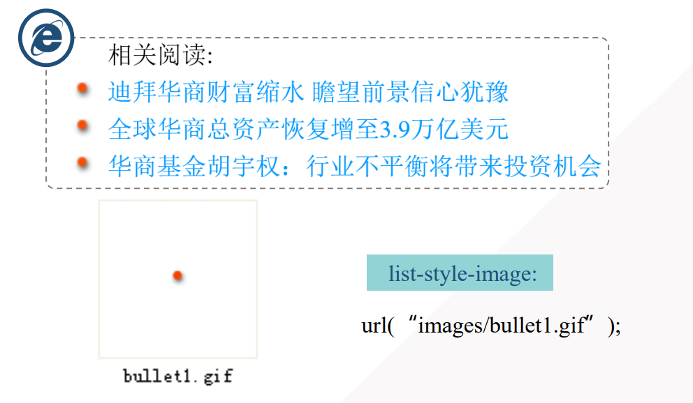

### 表格

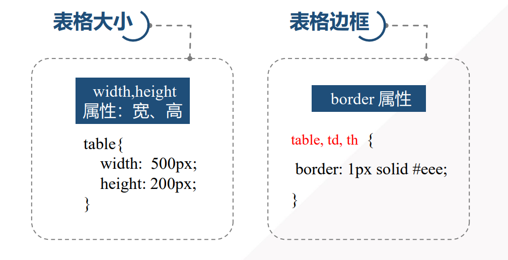

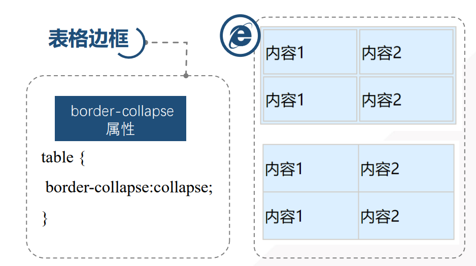

**隔行设置不同颜色（奇偶选择器）**

odd表示奇数，even表示偶数

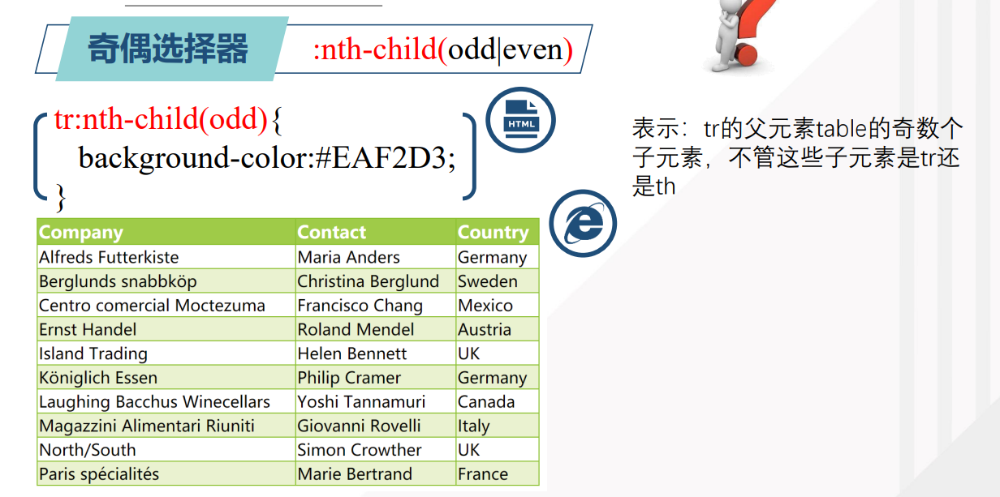

