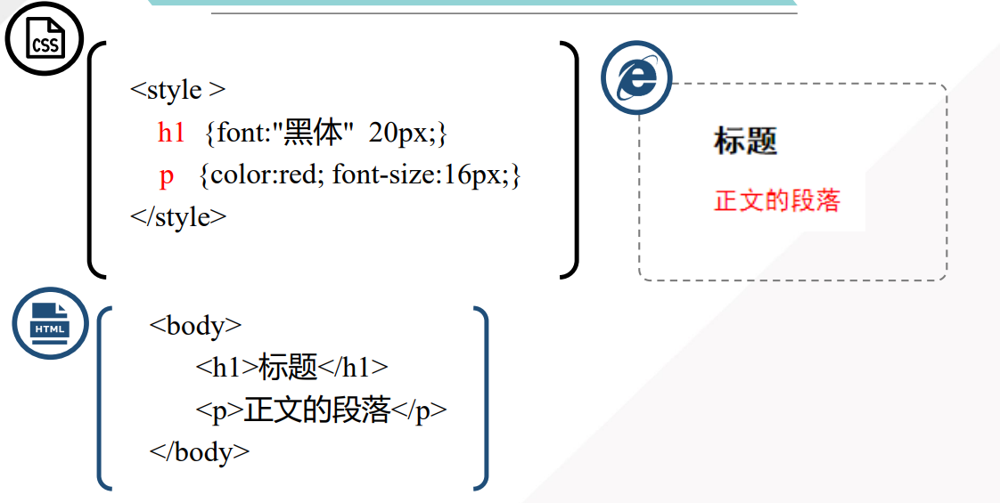
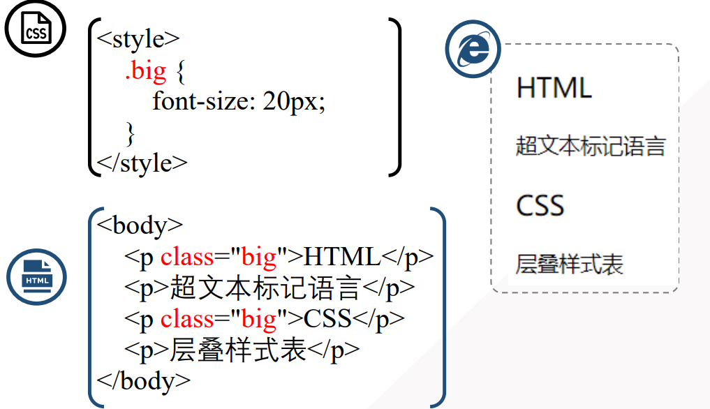
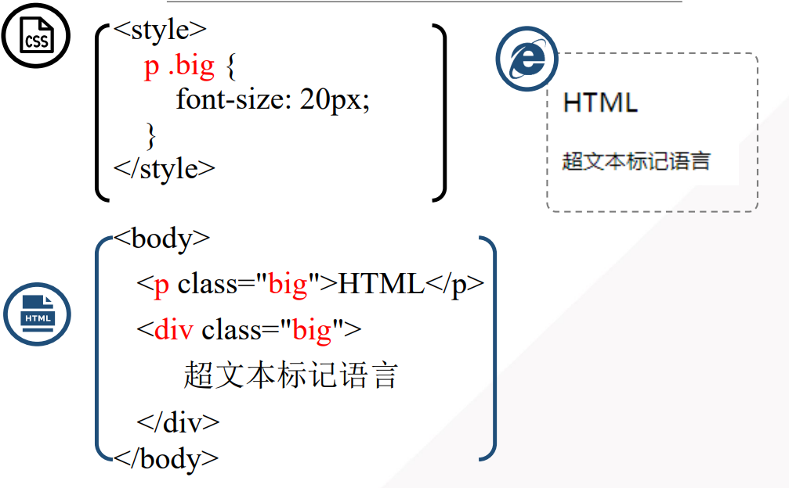
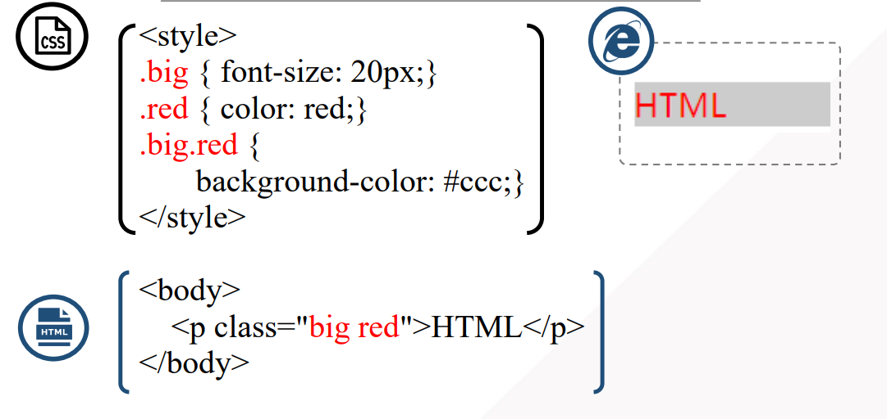
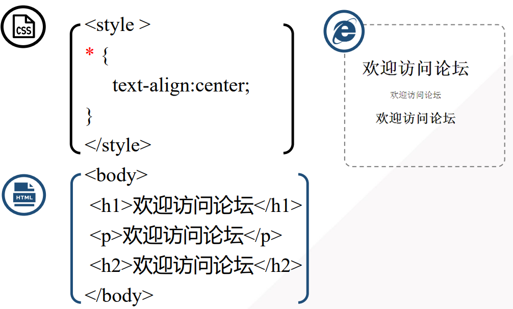
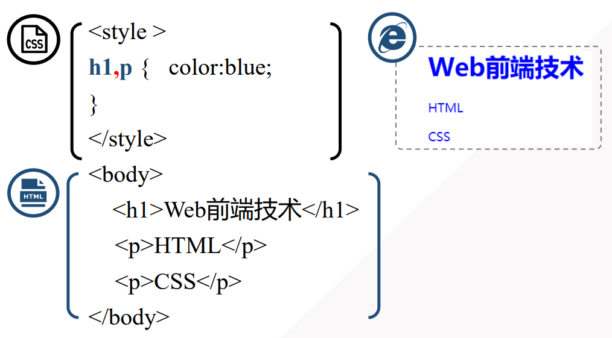
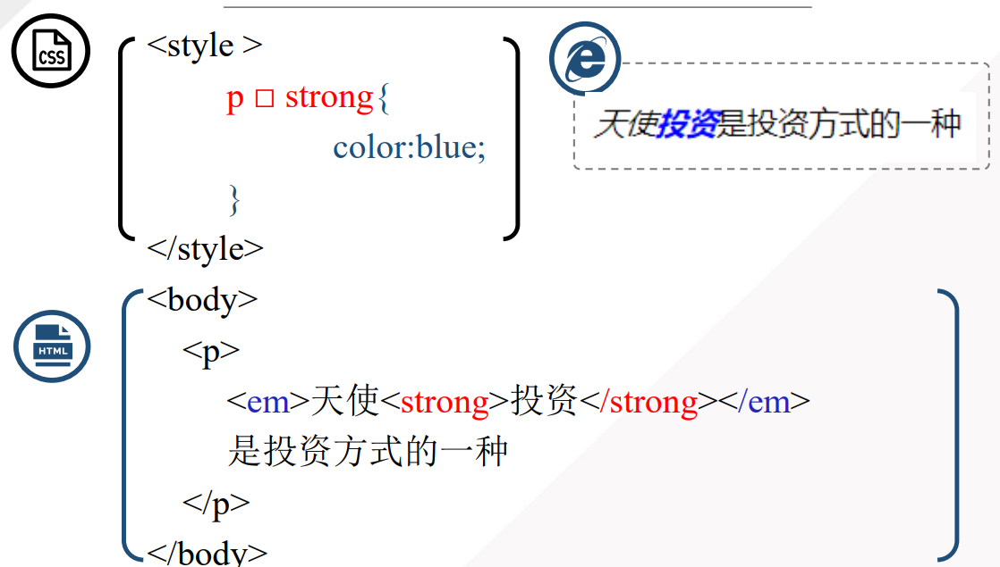
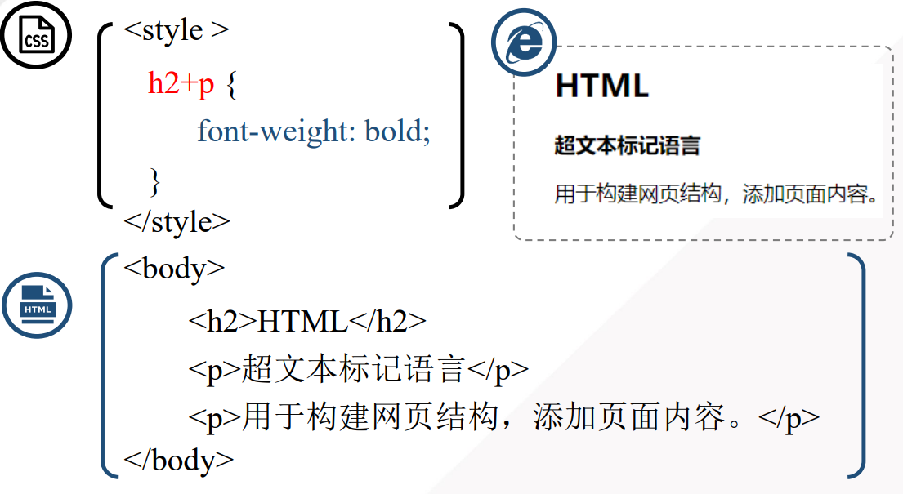
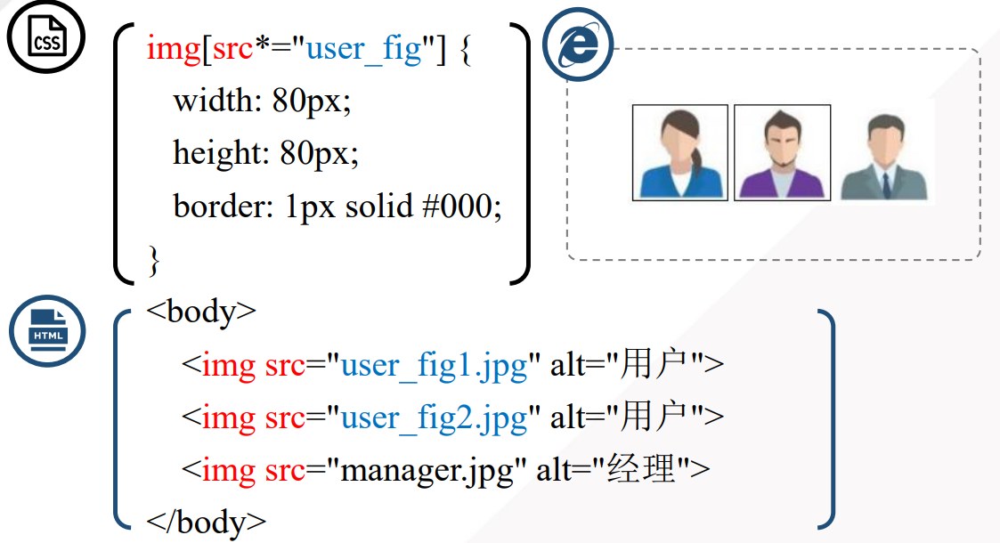

## CSS 选择器

严格来讲，选择器的种类可以分为三种：标签名选择器、类选择器和ID选择器。而所谓的后代选择器和群组选择器只不过是对前三种选择器的扩展应用。而在标签内写入 style="" 的方式，应该是 CSS 的一种引入方式，而不是选择器，因为根本就没有用到选择器。而一般人们将上面这几种方式结合在一起，所以就有了5种或6种选择器了。

最基本的选择器是元素选择器(比如 div),ID 选择器(比如 #header)还有类选择器(比如.tweet)。一些的不常见的选择器包括伪类选择器 (:hover)，很多复杂的 CSS3 和正则选择器，比如：first-child，class ^= “grid-”。CSS选择器具有高效的继承性，引用 Steve Souders 的话， CSS 选择器效率从高到低的排序如下：

| 选择器       | 用法                  |
| ------------ | --------------------- |
| id选择器     | #myid                 |
| 类选择器     | .myclassname          |
| 标签选择器   | div,h1,p              |
| 相邻选择器   | h1+p                  |
| 子选择器     | ul > li               |
| 后代选择器   | li a                  |
| 通配符选择器 | *                     |
| 属性选择器   | a[rel="external"]     |
| 伪类选择器   | a:hover, li:nth-child |

纵使ID选择器很快、高效，但是它也仅仅如此。从 Steve Souders 的 CSS Test 我们可以看出ID选择器和类选择器在速度上的差异很小很小。

### 元素选择器（标签选择器）

标签选择器是指用HTML标记名称作为选择器，按标记名称分类，为页面中某一类标签指定统一的CSS样式。

基本语法格式：标签名{ 属性1：属性值1；属性2：属性值2；}

所有的HTML标记名都可以作为标签选择器，例如a、body、p、h1等等。用标签选择器定义的样式对页面中该类型的所有标签都有效。

标签选择器最大的优势是能快速为页面中同类型的标签统一样式，同时这也是它的缺点，不能设计差异化样式。

### 类选择器

基本语法格式：.类名{ 属性1：属性值1；属性2：属性值2；}

该语法中，**类名即为HTML元素的class属性值**，大多数HTML元素都可以定义class属性。

类选择器最大的优点是可以为元素对象定义单独或相同的样式，而且多个标记可以使用同一个类名，可以实现为**不同类型的标记指定相同的样式**。同时，**一个HTML元素也可以应用多个class类**，设置多个样式，此时多个类名之间需要用空格隔开。

### ID选择器

基本语法格式：#id名{ 属性1：属性值1；属性2：属性值2；}

该语法中，id名即为HTML元素的id属性值，大多数HTML元素都可以定义id属性，**元素的id值是唯一的**，只能对应于文档中某一个具体的元素。

注意：同一个id不允许应用于多个标记，虽然很多浏览器并不会报错，但JavaScript等脚本语言调用id时会出错。另外，id选择器不支持像类选择器那样定义多个值。

### 类选择器与元素选择器

### 多类选择器

### 通用选择器（通配符选择器）

通配符选择器常用 **‘\*’** 号表示，它是所有选择器里作用范围最广的，能**匹配页面中所有的元素**。

基本语法格式：*{ 属性1：属性值1；属性2：属性值2；}

使用该选择器定义样式，清除所有HTML标记的默认边距。但实际开发中**不建议使用通配符选择器**，因为它设置的样式对所有的HTML标记都生效，不管标记是否需要该样式，反而降低了代码的执行速度。

### 选择器分组

### 后代选择器

后代选择器也称包含选择器，用来选择特定元素的后代。如.asideNav li{ }，表示先匹配第二个选择器的元素，并属于第一个选择器内。

语法格式（标签名称1与标签名称2之间有一个空格）：
标签名称1 标签名称2{ 属性1：属性值1；属性2：属性值2；}

### 子元素选择器

子代选择器使用**‘>’**表示，如ul>li{ }，表示匹配第二个选择器，且为第一个选择器的元素的后代。

语法格式：
标签名称1>标签名称2{ 属性1：属性值1；属性2：属性值2；}

注意：
1、只会查找儿子，不会查找其他被嵌套的标签。
2、子元素选择器也可以用其他的id和class选择器来进行查找。
3、子元素选择器也可以通过>符号一直延续下去。

### 相邻兄弟选择器

相邻兄弟选择器使用+号表示，如p+a{ }，表示匹配紧跟第一个选择器并匹配第二个选择器的元素，如紧跟p元素后的a的元素。
如果需要选择紧接在另一个元素后的元素，而且二者有相同的父元素，可以使用相邻兄弟选择器。

语法格式：标签名称1+标签名称2 { 属性1：属性值1；属性2：属性值2；}

兄弟只会影响下面的p标签的样式，不影响上面兄弟的样式。
注意这里的’+’的意义跟’and’意义不一样，兄弟选择器的样式是应用在兄弟元素上，跟参照的元素样式无关，如上例只影响p元素的样式，而不影响h1标签的样式。

### 属性选择器

属性选择器可以**为拥有指定属性的 HTML 元素设置样式**，而不仅限于 class 和 id 属性。

语法格式：[标签名称] { 属性1：属性值1；属性2：属性值2；}

注意：只有在规定了 !DOCTYPE 时，IE7 和 IE8 才支持属性选择器。在 IE6 及更低的版本中，不支持属性选择。

CSS 选择器参考手册：

| **选择器**         | **描述**                                                   |
| ------------------ | ---------------------------------------------------------- |
| [attribute]        | 用于选取带有指定属性的元素                                 |
| [attribute=value]  | 用于选取带有指定属性和值的元素                             |
| [attribute~=value] | 用于选取属性值中包含指定词汇的元素                         |
| [attributeI=value] | 用于选取带有以指定值开头的属性值的元素，该值必须是整个单词 |
| [attribute^=value] | 匹配属性值以指定值开头的每个元素                           |
| [attribute$=value] | 匹配属性值以指定值结尾的每个元素                           |
| [attribute*=value] | 匹配属性值中包含指定值的每个元素                           |

### 混合

- 多个class选择器混用，用空格分开
- id和class混用
- id选择器不可以多个同时使用