# CSS3

w3c制定标准慢，浏览器厂商快速加入新属性的支持，加前缀

w3c确定标准后，全面支持，去掉前缀


| 浏览器内核 | 浏览器            | CSS3前缀 |
| ---------- | ----------------- | -------- |
| Webkit     | Safari <br>Chrome | -webkit- |
| Gecko      | Firefox           | -moz-    |
| Presto     | Opera             | -o-      |
| Trident    | Opera             | -ms-     |


## 圆角边框border-radius


bdrs扩展


具体属性：

- border-top-left-radius               左上角的形状
- border-top-right-radius             右上角的形状
- border-bottom-left-radius        左下角的形状
- border-bottom-right-radius      右下角的形状


取值：

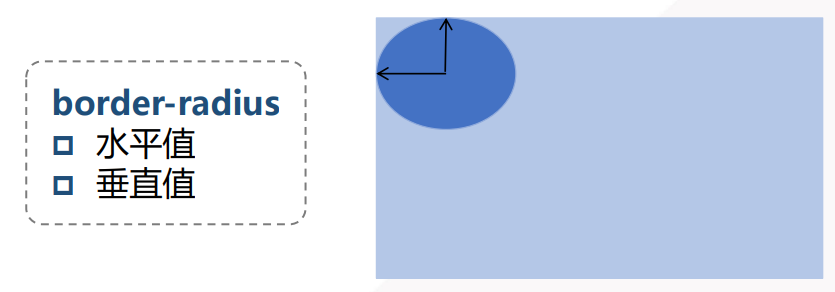


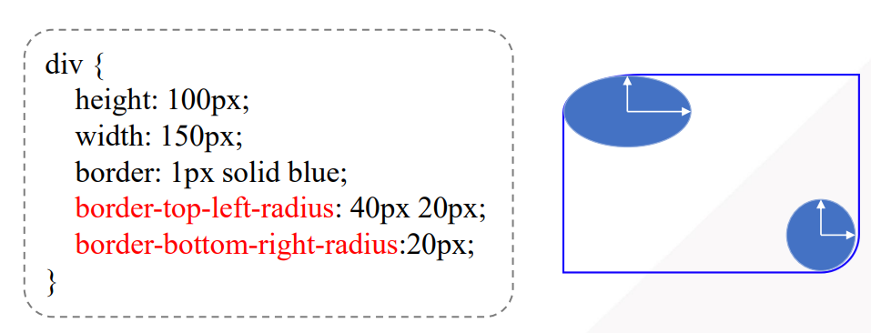


当border-radius为border的一半时，就会形成下面的这种图形


## 阴影box-shadow

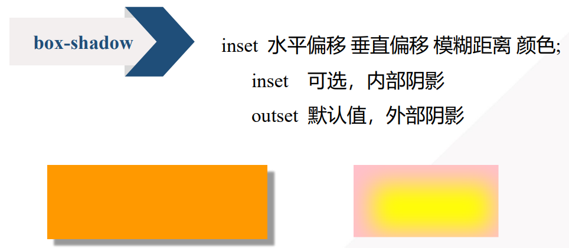


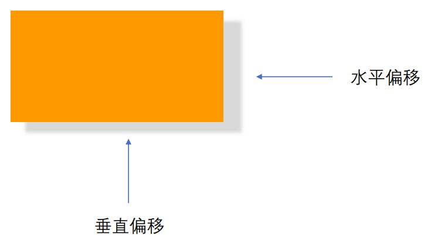


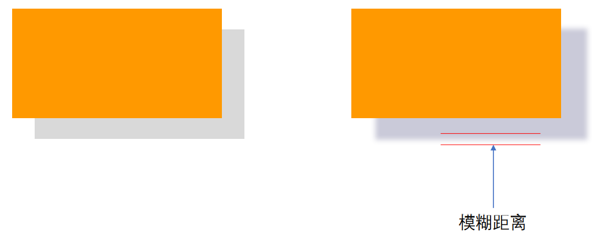


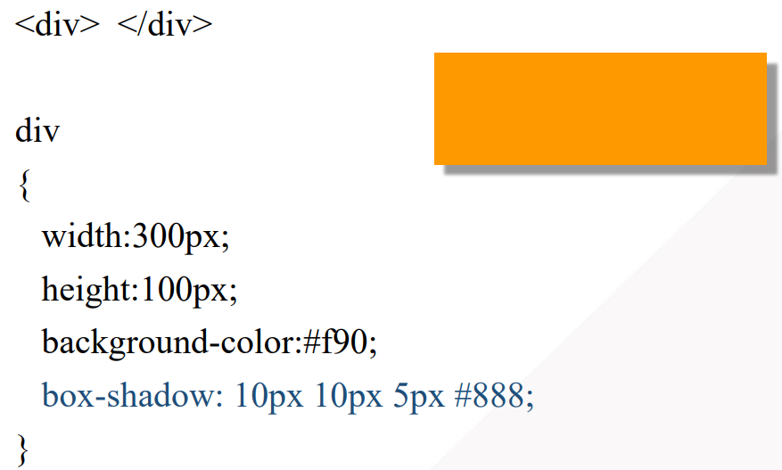


## 文字与文本

### text-shadow属性

**取值：**


其中， 模糊值可以省略


**实例：**


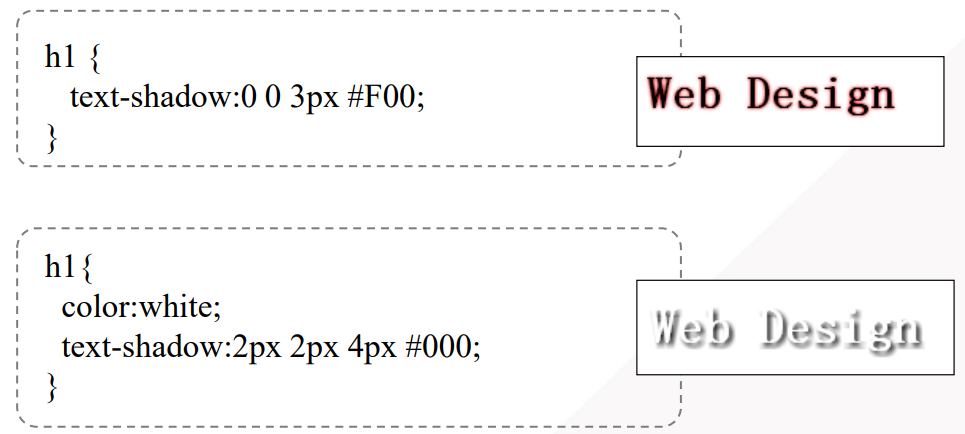


### word-wrap属性

允许长单词、URL强制进行换行。

**取值：**

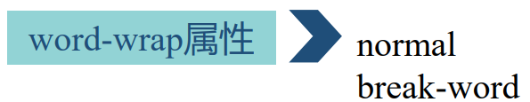


**实例：**

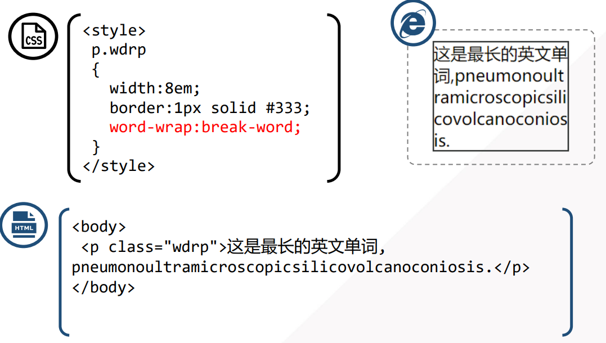


### @font-face规则

**预备知识：**

在word里面，通常文本会有多种字体进行选择。但是，实际上，这些字体的相关文件是windows系统自带的，通常存储在文件夹`C:\Windows\Fonts `里面

**特殊字体文件存储方式：**

- 在使用CSS3之前，通常都是：在客户端安装特殊字体的文件；或者使用带有特殊字体的图片来间接使用特殊字体
- 在CSS里，使用Web字体（即特殊字体，通常在网址项目里创建一个fonts文件夹，用来存放特殊字体），放在服务器上，需要时下载使用


**@font-face使用方式**

利用@font-face规则，定义web字体，并引用需要字体的四种文件格式，确保能在主流浏览器中都能正常显示该字体。

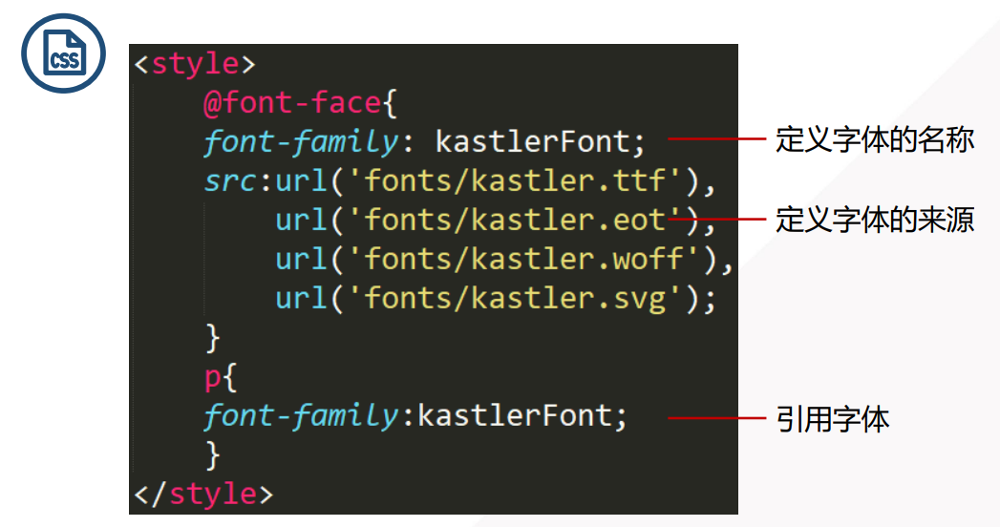


**字体文件格式**

| 字体文件后缀 | 适用于浏览器            |
| ------------ | ----------------------- |
| .TTF或.OTF   | Firefox 、Safari、Opera |
| .EOT         | Internet Explorer 4.0+  |
| .SVG         | Chrome、IPhone          |
| .WOFF        | Chrome、Firefox         |


**字体文件下载及转换**

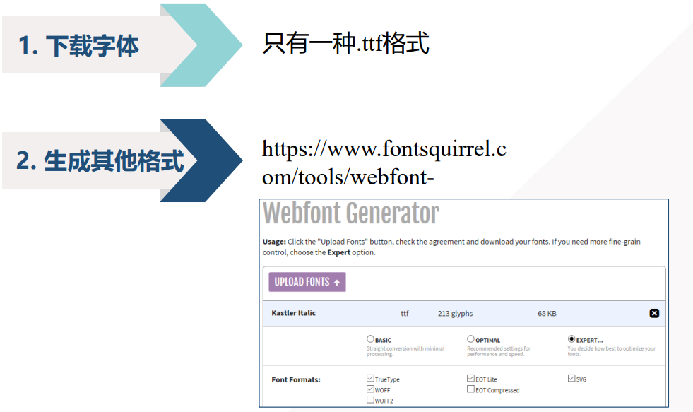


## 2D转换

对元素进行**旋转**、**缩放**、移动、拉伸，主要是通过属性transform属性来实现


**transform属性**

在transform属性，属性值主要有两个函数rotate()  、scale()  。

其中，rotate()  控制元素的旋转，scale()控制元素的缩放


**旋转transform:rotate()**  （trsf扩展）

在rotate()里，deg（degree）表示 角度值，取为正值，表示顺时针旋转。

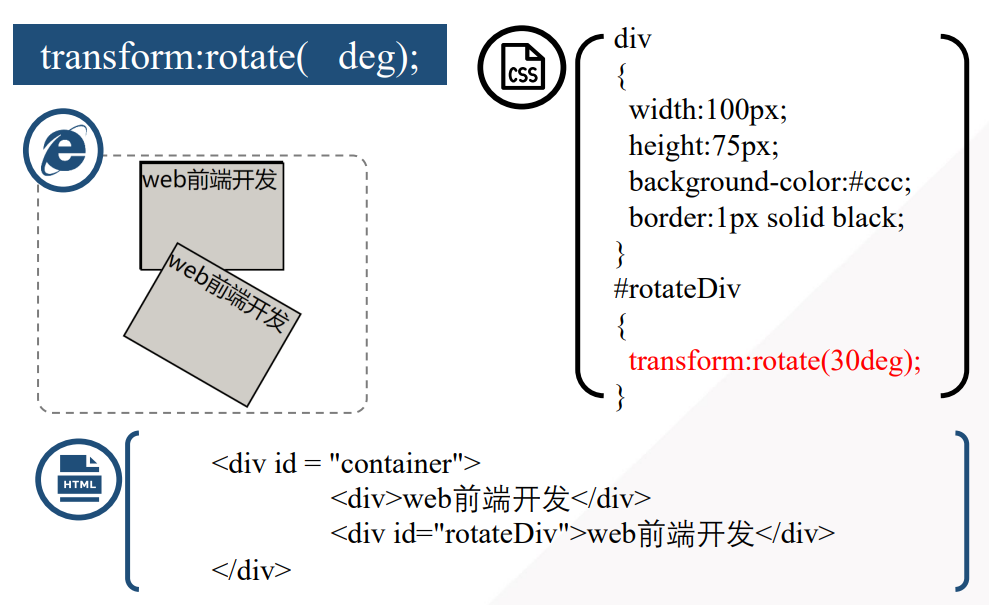


**缩放transform:scale()**

取值如下：

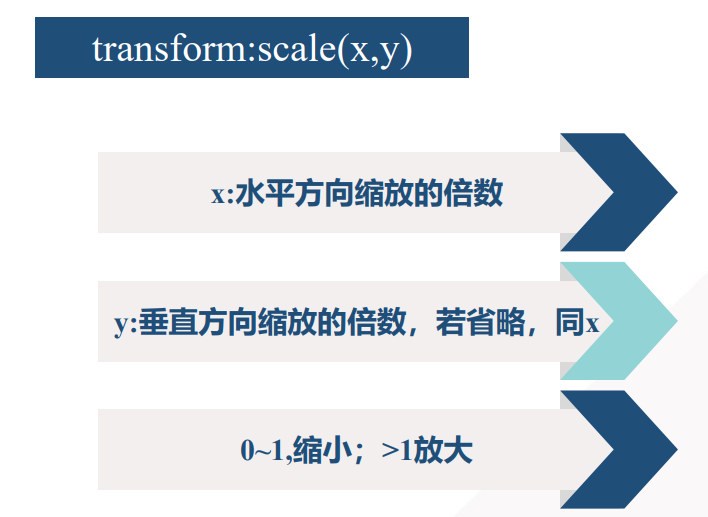

实例：

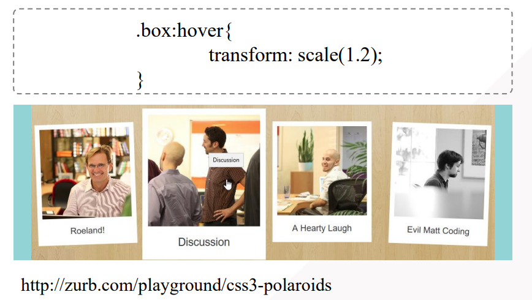


## 过渡与动画

### **过渡transition**

将元素的某个属性从“一个值” 在指定的时间内过渡到“另一个值”

**transition属性取值**：

| 属性                | 取值                                    |
| ------------------- | --------------------------------------- |
| transition          | 属性名 持续时间 过渡方法                |
| transition-property | **属性名\|all**      对哪个属性进行变化 |
| transition-duration | 持续时间                                |
| transition-duration | 过渡使用的方法（**函数**）              |

**transition-timing-function属性取值**

| 值          | 描述   |
| ----------- | ------ |
| linear      | 匀速   |
| ease        | 慢快慢 |
| ease-in     | 慢快   |
| ease-out    | 快慢   |
| ease-in-out | 慢快慢 |


**实例**

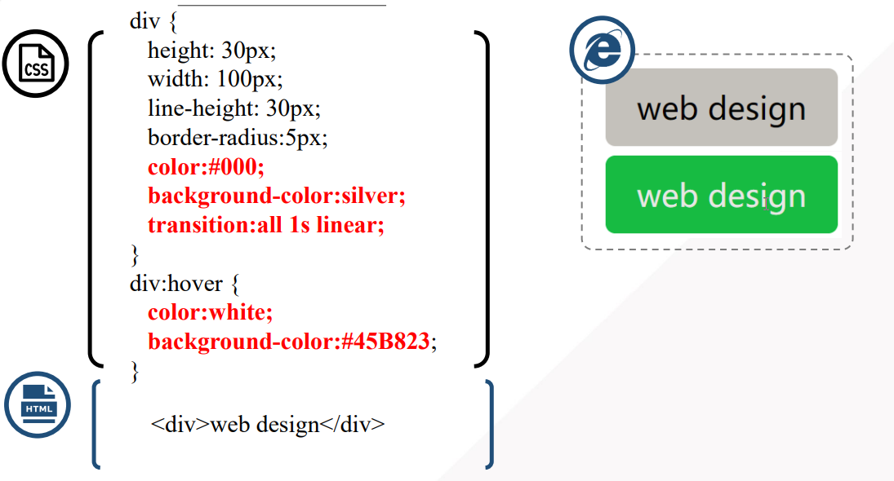


### animation动画

**使用步骤：**

1. 定义动画 （@keyframes规则）
2. 调用动画 （animation属性）


**animation属性取值**

| 值                        | 描述                                 |
| ------------------------- | ------------------------------------ |
| animation                 | 简写                                 |
| animation-name            | 引用 @keyframes 动画的名称           |
| animation-duration        | 动画完成时间                         |
| animation-timing-function | 规定动画的速度曲线。默认是 "ease" 。 |
| animation-play-state      | running \| paused                    |


**实例：**

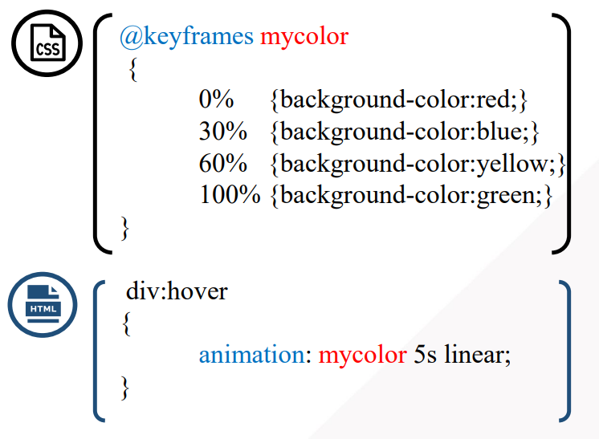


## 3D变换

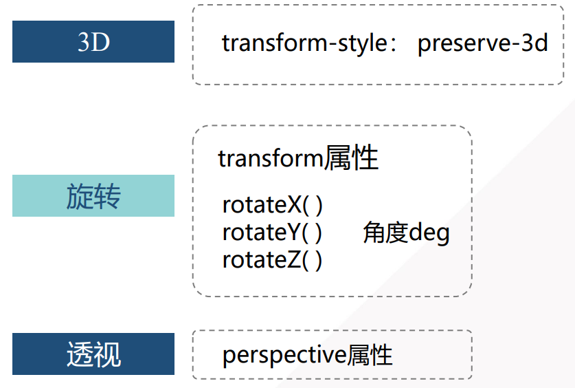


**旋转坐标系理解**

沿着x轴旋转，类似体操运动员抓着杆子旋转

沿着y轴旋转，类似芭蕾舞者旋转

沿着z轴旋转，类似翻跟头

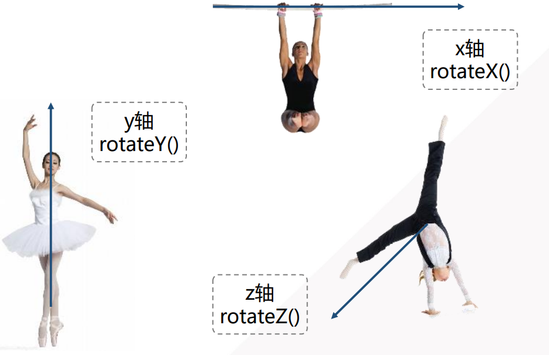


**3D变换理解**


**案例**


html文件：

```html
<div id="stage">
<div class="box x">

</div>
<div class="box y">

</div>
<div class="box z">

</div>
</div>
```


CSS文件：

```css
 /* 舞台，通常用id选择器 */
#stage{
width: 300px;
margin: 100px auto;
 /* 透视关系 */
perspective:100px;
}

 /* 三个父容器，通常用类选择器 */
.box{
width: 100px;
height:100px;
float:left; 
     /* 过渡效果*/ 
transition:linear 1s;
  /* 3D*/  
transform-style: preserve-d;
}

img{
width:100px;
height:75px;
}

.x:hover
{
transform:rotateX(60deg);
}
.y:hover
{
transform:rotateY(60deg);
}
.z:hover
{
transform:rotateZ(60deg);
}
```

