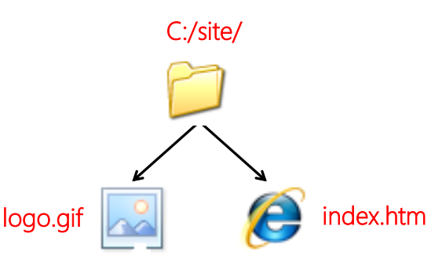
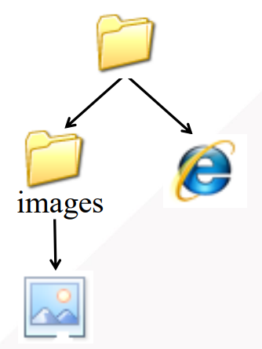
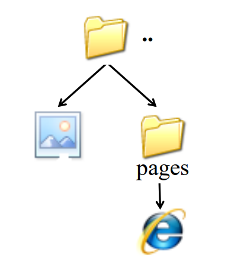
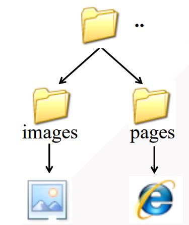
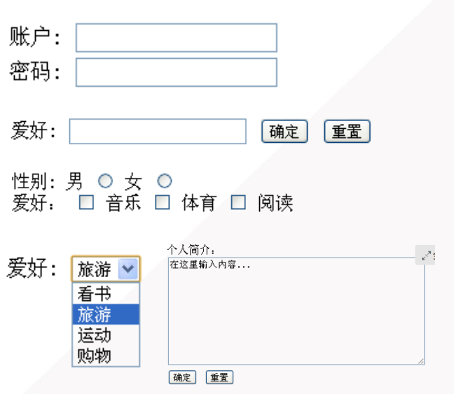

# 一、常见的 HTML 标签

### 标题h1 ~ h6  

一个页面建议只有一个h1


### 段落p、段内换行br、空格字符&nbsp、预留格式pre

`p`用来定义段落。

每个段落自动换行

段落内部文字忽略连续空格， 也不会显示空行，且不会换行。


`br`为单独出现的标签，通常为`<br />`


 ` &nbsp;`  为特殊字符，全小写。 该字符可以用来解决“段落内部文字忽略连续空格”


`pre`定义预格式化的文本，文本中的空格和换行符会被保留。

该标签很适合用来显示计算机代码。


### 行内组合span

组合行内元素，以便通过CSS样式来格式化


### 水平线hr

`<hr />`


### 超链接a

```html
链接到本站点其他网页
<a href=“news.html”> 新闻 </a>

链接到其他站点
<a href=“http://www.baidu.com”> 百度 </a>

虚拟超链接
<a href=“#”>版块2</a>

```


### 区域div

最大用处就是结合CSS样式对每个区域进行排版布局


无序列表ul、有序列表ol、列表项li

快速生成无序列表

`ul>li*3`

快速生成有序列表

`ol>li*10>a[href=:="#"]`


### 图像标签img

**图像格式**：

- GIF： 简单动画、背景透明
- PNG： 无损压缩、透明、交错、动画
- JPG：有损压缩

**透明**：可以给图片指定一种颜色，使其不被显示而成为透明

**交错**：在显示图片的过程中可以从概貌逐渐变化到全貌，看上去也就是清晰度的从小变大


**插入图像img**

 是空标签，它只包含属性，并且没有闭合标签。

定义语法为：

```html

```

源属性src 指 "source"，源属性的值是图像的 URL 地址（即src = 路径 + 文件名）。

替换文本属性alt用来为图像定义一串预备的可替换的文本（当图片无法加载出来时，显示该文本）。替换文本属性的值是用户定义的。


**绝对路径与相对路径**

绝对路径：以根目录为基准

相对路径： 以该文档所在位置为基准


相对路径的具体使用情况如下：




```
前端页面插入图片的代码

```



```
前端页面插入图片的代码

```



```
前端页面插入图片的代码,其中“..”表示上一级目录

```



```
前端页面插入图片的代码,其中“..”表示上一级目录

```


### 表格table 、tr 、 td 、表头单元格th

表格由 <table> 标签来定义。每个表格均有若干行（由 <tr> 标签定义），每行被分割为若干单元格（由 <td> 标签定义）。字母 td 指表格数据（table data），即数据单元格的内容。数据单元格可以包含文本、图片、列表、段落、表单、水平线、表格等等。

快速生成方式

` table>tr*2>td*3`


### 表单form和表单元素

表单是一个区域，采集用户信息。

在表单中，**action**属性是十分重要的属性，属性值为数据处理网页（主要应用于后端处理），表示收集来的信息交由哪一个页面进行处理。


表单元素：文本框、按钮、单选、复选、下拉列表、文本域

```html
文本框，name属性表示表单元素，用于后端读取数据
<input type="text" name="userName" />

密码框
<input type="password" name="userPassword" />

提交按钮,value属性值为按钮上面显示的文字
<input type="submit" value=“提交” name="submitBtn" />

确定按钮
<input type="submit" value=“确定” />

重置按钮
<input type="reset" value=“重置” />

单选框（只能选择一项），name属性相同，value属性表示要提交到后端的数据，checked属性表示该选项是否被默认选中.
性别：
男     <input type="radio" value=“boy” name="gender" checked="checked" />
女     <input type="radio" value=“girl” name="gender"/>

多选框（任意选择多项），name属性可以不同
爱好：
<input type="checkbox" value=“1” name="music" checked="checked" />音乐
<input type="checkbox" value=“2” name="sport" />体育
<input type="checkbox" value=“3” name="reading" />阅读


下拉列表框，selcted="selected":被选择的那一项
<select>
    <option>看书</option>
    <option selcted="selected">旅游</option>
    <option>运动</option>
    <option>购物</option>
</select>


文本域
<textarea rows="行数" cols="列数">文本</textarea>


```


相应的演示效果：



