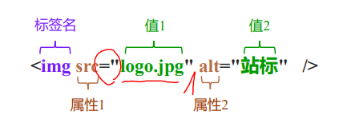
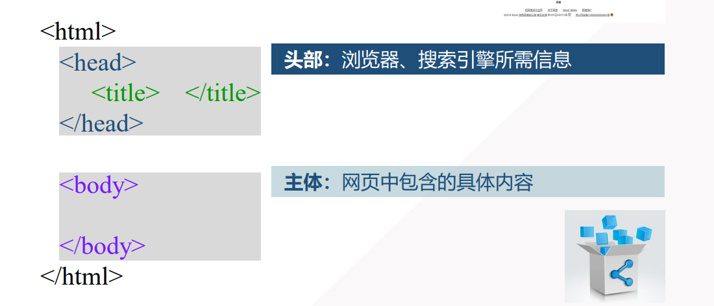
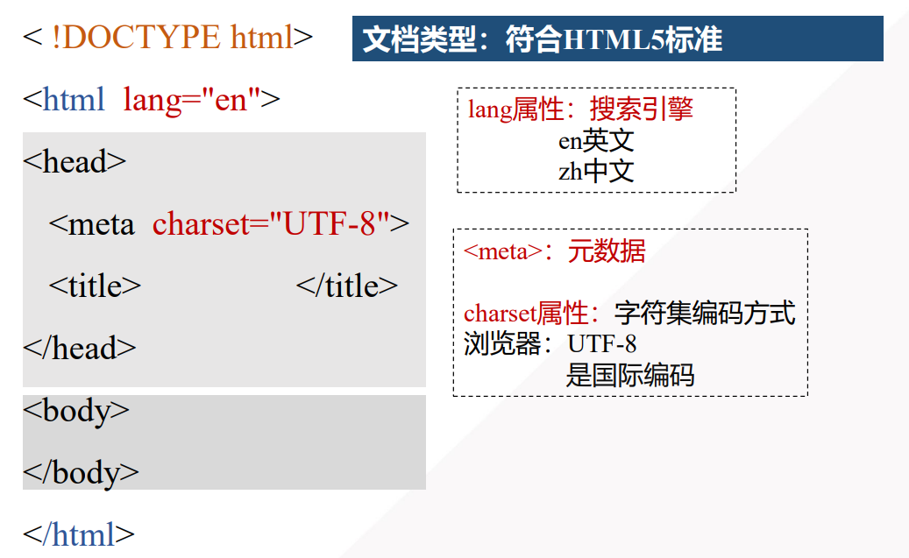
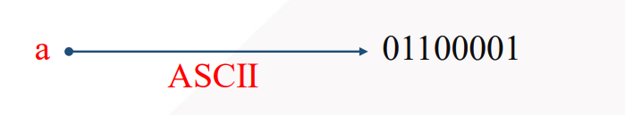
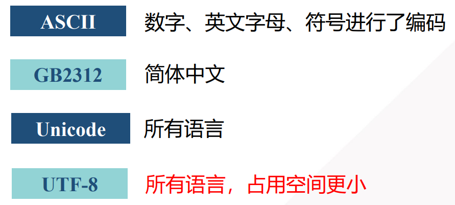

# 一、HTML 概述

### 1.1 **什么是HTML**

HTML 是用来描述网页的一种语言。

- HTML 指的是超文本标记语言 (**H**yper **T**ext **M**arkup **L**anguage)

> 超文本是指通过超链接的形式将文本有机地组织在在一起。标记就是所谓的标签

- HTML 不是一种编程语言，而是一种*标记语言* (markup language)
- 标记语言是一套*标记标签* (markup tag)
- HTML 使用*标记标签*来描述网页
- HTML **不区分大小写**

### 1.2 HTML标签

HTML 标记标签通常被称为 HTML 标签 (HTML tag)。(标签+标签之间的内容 = 元素)

- HTML 标签是由**尖括号**包围的关键词，比如 <html>
- HTML 标签通常是***成对出现***的，比如<b>  和  <b>   ,标签对中的第一个标签是*开始标签*，第二个标签是*结束标签*
- 开始和结束标签也被称为*开放标签*和*闭合标签*

在HTML标签中,要注意缩进以及标签嵌套。

一个标签可能有多个属性,属性先后顺序无关,属性之间用空格隔开。

# 二、HTML 文件结构

### **HTML和HTML5文件结构**

HTML文件的后缀名通常为.htm 或者 .html 。

基本的文件结构为:

HTML5文件结构为:

# 三、字符与编码

### 3.1 **字符与编码**

- 字符(Character):  文字、符号

  > 123 abc 一二三 ！，% @

- 字符集（Charset）: 字符的集合

  > 字符集 —— 语言文字,比如英文字符集、汉字字符集、日文汉字字符集

- 编码： 将字符和二进制码对应起来

常用的字符集主要如下：

## 3.2 乱码问题

当 源文件保存时的编码方式 和 源文件声明 `<meta charset="编码方式">` 不一致时  ，就会出现乱码问题

