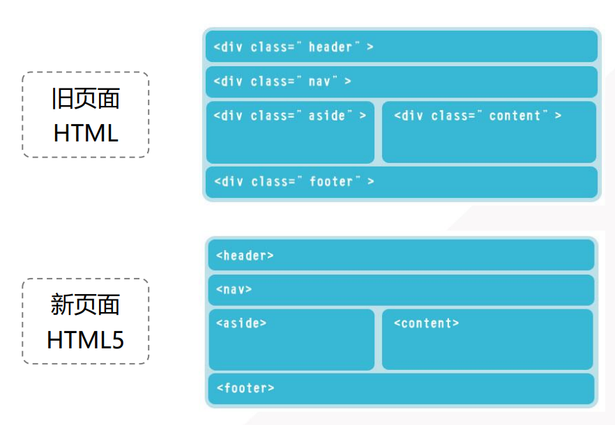

# 一、HTML5 概述

## 1.1 新结构元素

添加了新的元素标签




## 1.2 音频audio

支持.mp3 .wav .ogg 格式音频文件


引用代码：

```html
<!-- 当代码无法正常运行时，会显示“浏览器不支持HTML5:audio”，即标签内自己编写的内容 -->
<audio src="peppa.mp3" controls="controls">
浏览器不支持HTML5:audio
</audio>
```


## 1.3 视频video

支持.mp4 .webm .ogg 格式视频文件

```html
<video id="myVideo" width="420">
  <source src="course.mp4" type="video/mp4" />
  浏览器不支持HTML5:video
</video>
<button onclick="playPause()">播放/暂停
</button>
```

```html
<script>
  var v = document.getElementById("myVideo");
  function playPause() {
    if (v.paused)
      v.play();
    else
      v.pause();
  } 
</script>
```


## 1.4 

## Canvas

具体案例流程为：

（1）定义画布 

```html
<!-- width和height属性值都没有px-->
<canvas id="myCanvas" width="860" height="480">
浏览器不支持画布
</canvas>
```

（2）设置画布样式 

```css
#myCanvas {
border: 1px solid black;
}
```

（3）JS 准备绘图上下文环境 

（4）JS 绘图

```html
<script>
  function draw(event) {
    var canvas = document.getElementById("myCanvas");
    var pen = canvas.getContext("2d");
    pen.moveTo(50, 50);
    pen.lineTo(300, 300);
    pen.lineWidth = 5;
    pen.strokeStyle = "red";
    pen.stroke();
  }
  window.onload = draw;
</script>
```


