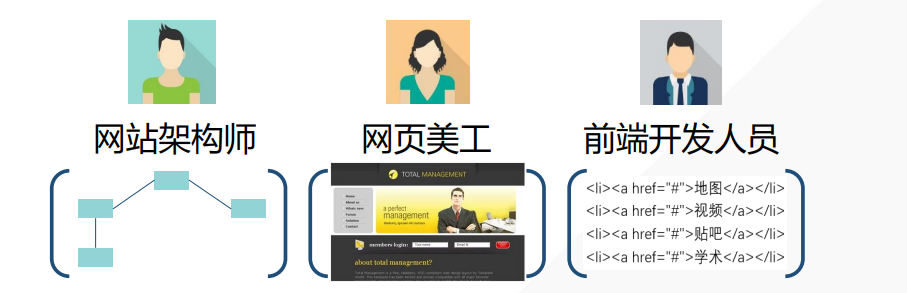
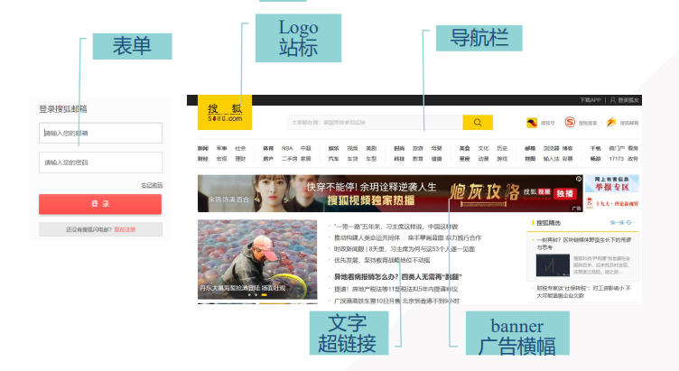
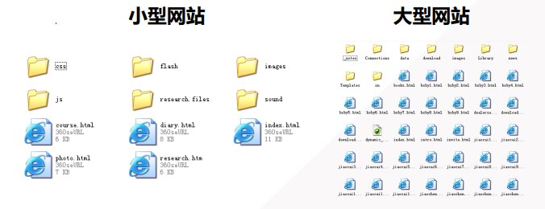
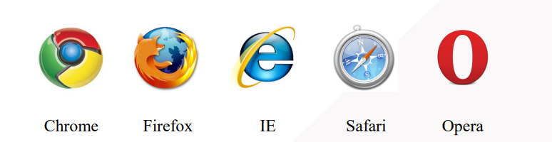
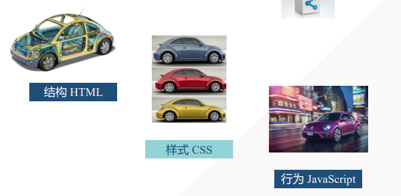

## web前端开发技术概述

web系统：以网站形式呈现，通过浏览器访问，完成一定功能的系统

前端：网页上为用户呈现的部分（后端则是与数据库进行交互，完成数据存取）

开发：编写代码。

### web开发

web前端开发是网站设计中的一个部分。在web开发中，有许多不同种类的人员，负责不同的部分。

- 网站架构师 ：网站架构师实际上就是网站的总体设计师。

- 网页美工：将每个页面（网页）设计出来一个效果图。

- 前端开发人员：将效果图这样的图片转换为代码，即通过编写代码的方式形成一个网页文件。这个网页文件就是可以被浏览器解析和识别的网页文件。

## 网站与网页

网站(web site)：互联网上用于展示特定内容的相关网页的集合。

网页（web page）：网站中的一页，一个网站中的网页通过“超链接” 的方式被组织在一起。

> 进入网站看到的第一个网页(主页homepage或者首页)，主页的 文件名通常是index。

**网页元素**

 

网站风格：网站主题

从开发者角度来看，网站为文件夹，网页则为文件

## 浏览器相关知识

浏览器的主要功能为:解析网页源代码,渲染网页.

市面上现在主要有的浏览器有

其中,浏览器的区别主要有:

## web前端开发技术

### 前端技术构成

**结构 (内容)**: HTML  

从语义的角度，描述页面结构.

**样式 **: CSS

从审美的角度,美化页面

**行为 **: JavaScript

从交互的角度,提升用户体验

举个例子,这前端三件套的作用如图所示.

### 技术标准

前端技术标准制定者：万维网联盟  W3C （**the World Wide Web Consortium**）

W3C标准:  www.w3.org (HTML5 CSS3 JavaScript)

W3C教程:  http://www.w3school.com.cn/