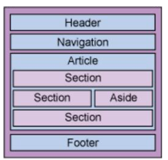

### Web语义化

Web语义化是指使用恰当语义的html标签、class类名等内容，**让页面具有良好的结构与含义，从而让人和机器都能快速理解网页内容。**语义化的web页面一方面可以让机器在更少的人类干预情况下收集并研究网页的信息，从而可以读懂网页的内容，然后将收集汇总的信息进行分析，结果为人类所用；另一方面它可以让开发人员读懂结构和用户以及屏幕阅读器（如果访客有视障）能够读懂内容。

**为什么要Web语义化？**（针对人和机器来讨论）

- 良好的语义化标签，可以减少很多差异化，结构清晰，减少成员间沟通成本，利于团队的开发、维护

- 有利于搜索引擎理解，**SEO** （Search Engine Optimization）搜索引擎优化。

  > SEO也就是Search Engine Optimization，搜索引擎优化。指通过站内优化比如网站结构调整、网站内容建设、网站代码优化等以及站外优化，比如网站站外推广、网站品牌建设等，使网站满足搜索引擎收录排名需求，在搜索引擎中提高关键词排名，从而吸引精准用户进入网站，获得免费流量，产生直接销售或品牌推广。
  >
  > 人可以通过视觉的划分判断内容的语义，而**搜索引擎只能通过爬取网页标签等代码来判断内容的语义**。得到搜索引擎的有效爬取，是提高网站流量的有效方法之一。要使页面尽可能地对搜索引擎友好，所以就要尽可能地使标签和内容语义化。

- 容易兼容不同设备

- 在页面去掉或样式丢失的时候，能让页面呈现清晰的结构。html的一些标签，例如h1（粗体）、 strong（加粗）、em（斜体），通过一些默认的样式，可以使**页面即使在缺失CSS样式修饰时也能呈现清晰的结构**。

- 屏幕阅读器（如果访客有视障）会完全根据你的标记来“读”你的网页，便于无障碍阅读。

**Web语义化的分类**

web语义化应该是样式与结构分离的结果，重构中的语义化包含HTML标签语义化和CSS命名语义化，HTTP的语义化是针对HTTP协议来说。

- **HTML标签语义化**

HTML为网页文档内容提供上下文结构和含义。对于HTML体系而言，Web语义化是指使用语义恰当的标签，使页面有良好的结构，让页面元素有含义，便于被浏览器、搜索引擎解析。通常我们所说的HTML应该是完全脱离表现信息的，其中的标签应该都是语义化地定义了文档的结构。

例如：为了SEO，我们会选择 h1标签来突出标题，用strong标签来突出关键字，这其实就是语义化的体现。**SEO的原理其实是分析源码来体现或猜测网站要表达的内容。**

根据应用场景，一些**常用的标签元素**有：

​            em(强调，斜体，无语义)  strong（重点强调、粗体、无语义） 标签

​             自定义列表dl   列表项dt    描述dp 标签

HTML 规范其实一直在往语义化的方向上努力，许多元素、属性在设计的时候，就已经考虑了如何让各种用户代理甚至网络爬虫更好地理解 HTML 文档。

HTML5 更是在之前规范的基础上，将所有表现层的语义描述都进行了修改或者删除，增加了不少可以表达更丰富语义的元素，也出现很多可以替代div元素的更具象的标签。

一个经典的页面结构如图：

- **CSS命名语义化**

CSS语义就是class和ID命名的语义。class属性作为HTML与CSS衔接的纽带，其本意是用来描述元素内容的。指用易于理解的名称对 HTML 标签附加的class或id命名。如果说HTML语义化标签是给机器看的，那么CSS命名的语义化就是给人看的。良好的CSS命名方式减少沟通调试成本，易于理解。

# 参考资料

[web语义化](https://zhuanlan.zhihu.com/p/25493886)