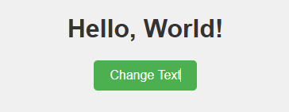

[TOC]

##  一、JavaScript 脚本添加方式

在 HTML 文件中使用 JavaScript 代码主要有以下三种方式：

- **内联 JavaScript**：适用于简单、快速的事件处理，代码直接绑定在 HTML 元素上，但不适合复杂或大量的 JavaScript 逻辑。
- **内嵌 JavaScript**：适用于代码量适中的情况，能够将 JavaScript 和 HTML 放在同一个文件中，便于快速开发。
- **外部引用 JavaScript**：适合于大型项目，能够提高代码的复用性和维护性，同时支持浏览器缓存，性能更优。


### 1.1 内联 JavaScript

内联 JavaScript 是将 JavaScript 代码直接写在 HTML 元素的事件属性中。例如，使用 `onclick` 属性来处理按钮点击事件。

```html
<!DOCTYPE html>
<html lang="en">
<head>
  <meta charset="UTF-8">
  <title>Inline JavaScript Example</title>
</head>
<body>
  <button onclick="alert('Button clicked!')">Click me</button>
</body>
</html>
```


### 1.2 内嵌 JavaScript

内嵌 JavaScript 是将 JavaScript 代码放在 HTML 文件中的 `<script>` 标签内，通常放置在 `<head>` 或 `<body>` 中。

`<script>`允许出现网页的任意位置处

```html
<!DOCTYPE html>
<html lang="en">
<head>
  <meta charset="UTF-8">
  <title>Embedded JavaScript Example</title>
</head>
<body>
  <button onclick="showMessage()">Click me</button>

  <script>
    function showMessage() {
      alert('Button clicked!');
    }
  </script>
</body>
</html>

```


### 1.3 外部引用 JavaScript

外部引用 JavaScript 是将 JavaScript 代码放在独立的 `.js` 文件中，然后通过 `<script>` 标签引用该文件。这种方法有助于分离内容和行为，提高代码的可维护性和重用性。

- 创建 script.js 文件

  ```javascript
  function showMessage() {
    alert('Button clicked!');
  }
  ```

- 在页面中引入  script.js 文件    ,  `<script src="js文件路径"></script>`

  ```html
  <!DOCTYPE html>
  <html lang="en">
  <head>
    <meta charset="UTF-8">
    <title>External JavaScript Example</title>
    <script src="script.js"></script>
  </head>
  <body>
    <button onclick="showMessage()">Click me</button>
  </body>
  </html>
  
  ```

  >  注意：`<script src=""></script>`该对标记中，是**不允许出现任何内容**的


## 二、外部引用 JavaScript 的注意事项

为了提高页面的加载速度和用户体验，建议优化 javascript 加载顺序（先加载页面内容，再加载 JavaScript）。**优化 javascript 加载顺序**的实现方式主要有：

- 一般来说，建议将 `<script>` 标签放在页面底部（即在 `</body>` 之前），以确保页面内容先加载，然后再加载和执行 JavaScript。这可以

  ```html
  <!DOCTYPE html>
  <html lang="en">
  <head>
    <meta charset="UTF-8">
    <title>Script at Bottom</title>
  </head>
  <body>
    <h1>Hello, World!</h1>
    <p>This is an example.</p>
    <script src="script.js"></script>
  </body>
  </html>
  
  ```

- 另一种方法是使用 `defer` 或 `async` 属性来控制脚本加载和执行的时机。

  ```html
  <!DOCTYPE html>
  <html lang="en">
  <head>
    <meta charset="UTF-8">
    <title>Script Loading Example</title>
    <script src="script.js" defer></script>
    <!-- 或者 -->
    <script src="script.js" async></script>
  </head>
  <body>
    <button onclick="showMessage()">Click me</button>
  </body>
  </html>
  ```

  


## 三、 JavaScript 脚本使用案例

### 3.1 编写代码

创建 `hello.html` 文件，具体内容如下：

```html
<!DOCTYPE html>
<html lang="en">
<head>
    <meta charset="UTF-8">
    <meta name="viewport" content="width=device-width, initial-scale=1.0">
    <title>Simple JavaScript Example</title>

    <style>
        /* 设置页面背景颜色 */
        body {
            background-color: #f0f0f0;
            font-family: Arial, sans-serif;
        }

        /* 设置标题的样式 */
        h1 {
            color: #333;
            text-align: center;
            margin-top: 50px;
        }

        /* 设置按钮的样式 */
        button {
            display: block;
            margin: 20px auto;
            padding: 10px 20px;
            font-size: 16px;
            background-color: #4CAF50;
            color: white;
            border: none;
            border-radius: 5px;
            cursor: pointer;
        }

        /* 设置按钮的 hover 效果 */
        button:hover {
            background-color: #45a049;
        }
    </style>

</head>
<body>

    <h1 id="message">Hello, World!</h1>  <!-- 显示初始文本 -->
    <button id="changeTextButton">Change Text</button>  <!-- 按钮 -->

    <script>
        // 获取按钮和文本元素
        const button = document.getElementById('changeTextButton');
        const message = document.getElementById('message');

        // 为按钮添加点击事件监听器
        button.addEventListener('click', function() {
            // 修改文本内容
            message.textContent = 'You clicked the button!';
        });
    </script>

</body>
</html>
```


### 3.2 测试运行效果

页面加载时，标题显示 `Hello, World!`。用户点击按钮后，标题文本会变为 `You clicked the button!`。




### 参考资料

[什么是 JavaScript？ - 学习 Web 开发 | MDN](https://developer.mozilla.org/zh-CN/docs/Learn/JavaScript/First_steps/What_is_JavaScript)