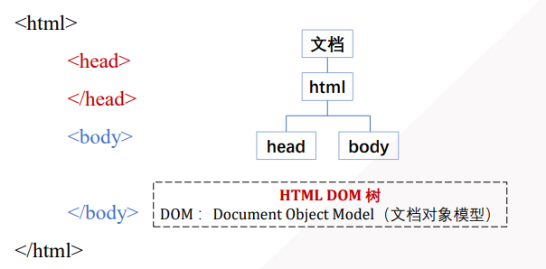
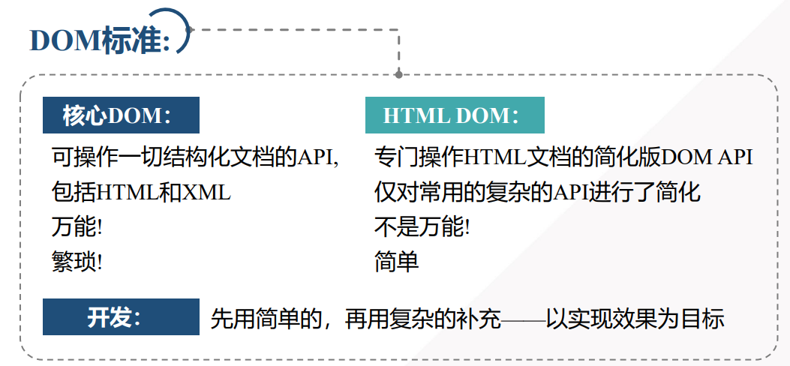
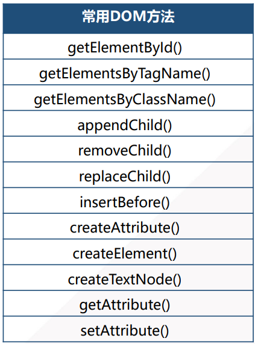
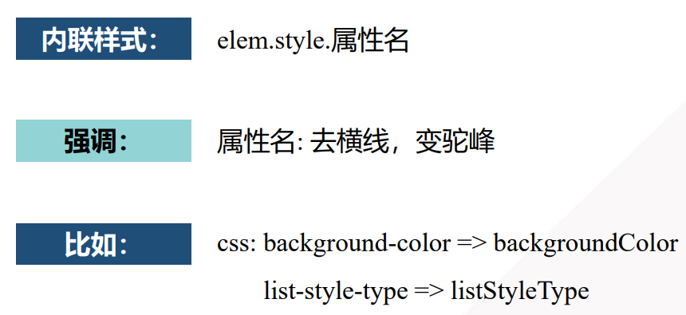

## DOM

### 什么是 DOM

DOM （document object model）是 W3C（万维网联盟）的标准， 是中立于平台和语言的**接口**，它允许程序和脚本**动态地访问和更新**文档的内容、结构和样式。

实际上，DOM是对网页进行增删改查的操作。DOM 相关内容包括：

- **节点操作**：如获取、创建、删除、替换节点。
- **属性操作**：如获取、设置元素属性。
- **事件处理**：如 `addEventListener`、事件冒泡和捕获。







### 常用的DOM操作和方法

常用的DOM操作

- 查找节点
- 读取节点信息
- 修改节点信息
- 创建新节点
- 删除节点


**常用DOM方法：**




## 节点操作

### DOM查找

#### 1、按id属性，精确查找一个元素对象

**语法：**`var elem=document.getElementById("id")`  **效率非常高**

> 强调：
>
> 何时：
>
> 问题：


#### 2、按标签名找

**语法：**`var elems=parent.getElementsByTagName("tag");` 查找指定parent节点下的所有标签为tag的子代节点

> 强调：
>
> -  可用在任意父元素上
> -  不仅查直接子节点，而且查**所有**子代节点
> -  返回一个动态集合。（即使只找到一个元素，也返回集合）必须用<font color='red'> [0] </font>,取出唯一元素
>
> 问题：不但找直接，而且找所有子代。（查找范围有点大，不太准确）


实际案例

```html
<ul id="myList">
  <li id="m1">首页</li>
  <li id="m2">企业介绍</li>
  <li id="m3">联系我们</li>
</ul>
```

```css
var ul = document.getElementById('menuList');
var list = ul.getElementsByTagName('li');
console.log(list );
```


#### 3、通过name属性查找

**语法：**`document.getElementsByName(‘name属性值’)`   可以返回DOM树中具有指定name属性值的所有子元素集合。


实际案例

```html
<form id="registerForm">
  <input type="checkbox" name="boy"/>
  <input type="checkbox" name="boy"/>
  <input type="checkbox" name="boy"/>
</form>
```

```css
var list = document.getElementsByName(‘boy');
console.log( typeof list );
```

 


#### 4、通过class查找

**语法：**`var elems=parent.getElemnetsByClassName("class");`  查找父元素下指定class属性的元素  （有兼容性问题: IE9+）

**实际案例：**

```html
<div id="news">
  <p class="mainTitle">新闻标题1</p>
  <p class="subTitle">新闻标题2</p>
  <p class=" mainTitle ">新闻标题3</p>
</div>
```

```css
var div = document.getElementById('news');
var list = div.getElementsByClassName('mainTitle');
console.log(list );
```

 

#### 5、通过CSS选择器查找

**1）只找一个元素**

**语法：**`var elem=parent.querySelector("selector")`

> selector支持一切css中选择器
>
> 如果选择器匹配的有多个，只返回第一个


**2）找多个**

**语法：**`var elem=parent.querySelector("selector")`

> selector API 返回的是非动态集合


#### 随机验证码

```html
<!DOCTYPE html>
<html lang="en">
<head>
	<meta charset="UTF-8">
	<title>Document</title>
	<style>
	#code{
		width: 100px;
		height: 50px;
		background-color: lightblue;
		font-size: 44px;
		letter-spacing: 5px;
	}
	</style>
</head>
<body>
	<script>
	function createRandCode(){
		var chars=['a','b','c','1','2','3'];
		var randcode="";
		for(var i=0;i<3;i++){//3位随机码
			var randpos =Math.floor(Math.random() * chars.length);	//视频修改，以这个为准		
			randcode+= chars[randpos];
		}
		document.getElementById("code").innerHTML=randcode;
	}
	</script>
	<div id="code"></div>
	<button onclick="createRandCode()">验证码</button>
</body>
</html>
```


### DOM修改

核心DOM的4个操作

#### 1、读取属性值（2种方法）

- 先获得属性节点对象，再获得节点对象的值:

  ```javascript
  var attrNode=elem.attributes[下标/属性名];
  var attrNode=elem.getAttributeNode(属性名)
  attrNode.value——属性值
  ```

- 直接获得属性值

  ```javascript
  var value=elem.getAttribute("属性名");
  ```

  

#### 2、修改属性值

**语法：**`elem.setAttribute("属性名", value);`

```javascript
var h1 = document.getElementById(“a1");
h1.setAttributeNode(“name”，zhangji);

```


#### 3、判断是否包含指定属性

**语法：**`var bool=elem.hasAttribute("属性名")`

element.hasAttribute('属性名')   //true或false

```javascript
document.getElementById('bt1').hasAttribute('onclick');

```


#### 4、移除属性

**语法：**`elem.removeAttribute("属性名")`

实例：

```html
<a id=“alink" class="slink" href=
"javascript:void(0)" onclick="jump()">百度搜索</a>


var a = document.getElementById('alink');
a.removeAttribute('class');

```


#### 修改样式




### DOM添加

#### 添加元素的步骤

##### 1）创建空元素

**语法：**`var elem=document.createElement("元素名")`

```javascript
var table = document.createElement('table');
var tr= document.createElement('tr');
var td= document.createElement('td');
var td= document.createElement('td');
console.log( table );

```


##### 2）设置关键属性

设置关键属性：

```html
a.innerHTML="go to tmooc"
a.herf="http://tmooc.cn";
<a href="http://tmooc.cn">go to tmooc</a>
```

设置关键样式：

```javascript
a.style.opacity = "1";
a.style.cssText = "width: 100px;height: 100px";
```


##### 3）将元素添加到DOM树

**语法：**`parentNode.appendChild(childNode)`   可用于将为一个父元素追加最后一个子节点

```javascript
var div = document.createElement( 'div' );
var txt = document.createTextNode('版权声明');
div.appendChild(txt);
document.body.appendChild(div);

```


**语法：**`parentNode.insertBefore(newChild, existingChild)`   用于在父元素中的指定子节点之前添加一个新的子节点

```javascript
<ul id="menu">
   <li>首页</li>
    <li>联系我们</li>
</ul>

var ul = document.getElementById('menu');
var newLi = document.createElement('li');
ul.insertBefore(newLi, ul.lastChild);

```


#### 添加元素优化

尽量少的操作DOM树

为什么：每次修改DOM树，都导致重新layout


为了避免layout，我们应该

- 如果同时创建父元素和子元素时，建议在内存中先将 子元素添加到父元素，再将父元素一次性挂到页面
- 如果只添加多个平级子元素时, 就要将所有子元素， 临时添加到文档片段中。再将**文档片段**整体添加到页面


**文档片段：**内存中，临时保存多个平级子元素的 虚拟父元素 用法和普通父元素完全一样

**文档片段使用方式：**

1. 创建片段   `var frag=document.createDocumentFragment();`
2. 将子元素临时追加到frag中  `frag.appendChild(child);`
3. 将frag追加到页面   ` parent.appendChild(frag);`   强调： append之后，frag自动释放，不会占用元素


