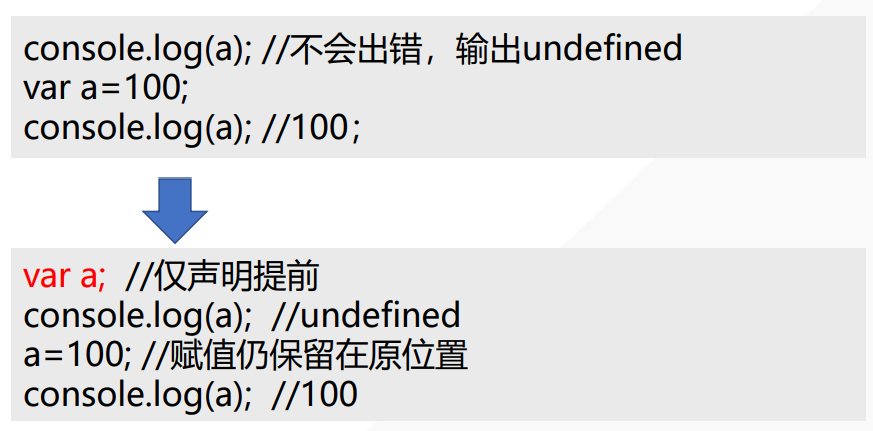
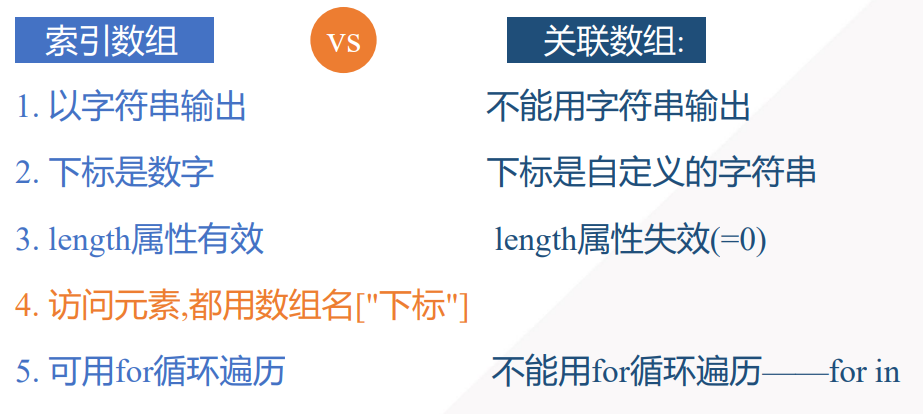
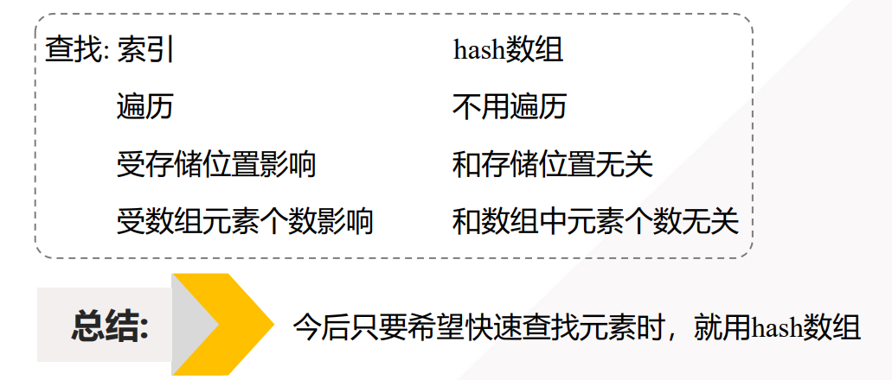

## JS语法规范

**1、语句**

- 允许被JS引擎所解释的代码
- 使用 分号 来表示结束，例如`console.log();` 、  `document.write();`
- 大小写敏感。 `console.log();` 正确示范 、  ``Console.log();``错误示范
- 英文标点符号
- 由表达式、关键字、运算符 组成

**2、注释**

单行注释: // 、

多行注释: /* */

 sublime text中 Ctrl+/


## 变量

### 什么是变量

就是内存中的一段存储空间 

变量的名：内存空间的别名，可以自定义 

变量的值：保存在 内存空间中的数据


### 变量的声明

**声明**：`var 变量名;`    或者 `let 变量名；`

**赋值**：变量名=值;

> 声明过程中，**尽量不要省略 var 关键字，否则声明的 是"全局变量"**

**一次性声明多个变量并赋值**:var 变量名1,变量名2,...变量名n;

ex:  `var stuName=“PP.XZ",stuAge=25, stuHeight;`


var 和 let 的区别查看 [如何存储你需要的信息——变量 - 学习 Web 开发 | MDN (mozilla.org)](https://developer.mozilla.org/zh-CN/docs/Learn/JavaScript/First_steps/Variables)


### 变量命名规范

1. 不允许使用JS的关键字和保留关键字
2. 由字母、数字、下划线以及$组成
3. 不能以数字开头
4. 尽量见名知意
5. 可以采用"驼峰命名法


### 变量的使用

变量声明后，从未赋值，称之为 **未经初始化变量**

变量未被定义过，直接打印或使用,`console.log(stuHeight);` 结果为错误


**变量的存取操作**：

1、获取变量的值-GET操作

```javascript
var userPwd = '123456' ;
console.log( userPwd );
document.write( userPwd );

// 创建新变量，赋值为已有变量的值
var newPwd = userPwd;
```

2、保存(设置)变量的值 - SET操作

```javascript
var oldPwd = '123' ;
oldPwd = '456' ;

//这条语句对于变量newPwd是GET操作；对于变量oldPwd是SET操作
oldPwd = newPwd;
```


## 数据类型

数据类型主要分为：原始类型(**基本类型**)  、 **引用类型**

### 原始类型(**基本类型**)分类

**1、数字类型**

**number类型**可以表示32位的整数（4字节）以及64位的浮点数（8字节）


**2、字符串类型**

表示一系列的文本字符数据
由Unicode字符，数字，标点组成 
Unicode 下所有的 字符，数字，标点 在内存中 都占2字节

> "张".charCodeAt().toString(16) 
> 查看 字符 "张" 的 十六进制 表现方式 
> 结果为：5f20
> \u4e00 : 汉字的起始字符
> \u9fa5 : 汉字的结束字符 
> 转义字符： 1、\n 换行 2、\r 回车 3、\t 一个制表符


**3、布尔类型**

**boolean**类型         作用: 用于表示 条件的结果

除条件判断外，做运算时，true可以当 做1运算，false当做0运算


**4、空**

声明对象未赋值, **null**


**5、未定义**

**undefined**

1、声明变量未赋值 

2、访问对象不存在的属性


### 数据类型转换

**1、隐式转换**

自动转换，由JS在运算过程中，自己进行转换的操作，不需人为参与

**函数**：typeof() 或 typeof

```javascript
var num1 = 15;
var s = typeof(num1); //获取 num1 的数据类型
var s1 = typeof num1; //获取 num1 的数据类型

```

**NaN**：

Not a Number 不是一个数字

**isNaN**(数据) : 判断 数据是否为非数字

注意：所有的数据类型 与 string 做 + 运算时，最后的结果都为 string


**2、转换函数 - 显示转换(强制转换)**

- toString()   将任意类型的数据转换为 string 类型

- parseInt()

  >  整型：Integer 
  >
  >  作用：获取 指定数据的**整数**部分 
  >
  >  语法： var result = parseInt(数据); 
  >
  >  注意：
  >  parseInt ， 从左向右依次转换，**碰到第一个非整数字符，则停止转换**。如果第一个字符就是非整数字符的话，结果为 NaN

- parseFloat()

  > Float ：浮点类型->小数 
  > 作用：将 指定数据转换成**小数 **
  > 语法： var result = parseFloat(数据); 
  > ex : 
  > var result=parseFloat("35.25"); //35.25 
  > var result=parseFloat("35.2你好!");//35.2 
  > var result=parseFloat("你好35.2");//NaN

- Number()

  > 作用：将一个字符串解析为number 
  > 语法：var result=Number(数据);
  > 注意：**如果包含非法字符，则返回NaN**


## 运算符和表达式

运算符：能够完成数据计算的一组符号 比如：+,-,*,/

表达式： 由运算符和操作数所组成的式子叫作表达式， 每个表达式都有自己的值

### 运算符

#### 算数运算符

加(＋)、 减(－)、 乘(*) 、除(/) 、求余(% )

－ 可以表示减号，也可以表示负号，如：x=-y

 + 可以表示加法，也可以用于字符串的连接

% : 取余操作，俗称模     作用：取两个数字的余数     使用场合：1、判断数字的奇偶性  2、获取数字的最后几位

++ : 自增，在数值的基础上，进行+1操作

 -- : 自减，在数值的基础上，进行-1操作


#### 关系运算符

判断数据之间的大小关系，关系表达式的运算结果为 boolean类型(true 或 false)

- `>`  `<`  `>=`   `<=`

- 判断等于`==`   不等于`!=`

  > 注意：**不比较类型，只比较数值**

- 全等`===`  不全等 `1==`

  >注意：**除数值之外，连同类型也会一起比较**

- isNaN(数据)

  > isNaN()会抛开数据类型来判断数据是否为数字 
  >
  > 如果 数据 是数字类型，则返回 false 
  >
  > 如果 数据 不是数字类型，则返回 true


#### 逻辑运算符

逻辑与 : &&    逻辑或 : ||    逻辑非 : !

表达式1?表达式2:表达式3;


## 字符串

### 模板字面量

使用反引号声明的字符串是一种特殊字符串，被称为[*模板字面量*](https://developer.mozilla.org/zh-CN/docs/Web/JavaScript/Reference/Template_literals)。

`${}` 是模板字面量（Template Literals）的一部分，用于字符串插值。

模板字面量是一种更强大的字符串创建方式，允许嵌入表达式和多行字符串。

它使用反引号（ `` `）而不是单引号或双引号来定义字符串。


## 函数

函数(function)，也可以被称之为方法(method),或者 过程(procedure)    ，是一段**预定义好**，并可以被**反复使用**的**代码块**。其 中可以包含多条可执行语句

> 预定义好:事先声明好，但不被执行 
>
> 反复使用：允许被多个地方(元素，函数中)所应用 
>
> 代码块：允许包含多条可执行的代码 函数本质上是功能完整的对象


### 函数定义

- function 函数名( )  { 

  可执行语句; 

  }

- function 函数名(参数列表声明){ 

  ​    //代码块(函数体，功能体，方法体)

   }


### 函数调用

执行函数中的内容 任何 JS 的合法位置处，都允许调用函数 

语法：函数名称();


### 作用域

作用域就是变量或函数的可访问范围。它控制着变量或函 数的可见性和生命周期。

- 函数作用域，只在当前函数内可访问
- 全局作用域，一经定义，代码的任何位置都可以方式


### 声明提前

JS在正式执行之前，会将所有var声明的变量和function声明的函数，预读到所在作用域的顶部 但是，对变量的赋值，还保留在原来的位置处




## 程序结构

### 顺序结构


### 分支结构

主要有if...else    switch-case   结构。

**switch-case在实现分支功能时和if-else的主要区别在于：**

- if...else... 可以 判定相等或不 等的情形，适用性更广；
- switch...case...  结构的结构更清晰、效率更高；
- switch...case...  一般只用于指 定变量相等于某 个范围内的某个 特定的值


注意：

if语句，**条件位置处**，必须为 boolean的值/表达式/变量

 如果条件不是boolean 类型的话，JS会自动进行转换

 以下情况，if 都会认为是 false

 **if(0/0.0/"“/null/undefined/NaN){}**

除以上情况外，一律为真


### 循环结构


## 数组

### 索引数组(下标为数字的数组)

**创建空数组**（使用时机: 在创建数组时，还不知道数组中的元素内容时），主要有两种创建方式：

-  数组直接量:` var arr=[];`
-  用`new: var arr=new Array();`


**创建数组同时初始化**

- 数组直接量: var arr=[元素1,元素2,...];
- 用new: var arr=new Array(元素1,元素2,...);


**数组的length属性:** 

记录了数组中理论上的元素个数 length属性的值永远是最大下标+1

```javascript
var arr5 = [ ]; //长度为0
arr5[0] = 87; //长度变为1
arr5[3] = 98; //长度变为4
```


**特殊：**

- 不限制数组的元素个数:**长度可变**

- 不限制**下标越界**: 

  > 获取元素值: **不报错**！返回undefined 
  >
  > 修改元素值: **不报错**! 自动在指定位置创建新元素，并且自动修改length属性为最大下标+1 
  >
  > 如果下标不连续的数组——稀疏数组

- 不限制元素的**数据类型**


### **关联数组（可自定义下标名称的数组）**

索引数组中的数字下标没有明确的意义。

但是，关联数组可自定义下标名称的数组，使每个元素都有专门的名称（即明确的意义）


创建流程（2步）：

1. 创建空数组

2. 向空数组中添加新元素，并自定义下标名称

```javascript
var bookInfo = [ ];
bookInfo['bookName'] = '西游记' ;
bookInfo['price'] = 35.5 ;
```


由于关联数组的 length 属性值无法获取其中元素的数量，所以遍历关联数组**只能使用 for..in 循环**

```javascript
for(var key in hash){
key//只是元素的下标名
hash[key]//当前元素值
}
```


### 索引数组与关联数组的对比







### 数组API

#### 数组转字符串

**1、String(arr) **

将arr中每个元素转为字符串，用逗号分隔

固定套路: 对数组拍照: 用于鉴别是否数组被修改过


**2、arr.join(“连接符”) ：**

将arr中每个元素转为字符串， 用自定义的连接符分隔 

固定套路：

- 将字符**组成单词**: `chars.join("")`->无缝拼接

​        扩展: 判断数组是空数组: arr.join("")==""

```javascript
//将字符拼接为单词
var chars=["H","e","l","l","o"];
console.log(chars.join("")); //Hello
```

- 将单词**组成句子**:` words.join(" ")`
- 将数组转化为**页面元素的内容**:

​       `"<开始标签>"+ arr.join("<开始标签>") +"</结束标签>"`


### 拼接

**concat()** 拼接两个或更多的数组，并返回结果

**语法：**`var newArr=arr1.concat(值1,值2,arr2,值3,...)`

> 将值1,值2和arr2中每个元素,以及值3都拼接到arr1的元素 之后，返回新数组 
>
> 其中: arr2的元素会被先**打散** ，再拼接

```javascript
var arr1 = [90, 91, 92];
var arr2 = [80, 81];
var arr3 = [70, 71, 72,73];
var arr4 = arr1.concat(50, 60, arr2, arr3);

console.log( arr1 ); //现有数组值不变
console.log( arr4 );
```


### 选取

**slice()** 返回现有数组的一个子数组

**语法：**`var subArr=arr.slice(starti,endi+1)`

> 选取arr中starti位置开始，到endi结束的所有元素组成新数组返回——原数组保持不变
>
> 强调: 凡是两个参数都是下标的函数， 都有一个特性:**含头不含尾**

```javascript
var arr1 = [10, 20, 30, 40, 50];
var arr2 = arr1.slice(1, 4); 	//20,30,40
var arr3 = arr1.slice(2);       //30,40,50
var arr4 = arr1.slice(-4, -2);	//20,30 (反向选取)
console.log(arr1); //现有数组元素不变
```


**选取简写：**

- 一直选取到结尾: 可省略第二个参数
- 如果选取的元素离结尾近: 可用倒数下标:`arr.slice(arr.length-n,arr.length-m+1) `;可简写为:`arr.slice(-n,-m+1);`
- 复制数组:`arr.slice(0,arr.length); `可简写为:`arr.slice();`


### 删除

**splice** 直接修改原数组

**语法：**`arr.splice(starti,n);`

> 删除arr中starti位置开始的n个元素,   不考虑含头不含尾
>
> 其实: var deletes=arr.splice(starti,n); 返回值deletes保存了被删除的元素组成的临时数组


### 插入

`arr.splice(starti,0,值1,值2,...)`

> 在arr中starti位置，插入新值1,值2,...
>
> 原starti位置的值 及其之后的值被向后顺移


### 替换

`arr.splice(starti,n,值1,值2,...)`

> 先删除arr中starti位置的n个值，再在starti位置插入新值
>
> 其实就是删除旧的，插入新的
>
> 强调: 删除的元素个数和插入的新元素个数不必一致。


### 颠倒

reverse() 颠倒数组中元素的顺序

强调: 仅负责原样颠倒数组，不负责排序


### 排序

arr.sort(): 默认将所有元素转为字符串再排列

> 问题: 只能排列字符串类型的元素 
>
> 解决: 使用自定义比较器函数

