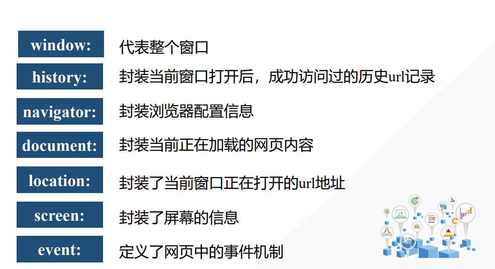

## BOM

BOM（Browser Object Model）是专门操作浏览器窗口的API——没 有标准, 有兼容性问题


浏览器对象模型如下




**获取当前窗口大小：**

- 完整窗口大小：`window.outerWidth/outerHeight`
- 文档显示区大小：`window.innerWidth/innerHeight`


### 定时器

定时器主要让程序按指定时间间隔自动执行任务，主要包含功能有：网页动态效果、计时功能等

定时器分类：周期性定时器  、一次性定时器


**1、周期性定时器**

让程序按指定时间间隔反复自动执行一项任务

语法：`setInterval(exp,time)`

> setInterval(exp,time)：周期性触发代码exp
>
> exp：执行语句       time：时间周期，单位为毫秒

```javascript
setInterval(function(){
console.log("Hello World");
},1000);
```


**停止定时器步骤**：

1. 给定时器取名

   ```javascript
   /*定时器取名为timer  */
   var timer = setInterval(function(){
   console.log("Hello World");
   },1000);
   ```

   

2. 停止定时器

```javascript
clearInterval(timer);
```


**2、一次性定时器**

让程序延迟一段时间执行

语法：setTimeout(exp,time)

> setTimeout(exp,time)：**一次性**触发代码exp
>
> exp：执行语句       time：时间周期，单位为毫秒

```javascript
setTimeout(function(){
alert("恭喜过关");
},3000);
```


