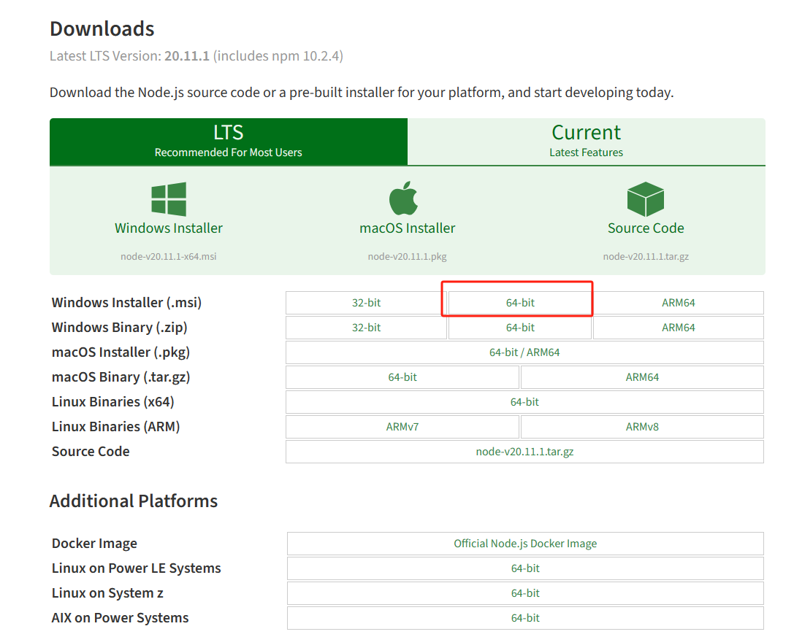
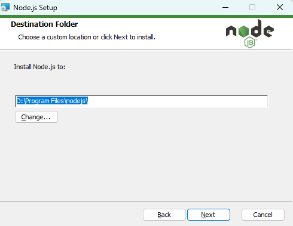
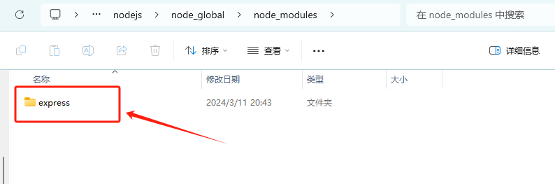

# 一、Node.js  下载和安装

## 1.1 下载 Node.js

打开 [Node.js — Download (nodejs.org)](https://nodejs.org/en/download)， 选择合适的版本。




## 1.2 安装 Node.js

双击 `node-v20.11.1-x64.msi`，安装 Node.js （自定义安装目录，我的修改为 `D:\Program Files\nodejs\`）




## 1.3 检查 Node.js

由于`node-v20.11.1-x64.msi` 安装包已经自动将 Node.js 的安装路径(我的为 `D:\Program Files\nodejs\`)添加到 “系统环境变量” 的 `Path` 里面，我们可以在 cmd 里面使用  Node.js 的可执行程序。

打开 cmd 窗口，  输入 `node -v`  和 `npm -v`  分别查看安装软件版本：

```shell
C:\Users\username>node -v
v20.11.1

C:\Users\username>npm -v
10.2.4
```


# 二、模块安装路径配置

## 2.1 创建文件夹并配置相应路径

在node.js的安装目录 `D:\Program Files\nodejs` 中，新建两个文件夹 `node_global` 和 `node_cache`，分别用来存放安装的全局模块和全局缓存信息

> 如果不进行该配置，Node.js安装的包将会安装到默认路径 `C:\Users\username\AppData\Roaming\npm`)里面


然后，使用管理员权限打开 cmd 窗口， 输入以下命令：

```
  # 设置全局模块安装路径
  npm config set prefix "D:\Program Files\nodejs\node_global"
  
  # 设置全局缓存存放路径
  npm config set cache "D:\Program Files\nodejs\node_cache"
```


## 2.2 创建环境变量

在系统变量中， 新建变量 `NODE_PATH`， 变量值为  `D:\Program Files\nodejs\node_global\node_modules`

这里说明一下，`NODE_PATH` 就是 `Node.js` 中用来寻找模块所提供的路径注册环境变量

> 如果输入变量值之后没有自动创建【node_modules】文件夹，就在【node_global】下手动创建一个【node_modules】文件夹


## 2.3 测试是否安装成功

配置完成后，安装 express 模块进行测试。

```
C:\Windows\System32>npm install express -g

added 64 packages in 19s

12 packages are looking for funding
  run `npm fund` for details
npm notice
npm notice New minor version of npm available! 10.2.4 -> 10.5.0
npm notice Changelog: https://github.com/npm/cli/releases/tag/v10.5.0
npm notice Run npm install -g npm@10.5.0 to update!
npm notice
```

其中，`npm install express -g` 的 `-g` 表示全局模块


在 `D:\Program Files\nodejs\node_global\node_modules` 目录里面，我们可以看到新安装的 express 模块




# 参考资料

[NodeJs 的安装及配置环境变量_nodejs配置环境变量-CSDN博客](https://blog.csdn.net/zimeng303/article/details/112167688)

