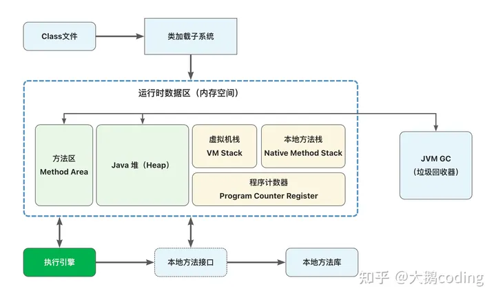

# 一、JVM的基本介绍

## 1.1 什么是JVM

JVM 是 Java Virtual Machine（Java 虚拟机）的缩写。它是一个在计算机上**运行 Java 字节码的虚拟机**，是 Java 语言的核心和关键部分。Java 虚拟机使得 Java 程序能够在不同的计算机体系结构和操作系统上运行，实现了“一次编写，到处运行”的理念。

JVM 提供了一个抽象的计算环境，它屏蔽了底层操作系统和硬件的差异，使得开发人员能够专注于编写 Java 代码而不用担心底层平台的细节。Java 程序首先被编译成字节码，然后由 JVM 解释执行或者通过即时编译器（Just-In-Time Compiler，JIT）转换为本地机器代码执行。

JVM 还提供了垃圾回收（Garbage Collection）和其他一些管理和监控功能，以确保 Java 应用程序的性能和稳定性。

## 1.2 为什么学习JVM

学习JVM对我们的好处主要有：

- **性能优化：** 通过了解 JVM 的工作原理，程序员可以更好地优化 Java 代码，提高程序的性能。例如，理解 JVM 的即时编译（JIT）技术、垃圾回收算法等，有助于写出更高效的代码； 能够利用一些工具，jmap, jvisualvm, jstat, jconsole等工具可以辅助你观察Java应用在运行时堆的布局情况，由此你可以通过调整JVM相关参数提高Java应用的性能；
- **线上排查问题：**除去网络、系统本身问题，很多时候 Java 应用出现问题，就是 Java 虚拟机的内存出现了问题。要么是内存溢出了，要么是 GC 频繁导致响应慢等等。你想要解决线上的 Java 应用崩溃问题，那么你就必须学会 GC 日志。要看懂 GC 日志，就必须学习 Java 虚拟机内存模型。要看懂 Java 虚拟机内存模型，你就要学会垃圾回收机制等等。
- **理解Java语言特性：**理解 JVM 有助于深入了解 Java 语言本身的特性和设计理念，包括面向对象、异常处理、多线程等。例如，理解动态编译与静态编译的区别，以及动态编译相对于静态编译到底有什么好处（JVM JIT）；明白为什么Java最早期被称为解释型语言，而后来为什么又被大家叫做解释与编译并存的语言（了解JVM中解释器以及即时编译器就可以回答这个问题）；

# 二、JVM体系结构

## 2.1 Class文件

Class文件是 Java 源代码编译后生成的二进制字节码文件。Java 源代码在编译时不是直接翻译成机器码，而是被编译成一种称为 Java 字节码的中间形式。这些字节码以二进制形式存储在 `.class` 文件中。

Class文件的核心设计思想是 **平台无关性**，它存储的不是操作系统可以直接识别的二进制本地机器码，而是**根据Java虚拟机规范所自定义的指令集、符号表和一些其他信息**。所以只要任何一个操作系统下开发有对应的Java虚拟机，开发者的Java程序就能跑起来。

## 2.2 类加载子系统(类加载器)

类加载子系统也可以称之为类加载器，JVM默认提供三个类加载器：

- **Bootstrap ClassLoader** 
- **Extension ClassLoader**

- **App ClassLoader**

## 2.3 方法区

方法区用于存储JVM加载完成的类型信息、常量、静态变量、即时编译器编译后的代码缓存，方法区和 Java 堆区一样，都是线程共享的内存区域。

## 2.4 **Java堆（JVM堆**、Java heap）

堆区负责存放对象实例，当Java**创建一个类的实例对象或者数组时，都会在堆中为新的对象分配内存**。

## 2.5 虚拟机栈（JVM栈、VM Stack）

在Java栈中**只保存基础数据类型**（**参考：**[Java 基本数据类型 - 四类八种 - 知乎专栏](https://zhuanlan.zhihu.com/p/25439066)）和对象的**引用**

> 注意只是对象的引用, 而不是对象本身. 对象是保存在堆区中的

## 2.6 本地方法栈（Native Method Stack）

本地方法栈的功能和JVM栈非常类似，区别在于虚拟机栈执行的是Java方法，本地方法栈执行的是本地（Native）方法服务，存储的也是本地方法的局部变量表，本地方法的操作数栈等信息。

## 2.7 JVM执行引擎

Java虚拟机相当于一台虚拟的“物理机”，这两种机器都有代码执行能力，区别主要是物理机的执行引擎是直接建立在处理器、硬件、指令集和操作系统层面上的，而JVM的执行引擎是自己实现的，因此程序员可以自行制定指令集和执行引擎的结构体系。

执行引擎的主要职责，就是**把这些自行制定的指令集翻译成硬件所支持的指令集格式，然后执行**。

## 2.8 本地方法接口（JNI）

JNI是Java Native interface的缩写，它提供了若干的API**实现了Java和其他语言的通信**（主要是C和C++）。

# 参考资料

[Java SE Specifications (oracle.com)](https://docs.oracle.com/javase/specs/index.html)

[为什么要学习JVM？慢慢带你深入理解Java虚拟机 - 知乎 (zhihu.com)](https://zhuanlan.zhihu.com/p/151727571#:~:text=所以很多人对于为什么要学虚拟机这个问题，一致的答案皆是：因为面试。 其实学习JVM并不仅仅在于面试，而在于更深入地理解,Java 这门语言，以及为未来排查线上问题打下基础。)

[Java JVM 运行机制及基本原理 - 知乎 (zhihu.com)](https://zhuanlan.zhihu.com/p/25713880)