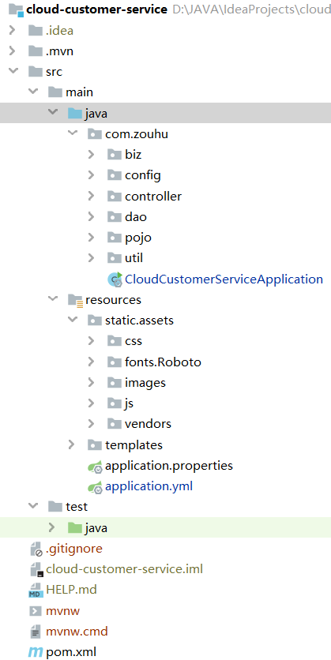

端口号问题

解决方案

# Spring Boot概述

​		Spring Boot 是由 Pivotal 团队提供的全新框架，其设计目的是用来简化新 Spring 应用的初始搭建以及开发过程。该框架使用了特定的方式来进行配置，从而使开发人员不再需要定义样板化的配置。Spring Boot 其实不是什么新的框架，它默认配置了很多框架的使用方式，就像 Maven 整合了所有的 Jar 包，Spring Boot 整合了所有的框架。

## 核心功能

- 内嵌Servlet容器
- 独立运行的Spring项目
- 提供starter简化Maven配置

## 优缺点

#### 1）优点

- 快速构建项目。
- 对主流开发框架的无配置集成。
- 项目可独立运行，无须外部依赖Servlet容器。
- 提供运行时的应用监控。
- 极大地提高了开发、部署效率。
- 与云计算的天然集成。

#### 2）缺点

- 版本迭代速度很快，一些模块改动很大。
- 由于不用自己做配置，报错时很难定位。
- 网上现成的解决方案比较少。

## Spring Boot项目结构

### 一、代码层结构

**根目录：src/main/java**

> 入口启动类及程序的开发目录。在这个目录下进行业务开发、创建实体层、控制器层、数据连接层等。

- 启动类CloudCustomerServiceApplication.java推荐放在src/main/java/com.user下

- 数据库实体层pojo

> model层即**数据库实体**层，也被称为entity层，pojo层。
> 一般数据库一张表对应一个实体类，类属性同表字段一一对应.
> 模型通常认为是视图的内核，何谓之视图？我们正在与之交互的网站的界面就是视图，而模型是指他的内核：数据。

- 数据持久层dao

> dao(Data Access Object)层即数据持久层，也被称为mapper层。
> dao层的作用为访问数据库，向数据库发送sql语句，完成**数据的增删改查任务**。
> 通常我们在DAO层里面写接口，里面有与数据打交道的方法。SQL语句通常写在mapper文件里面的。
> 结构清晰，Dao层的数据源配置以及相关的有关数据库连接的参数都在Spring配置文件中进行配置。

- 数据服务接口层service

> service层即业务逻辑层，**主要负责业务逻辑应用设计**。
> 首先也要设计接口，然后再设计其实现该接口的类(serviceImpl)。这样我们就可以在应用中调用service接口进行业务处理。
> service层调用dao层接口，接收dao层返回的数据，完成项目的基本功能设计。

- 控制器层controller

> controller层即控制层.**主要负责具体业务模块流程的控制**，。
> controller层的功能为请求和响应控制。
> controller层负责前后端交互，接受前端请求，调用service层，接收service层返回的数据，最后返回具体的页面和数据到客户端。

- 工具类库utils

- 配置类config

- 数据传输对象dto

> 数据传输对象`Data Transfer Object`用于封装多个实体类`domain`之间的关系，不破坏原有的实体类结构

- 视图包装对象vo
>视图包装对象View Object用于封装客户端请求的数据，防止部分数据泄露如：管理员ID，保证数据安全，不破坏 原有的实体类结构

### 二、资源目录结构
**资源文件根目录：src/main/resources**

> 主要用来存放静态文件和配置文件

- 项目配置文件：resources/application.yml

> 用于配置项目运行所需的配置数据，也可以是resources/application.properties

- 静态资源目录：resources/static/

>  用于存放静态资源，如css、js、图片、音频等资源
>
>  注意：static目录下的静态资源可以直接访问。

- 视图模板目录：resources/templates/

>  - 用于存放html、jsp、thymeleaf等模板文件
>
>  - 注意：**templates目录里存放的html页面，不能通过url直接访问（被websecurity权限控制），需跳转后台（通过Controller，即走控制器–服务–视图解析器这个流程）才能访问，同时还要引入thymeleaf模板引擎  ； 或者配置静态资源路径\  。**
>
>  -  html静态页面放置在templates目录原因：
>  templates目录下的html页面不能直接访问，需要通过服务器内部进行访问，可以避免无权限的用户访问到隐私页面，造成信息泄露。

- mybatis映射文件：resources/mappers/

- mybatis配置文件：resources/spring-mybatis.xml

### 三、测试测序目录结构

**测试文件根目录：src/test/java**

### 四、项目结构示例

参考网站：

[SpringBoot项目目录结构（工程结构）](https://blog.csdn.net/qq_39615545/article/details/90172038)

[静态资源相关文件参考](https://blog.csdn.net/qq_34357018/article/details/109777607)

## IOC容器

### 1.IOC容器的认识

​    **IOC **（Inversion of Control）容器,是面向对象编程中的一种设计原则，以为“控制反转”。即将程序中创建对象的控制权交给Spring框架来管理，以便降低计算机代码之间的耦合度。
​       **IOC 容器**具有依赖注入功能的容器，它可以创建对象，IOC 容器负责实例化、定位、配置应用程序中的对象及建立这些对象间的依赖。通常new一个实例，控制权由程序员控制，而"控制反转"是指new实例工作不由程序员来做而是交给Spring容器来做。

例如：现有类 A 依赖于类 B
- **传统的开发方式** ： 往往是在类 A 中手动通过 new 关键字来 new 一个 B 的对象出来
- **使用 IoC 思想的开发方式** ： 不通过 new 关键字来创建对象，而是通过 IoC 容器(Spring 框架) 来帮助我们实例化对象。我们需要哪个对象，直接从 IoC 容器里面过去即可。

### 2 .IOC的实现方法
  IOC的实现方法主要有两种——依赖注入 与 依赖查找
  （1）依赖注入
  DI(依赖注入)　IoC的一个重点是在系统运行中，动态的向某个对象提供它所需要的其他对象。这一点是通过DI（Dependency Injection，依赖注入）来实现的。
  注入注解的语法：
  @Autowired     Spring为这个变量注入一个Bean
  @Inject 翻译为“注入”最易懂的注入注解
  @Resource 翻译为“资源”，可以理解为Spring往里面注入的时一个资源

### 3.SpringBoot IoC体现

​       在Spring中，你不需要自己创建对象，你只需要告诉Spring，哪些类我需要创建出对象，然后在启动项目的时候Spring就会自动帮你创建出该对象，并且只存在一个类的实例。这个类的实例在Spring中被称为Bean。而这种模式，我们称之为“单例模式”。也就是一个类只有一个实例的意思。  
  那么Spring是靠什么来了解究竟哪些类需要帮我们创建呢，这里介绍最常用的两种方式——JAVA注解配置，JAVA代码配置。之前的还有XML配置，groovy配置等，但是我们现在已经不推荐使用了。
  Spring会把注解@Controller、@Service、@Repository、@Component标注的类纳入Spring容器中进行管理。
  声明注解的语法：
  @Component 当前类是组件，没有明确的意思
  @Service 当前类在业务逻辑层使用
  @Repositorty 当前类在数据访问层使用
  @Controller 当前类在展现层（MVC）使用

## redirect方法和forward方法

[借鉴网站](https://www.cnblogs.com/selene/p/4518246.html)

## 拦截器

## Spring MVC

Spring MVC即一种基于 Java 的实现 MVC 设计模型的请求驱动类型的轻量级 Web 框架，主要由 DispatcherServlet、处理器映射、控制器、视图解析器、视图组成。其工作流程主要为：客户端请求提交到 DispatcherServlet；由 DispatcherServlet 控制器寻找一个或多个 HandlerMapping，找到处理请求的 Controller；DispatcherServlet 将请求提交到 Controller；Controller 调用业务逻辑处理后返回 ModelAndView；DispatcherServlet 寻找一个或多个 ViewResolver 视图解析器，找到 ModelAndView 指定的视图；视图负责将结果显示到客户端。

在Spring MVC的接口中，我具体的了解了DispatcherServlet。DispatcherServlet是前端控制器设计模式的实现，提供Spring Web MVC的集中访问点，而且负责职责的分派，而且与Spring IoC容器无缝集成，从而可以获得Spring的所有好处。即Spring MVC 所有的请求都经过 DispatcherServlet 来统一分发，在 DispatcherServlet 将请求分发给 Controller 之前需要借助 Spring MVC 提供的 HandlerMapping 定位到具体的 Controller。

springMVC的工作原理如下：

> - springmvc请所有的请求都提交给DispatcherServlet,它会委托应用系统的其他模块负责负责对请求进行真正的处理工作。 
> - DispatcherServlet查询一个或多个HandlerMapping,找到处理请求的Controller。
> - DispatcherServlet请请求提交到目标Controller 。
> - Controller进行业务逻辑处理后，会返回一个ModelAndView 。
> - Dispathcher查询一个或多个ViewResolver视图解析器,找到ModelAndView对象指定的视图对象 。
> - 视图对象负责渲染返回给客户端。

[C语言中文网](http://c.biancheng.net/view/4392.html)

# Model与session的区别

