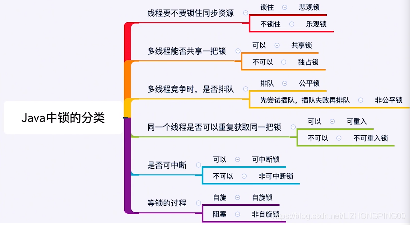

# 一、锁的分类

## 1.1 悲观锁和乐观锁

乐观锁：

- 定义: 假设在绝大多数情况下，对共享资源的访问是不会发生冲突的,所以不会对资源上锁。

- 实现方式：当线程要对资源进行更新时，它会**先获取资源的版本号或者标识符**，并在执行更新操作前不会对资源进行加锁。当线程完成更新操作后，会尝试提交(或者说乐观地认为)这次更新，如果在提交时发现资源的版本号已经发生了变化，说明其他线程已经对资源进行了修改，此时需要执行相应的**冲突处理策略**(例如重试、回滚等)。
- 使用场景：乐观锁通常适用于读操作多于写操作的场景，可以提高系统的并发性能。（因为在并发操作中，读操作一般不会导致冲突。）

悲观锁：

- 定义：假设在绝大多数情况下，对共享资源的访问都会发生冲突，因此在访问资源之前就会对资源进行加锁。

- 使用场景: 适用于写操作频繁的场景。

  

## 1.2 共享锁和独占锁

共享锁和独占锁的选择**取决于对资源的访问方式**。如果多个线程需要同时读取共享资源而不会修改它，可以使用共享锁；如果一个线程需要对资源进行写操作，需要确保在写操作期间其他线程不会读取或写入该资源，可以使用独占锁。

共享锁： 允许多个线程同时获取同一把锁，从而可以同时读取共享资源，但是不允许写操作。

独占锁(X锁，写锁/排他锁)： 只允许一个线程获取锁，其他线程必须等待该线程释放锁之后才能获取锁。

## 1.3 可重入锁和不可重入锁

可重入锁：

- 定义：允许同一个线程多次获取同一把锁，而不会发生死锁
- 实现方式：当一个线程已经持有锁时，再次尝试获取锁时，会增加锁的持有计数，直到锁的持有计数为零时释放锁。
- 应用场景：可重入锁通常用于递归函数、同步代码块、锁的嵌套等场景，可以避免因为同一线程多次获取锁而导致的死锁。

不可重入锁：

- 定义：不允许同一个线程多次获取同一把锁，如果一个线程已经持有锁，再次尝试获取锁时会被阻塞。

- 缺陷:  不可重入锁可能会导致死锁，因为同一个线程在持有锁的情况下再次尝试获取锁时会被阻塞，从而无法释放已经持有的锁，造成其他线程无法获取锁而发生死锁。

  

## 1.4 公平锁和非公平锁

- **公平锁** : 锁被释放之后，先申请的线程先得到锁。性能较差一些，因为公平锁为了保证时间上的绝对顺序，上下文切换更频繁。

- **非公平锁**：锁被释放之后，后申请的线程可能会先获取到锁，是随机或者按照其他优先级排序的。性能更好，但可能会导致某些线程永远无法获取到锁。

##  1.5 可中断锁和不可中断锁

**可中断锁（Interruptible Lock）**：

- 当一个线程在等待获取锁的过程中，允许其他线程通过中断操作打断它的等待，从而提前结束等待并执行其他操作。

**不可中断锁（Non-Interruptible Lock）**：

- 当一个线程在等待获取锁的过程中，不允许其他线程通过中断操作打断它的等待，即使其他线程调用了中断方法，等待线程也会继续等待直到获取到锁。

# 参考资料

[【锁】2 最全的锁分类_锁的分类-CSDN博客](https://blog.csdn.net/LIZHONGPING00/article/details/113963573)