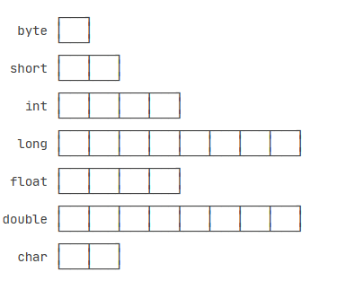

# 一、数据类型

在 Java 里面，数据类型主要分为 

- 基本类型
- 引用类型

## 1.1 基本类型

基本数据类型是 CPU 可以直接进行运算的类型。Java 定义了以下几种基本数据类型：

- 整数类型：byte，short，int，long 。
- 浮点数类型：float，double
- 字符类型：char
- 布尔类型：boolean

不同的数据类型占用的字节数不一样。Java 基本数据类型占用的字节数：

从上图可以看出，`byte` 恰好就是一个字节，而 `long` 和 `double` 需要8个字节。

对于整型类型，Java **只定义了带符号的整型**，因此，最高位的bit表示符号位（0表示正数，1表示负数）。

布尔类型`boolean`只有`true`和`false`两个值。Java语言对布尔类型的存储并没有做规定，因为理论上存储布尔类型只需要1 bit，但是通常 JVM 内部会把 `boolean `表示为4字节整数。

字符类型`char`表示一个字符。Java的`char`类型除了可表示标准的ASCII外，还可以表示一个Unicode字符。