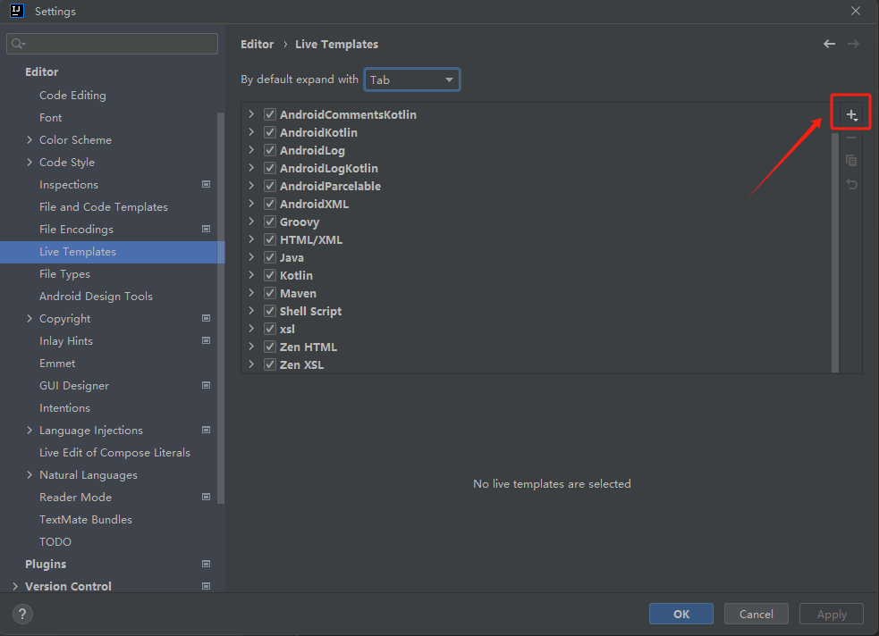
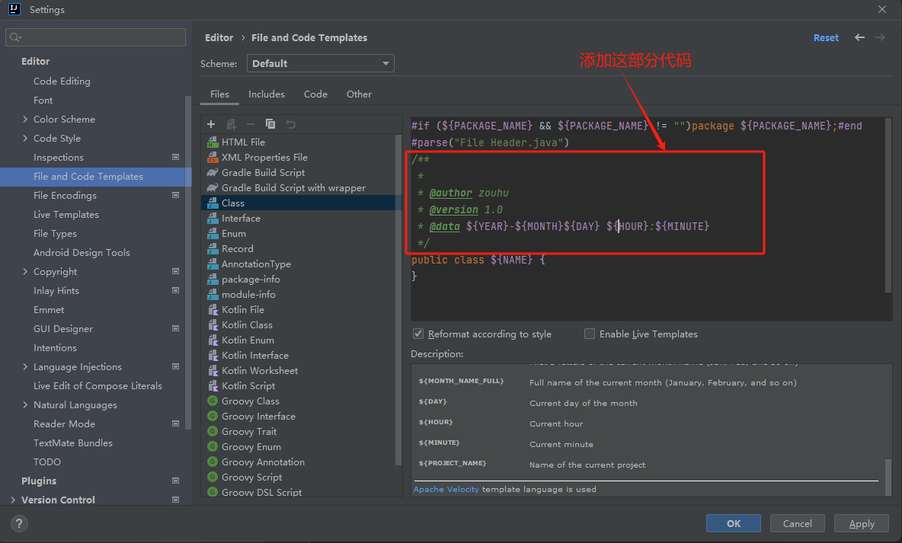

### 方法注释模板设置（自定义 Live Template）




### 类注释模板设置



```
#if (${PACKAGE_NAME} && ${PACKAGE_NAME} != "")package ${PACKAGE_NAME};#end
#parse("File Header.java")
/**
 * 
 * @author zouhu
 * @version 1.0
 * @data ${YEAR}-${MONTH}${DAY} ${HOUR}:${MINUTE}
 */
public class ${NAME} {
}
```


### 参考资料

[IDEA自定义/修改方法注释和修改类注释.注释时增加时间和作者._idea @date标签修改-CSDN博客](https://blog.csdn.net/Franciz777/article/details/113319228)