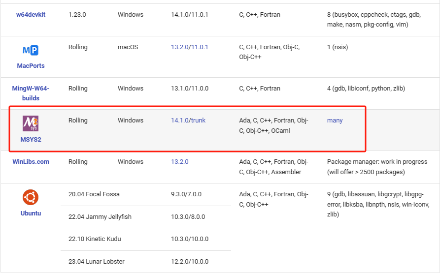

## 安装 MinGW-W64 及配置环境变量

### 安装 MinGW-W64

在  [Downloads - MinGW-w64](https://www.mingw-w64.org/downloads/)  或者 [Releases · msys2/msys2-installer (github.com)](https://github.com/msys2/msys2-installer/releases)选择合适版本 ,  下载并安装 msys2




在安装完成后,  双击 ucrt64.exe ,  在弹出的终端窗口输入以下命令并按回车键,  安装 MinGW-w64 工具链:

```
ppacman -S --needed base-devel mingw-w64-ucrt-x86_64-toolchain
```


### 配置环境变量

在安装 MSYS2 的目录里面, 找到 ucrt64 文件夹里面的 bin 文件夹,  复制路径

```
D:\Program Files\msys64\ucrt64\bin
```

然后,  在系统环境变量的 PATH 里面添加该路径


### 验证安装是否成功

```
D:\Learning>gcc --version
gcc (Rev6, Built by MSYS2 project) 13.2.0
Copyright (C) 2023 Free Software Foundation, Inc.
This is free software; see the source for copying conditions.  There is NO
warranty; not even for MERCHANTABILITY or FITNESS FOR A PARTICULAR PURPOSE.

D:\Learning>g++ --version
g++ (Rev6, Built by MSYS2 project) 13.2.0
Copyright (C) 2023 Free Software Foundation, Inc.
This is free software; see the source for copying conditions.  There is NO
warranty; not even for MERCHANTABILITY or FITNESS FOR A PARTICULAR PURPOSE.


D:\Learning>gdb --version
GNU gdb (GDB) 14.2
Copyright (C) 2023 Free Software Foundation, Inc.
License GPLv3+: GNU GPL version 3 or later <http://gnu.org/licenses/gpl.html>
This is free software: you are free to change and redistribute it.
There is NO WARRANTY, to the extent permitted by law.
```


## 参考资料