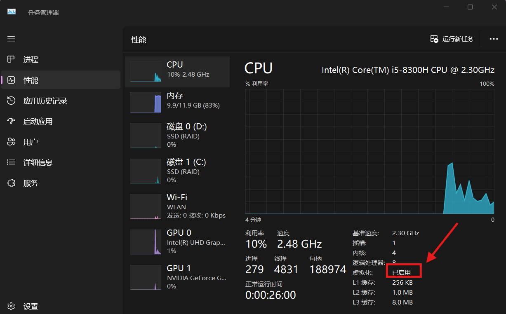
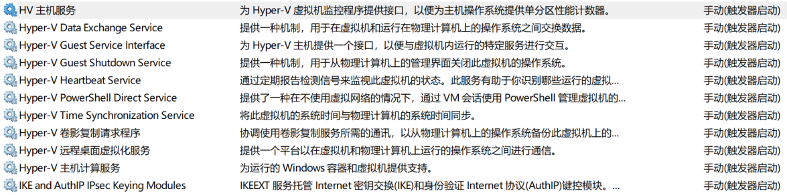
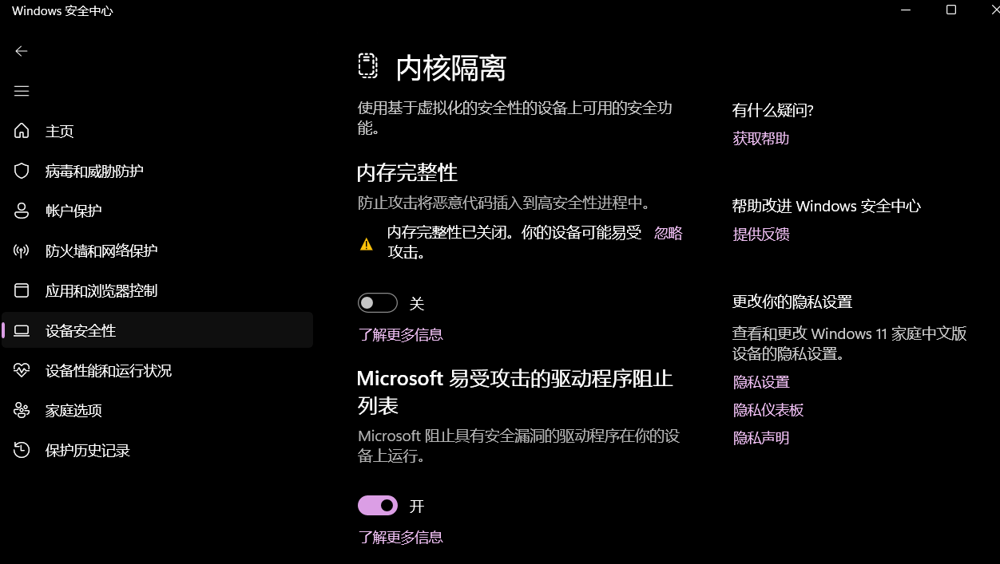
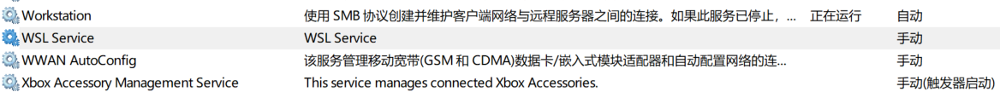
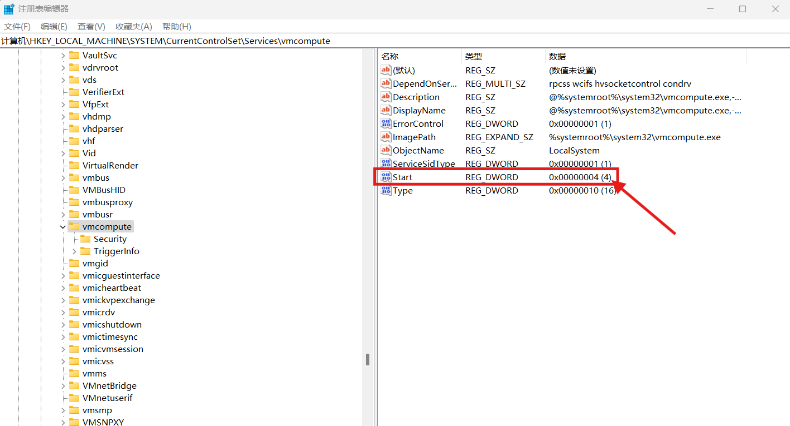
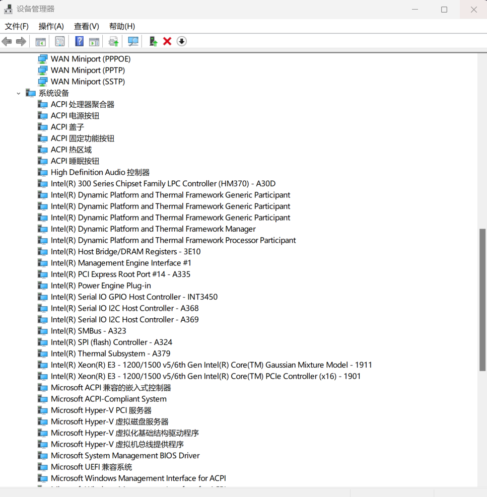

### 应用场景

在 Win11 家庭版中，设置 VMware Workstation 17 Player 虚拟机支持处理机虚拟化。


### 问题描述

打开虚拟机，却出现以下报错信息：

```
此平台不支持虚拟化的 Intel VT-x/EPT。 
不使用虚拟化的 Intel VT-x/EPT，是否继续?
```


### 原因分析

VMware Workstation 或 Player 默认使用 **“基于硬件的虚拟化”**（Intel VT-x/AMD-V）

当 Hyper-V 或者 WSL 启用时，VT-x 被占用，VMware 会报错。


### 解决方案

1. **检查本机VT功能是否开启**
   在升级前如果还在使用[虚拟机](https://cloud.baidu.com/product/bcc.html)，可以确定物理本机BIOS中的VT选项是打开的。在尝试解决此问题时，首先需要检查本机VT功能是否已正确开启。

   

2. **关闭Hyper-V**
   由于 Windows 11专业版可能默认安装了Hyper-V，而 Hyper-V 与 VMware Workstation 存在兼容性问题。因此，需要检查Hyper-V是否已安装，并在控制面板中将其关闭。

   同时，禁用 Windows 自带的虚拟机 Hyper-V 的相关服务：
   
   - HV 主机服务
   - Hyper-V 卷影复制请求程序
   - Hyper-V 主机计算服务
    
   
3. **禁用Windows沙盒**
   Windows沙盒功能也可能与VMware Workstation产生冲突。在Windows[安全](https://cloud.baidu.com/solution/security/soc.html)中心>设备安全性>内核隔离中，确保“基于虚拟化的安全处理（如DMA保护）”已关闭。

   

4. **关闭 WSL** 

   关闭 Windows 功能中的**适用于 Linux 的 Windows 子系统（Windows Subsystem for Linux，WSL）**。但是，这并不一定完全移除 WSL2 的依赖组件（如虚拟机平台）。

   ```cmd
   # 显示了当前系统中安装的 WSL发行版
   $ wsl --list --verbose
     NAME              STATE           VERSION
   * docker-desktop    Stopped         2
   ```

   这是 Docker Desktop 默认安装的 WSL2 发行版（用于运行 Docker 容器）。它的存在说明 Docker Desktop 正在使用 WSL2 作为后端引擎。即使 `docker-desktop` 是 `Stopped` 状态，只要 WSL2 发行版存在，虚拟机平台（Virtual Machine Platform）仍会启用，那我们后续就无法支持关闭虚拟机平台这个功能。

   同时，关闭服务中 WSL Service， 并将其启动类型修改成手动。

   

5. 检查注册表

   按 `Win + R`，输入 `regedit` 回车，导航到：
   `HKY_LOCAL_MACHINE\SYSTEM\CurrentControlSet\Services\vmcompute`，修改 `Start` 的值为 **4**（禁用）。

6. **关闭虚拟机平台**

   Windows功能中的虚拟机平台同样需要关闭。在“控制面板”>“程序”>“启用或关闭Windows功能”中，取消虚拟机平台前的勾选以关闭该功能。

   注意，在没有彻底关闭依赖虚拟机平台的组件时，我们无法关闭这个功能。系统会自动在重启的时候撤销这个动作。

7. **在 CMD 中设置 Hypervisor 启动类型**
   以管理员身份打开命令提示符（CMD），并输入命令：

   ```
   bcdedit /set hypervisorlaunchtype off
   ```

   这条命令会禁用 Hypervisor 的自动启动，影响依赖它的技术（如 Hyper-V、Windows Sandbox、WSL2 等）。

8. **关闭 Windows 更新**

9. 关闭 Hyper-V 设备

   

10. **重启计算机**
   完成以上所有步骤后，需要重启计算机以使更改生效。