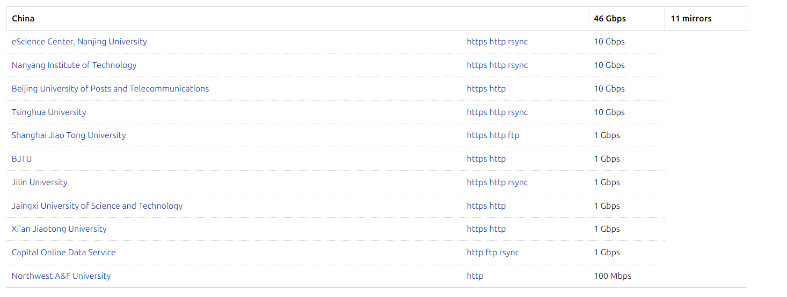
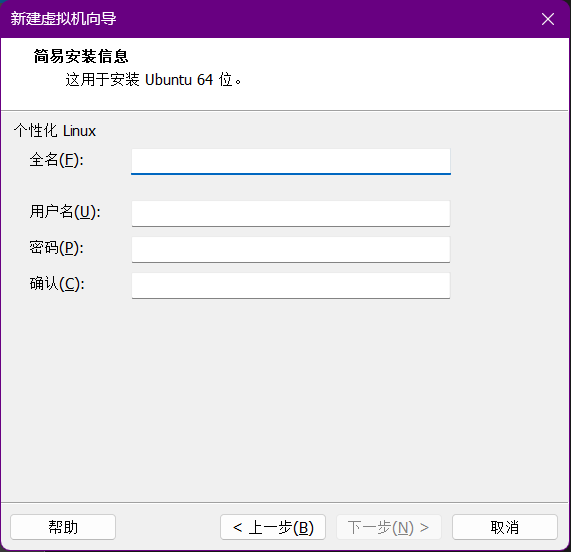
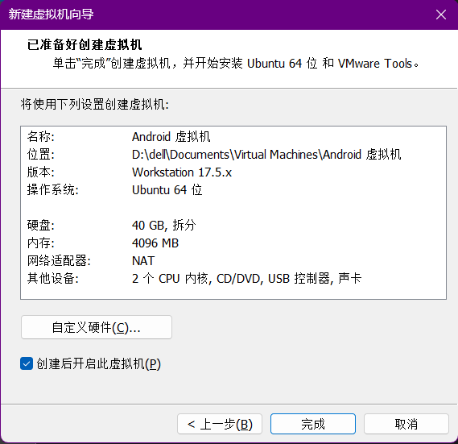

## 一 、下载操作系统

### 1.1 在镜像网站下载合适版本

在 Ubuntu 官网提供的镜像网站列表 [Mirrors : Ubuntu (launchpad.net)](https://launchpad.net/ubuntu/+cdmirrors)， 根据所在地区选择合适的镜像网站，下载 Ubuntu 操作系统

选择 [Index of /ubuntu-releases/20.04/ | 清华大学开源软件镜像站 | Tsinghua Open Source Mirror](https://mirrors.tuna.tsinghua.edu.cn/ubuntu-releases/20.04/)， Ubuntu 20.04.6 LTS 版本的桌面版安装镜像文件 `ubuntu-20.04.6-desktop-amd64.iso`

## 二、创建虚拟机

### 2.1 简易安装模式

在简易安装信息过程中，配置相关信息：

- 全名：标识用户的实际姓名（如个人姓名或组织名称），属于**描述性信息**。这个不影响系统操作权限，仅作为友好名称使用，通常显示在登录界面中。

- 用户名：用于系统登录、文件权限管理和命令行操作，是**唯一的系统标识符**。建议用户名全小写，并且不要过长，用户名一旦创建无法修改。

在自定义配置信息后，创建虚拟机。

## 三、可能出现的问题

### 3.1 虚拟机屏幕和笔记本屏幕尺寸对应不上

解决方案

- 调整虚拟机屏幕，使其对应笔记本屏幕尺寸
- 重启虚拟机