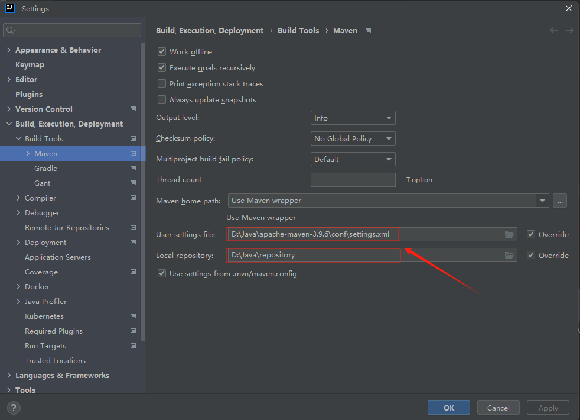

## Maven 仓库

在 Maven 的术语中，仓库是一个位置（place）。Maven 仓库是项目中依赖的第三方库，这个库所在的位置叫做仓库。在 Maven 中，任何一个依赖、插件或者项目构建的输出，都可以称之为构件。Maven 仓库能帮助我们管理构件（主要是JAR），它就是放置所有JAR文件（WAR，ZIP，POM等等）的地方。
Maven 仓库有三种类型：

- 本地（local）
- 中央（central）
- 远程（remote）

### Maven 的三大仓库

Maven 的本地仓库，在安装 Maven 后并不会创建，它是在第一次执行 maven 命令的时候才被创建。
运行 Maven 的时候，Maven 所需要的任何构件都是直接从本地仓库获取的。如果本地仓库没有，它会首先尝试从远程仓库下载构件至本地仓库，然后再使用本地仓库的构件。
默认情况下，不管Linux还是 Windows，每个用户在自己的用户目录下都有一个路径名为 .m2/respository/ 的仓库目录。
Maven 本地仓库默认被创建在 %USER_HOME% 目录下。要修改默认位置，在 %M2_HOME%\conf 目录中的 Maven 的 settings.xml 文件中定义另一个路径。


### 中央仓库

Maven 中央仓库是由 Maven 社区提供的仓库，其中包含了大量常用的库。
中央仓库包含了绝大多数流行的开源Java构件，以及源码、作者信息、SCM、信息、许可证信息等。一般来说，简单的Java项目依赖的构件都可以在这里下载到。
中央仓库的关键概念：

- 这个仓库由 Maven 社区管理。
- 不需要配置。
- 需要通过网络才能访问。
  要浏览中央仓库的内容，maven 社区提供了一个 URL：http://search.maven.org/#browse。使用这个仓库，开发人员可以搜索所有可以获取的代码库。


## 仓库配置

### 配置本地仓库

要配置 Maven 本地仓库，可以通过编辑 Maven 的 `settings.xml` 文件来完成。具体步骤如下：

1. **找到  `settings.xml`  文件**： `settings.xml` 是 Maven 的配置文件，可以在两个级别进行指定：

   - **用户级别**：此  `settings.xml`  文件为单个用户提供配置，通常位于 `${user.home}/.m2/settings.xml`。
   - **全局级别**：此 `settings.xml` 文件为一台机器上的所有 Maven 用户提供配置（假设他们都使用相同的 Maven 安装）。它通常位于 `${maven.conf}/settings.xml`。

   

2. **编辑  `settings.xml`  文件**:  打开  `settings.xml`  文件，找到  `<localRepository>`  元素。在 `<localRepository>`  元素中指定本地仓库的路径。例如，指定 `D:\Java\repository` 为本地仓库路径

   ```xml
   <settings xmlns="http://maven.apache.org/SETTINGS/1.2.0"
             xmlns:xsi="http://www.w3.org/2001/XMLSchema-instance"
             xsi:schemaLocation="http://maven.apache.org/SETTINGS/1.2.0 https://maven.apache.org/xsd/settings-1.2.0.xsd">
     <!-- localRepository
      | The path to the local repository maven will use to store artifacts.
      |
      | Default: ${user.home}/.m2/repository
     <localRepository>/path/to/local/repo</localRepository>
     -->
    <localRepository>D:\Java\repository</localRepository>
   ```

3. 为了保证 `settings.xml`  文件生效，我们还需要调整 idea 中的 Maven 配置。




### 配置远程仓库

编辑  `settings.xml`  文件， 

```xml
 <profile>
      <id>jdk-1.4</id>

      <activation>
        <jdk>1.4</jdk>
      </activation>

      <repositories>
        <repository>
          <id>jdk14</id>
          <name>Repository for JDK 1.4 builds</name>
          <url>http://www.myhost.com/maven/jdk14</url>
          <layout>default</layout>
          <snapshotPolicy>always</snapshotPolicy>
        </repository>
      </repositories>
    </profile>
```


### 配置镜像

编辑  `settings.xml`  文件，在`<mirrors></mirrors>`标签中添加 `<mirror>` 子节点:

```xml
 <mirror>
          <id>aliyunmaven</id>
          <mirrorOf>central</mirrorOf>
          <name>central库</name>
          <url>https://maven.aliyun.com/repository/central</url>
      </mirror>
```


## 参考资料

[仓库服务 (aliyun.com)](https://developer.aliyun.com/mvn/guide)

[Maven中央仓库地址大全_maven地址-CSDN博客](https://blog.csdn.net/chinawangfei/article/details/122049810)

[【Maven】推荐几个靠谱的Maven镜像源_maven配置那个镜像好-CSDN博客](https://blog.csdn.net/Transient_/article/details/134825426)