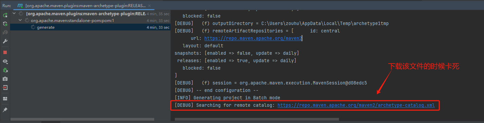
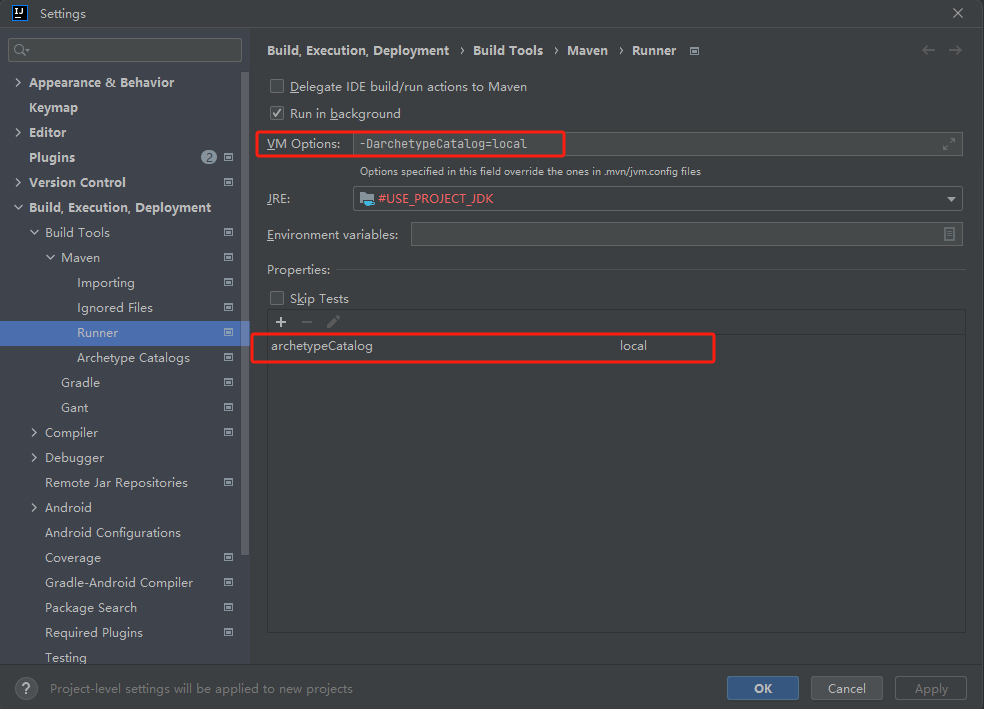
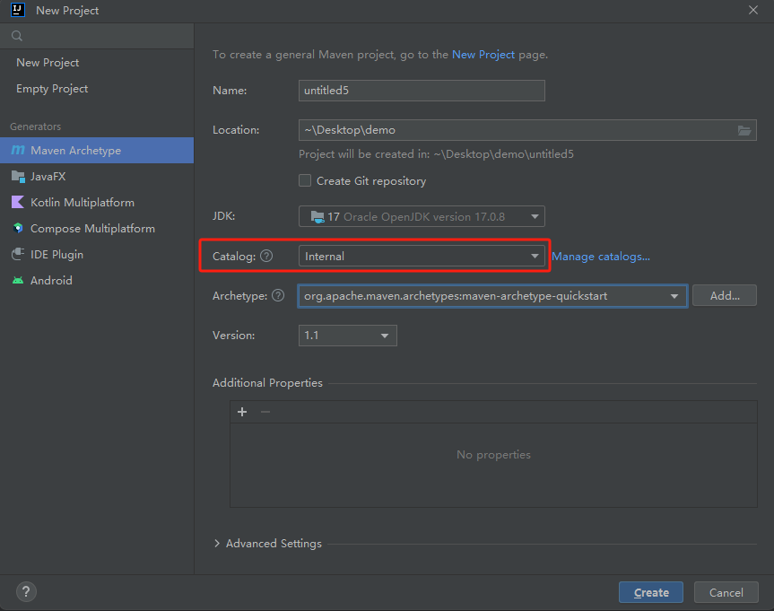
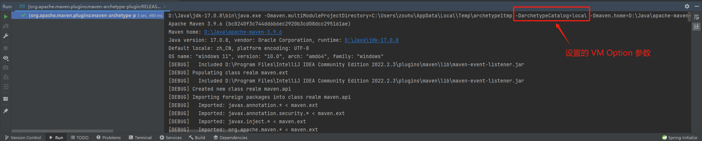

[TOC]

## 一、基本概念

### 1.1 Archetype（原型）

**Archetype** 是用于创建项目的模板。它允许开发人员利用预定义的结构、配置和依赖项生成新项目。使用 Archetype 有助于标准化项目，提供遵循特定设计的起点，从而实施最佳实践。

在 Maven 中，可以使用以下命令创建一个新项目：

```bash
mvn archetype:generate
```


### 1.2 Catalog（目录）

**Catalog** 在不同的上下文中指的是一个有组织的项目、实体或组件的集合。它通常用于结构化数据、项目或资源，以便于导航、发现和管理。

`archetype-catalog.xml` 文件存放了 Archetype 数据。Catalog 的默认路径包括：

- **Internal**：maven-archetype-plugin 内置的原型。
- **Local**：Maven 会使用本地原型数据供你选择生成骨架原型。
- **Remote**：指向 Maven 中央仓库的 Catalog 文件，具体路径为 https://repo.maven.apache.org/maven2/archetype-catalog.xml。

在 IntelliJ IDEA 中，Catalog 的默认路径主要有以上三种选择。


## 二、Maven 项目生成问题分析与解决

### 2.1 问题描述

在生成 maven 项目的时候，maven-archetype-plugin 在 generate 项目模板的时候卡死。


### 2.2 原因分析

调整 Maven 的日志输出级别为 Debug ，重新运行， 可以看到相关日志

```cmd
[INFO] Generating project in Batch mode
[DEBUG] Searching for remote catalog: https://repo.maven.apache.org/maven2/archetype-catalog.xml
```



在使用 Internal 创建项目的时候，maven 插件依旧会自动获取远程仓库的 `archetype-catalog.xml` 文件。由于 maven 官方仓库的流量限制，这一步会卡住。


### 2.3 解决方案

解决方案的关键在于<font color="red">**设置 Maven 插件如何获取 `archetype-catalog.xml` 文件**</font>。

#### 2.3.1 下载 archetype-catalog.xml 文件

首先，从 https://repo.maven.apache.org/maven2/archetype-catalog.xml 下载 **archetype-catalog.xml** 文件，并将其放置在 `~/.m2` 目录下。可以以管理员身份打开命令提示符，输入以下指令：

```bash
curl -o "C:\Users\zouhu\.m2\repository\archetype-catalog.xml" https://repo.maven.apache.org/maven2/archetype-catalog.xml
```


#### 2.3.2  编辑 Runner 配置

打开 `File -> Settings -> Build, Execution, Deployment -> Build Tools -> Maven -> Runner`，进行以下操作：

1. 在 **VM Options** 中输入以下内容：

   ```
   -DarchetypeCatalog=local
   ```

   这条命令用于指定 `archetype-catalog.xml` 文件的来源。

2. 在 **Properties** 中，添加以下属性：

   ```
   archetypeCatalog=local
   ```




#### 2.3.3 重新创建项目

在创建项目的时候，指定 catalog 为 Defalut Local 或者 Internal 即可。



在查看生成项目 archetype 的时候 ，我们可以看到设置的  **VM Options** 参数。




## 参考资料

[Maven Archetype – About (apache.org)](https://maven.apache.org/archetype/index.html)

[Maven Archetype Plugin – Archetype Catalog (apache.org)](https://maven.apache.org/archetype/maven-archetype-plugin/specification/archetype-catalog.html)

[老问题了：idea中使用maven archetype新建项目时卡住.md-腾讯云开发者社区-腾讯云 (tencent.com)](https://cloud.tencent.com/developer/article/2319717)