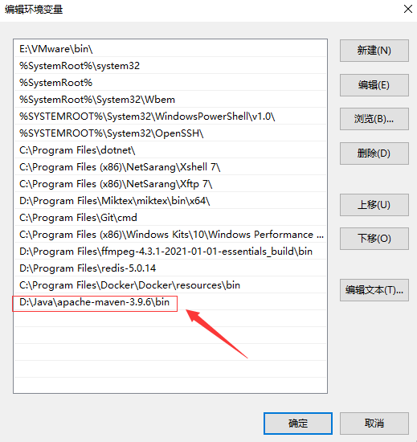

## 一、Maven下载和安装

### 1.1 下载 Maven

打开 Maven 的官方网站[Maven – Download Apache Maven](https://maven.apache.org/download.cgi#files)，下载最新版本的 Maven


在可选择的版本中，不同版本的区别在于:

- **binary**是已经编译过的、可直接运行的程序文件。这种版本包含已经编译和构建好的二进制文件，通常包括可执行文件、库文件和其他运行所需的二进制文件。

- **source**是还没编译过的源代码，需要自行编译。这种存档包含软件的源代码，通常包括所有的源代码文件、构建脚本和配置文件。源代码包可以用于查看、调试和理解项目的实现细节。

如果你只是想使用软件而不涉及修改或开发，建议直接选择 `Binary zip archive` 格式的 Maven软件


### 1.2 配置环境变量

配置环境变量是为了在命令行中方便地运行特定工具或应用程序，而不需要每次都提供完整的路径。

在Windows系统里，配置环境变量的步骤为：

1. 解压 maven 压缩包到自定义目录里面。比如，我的安装目录为 `D:\Java\apache-maven-3.9.6`

2. 在 "系统变量" 部分，找到 `Path` 变量，点击编辑。在编辑窗口中，点击 "新建"，然后添加 Maven 的 `bin` 目录路径，例如 `C:\Program Files\Apache\maven\bin`。



配置完成后，打开 cmd并运行 `mvn -v` ， 验证环境变量是否配置正确

```
C:\Users\zouhu>mvn -v
Apache Maven 3.9.6 (bc0240f3c744dd6b6ec2920b3cd08dcc295161ae)
Maven home: D:\Java\apache-maven-3.9.6
Java version: 17.0.8, vendor: Oracle Corporation, runtime: D:\Java\jdk-17.0.8
Default locale: zh_CN, platform encoding: GBK
OS name: "windows 10", version: "10.0", arch: "amd64", family: "windows"
```


## 参考资料

[Maven – Download Apache Maven](https://maven.apache.org/download.cgi#files)

