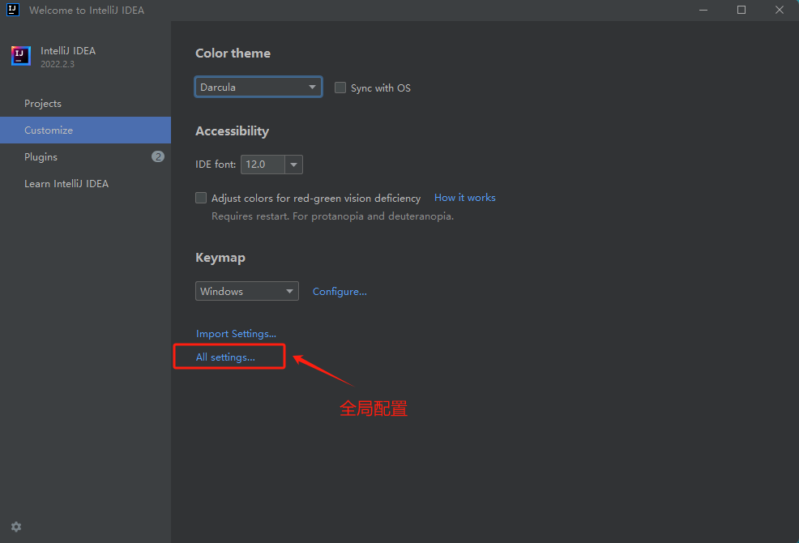
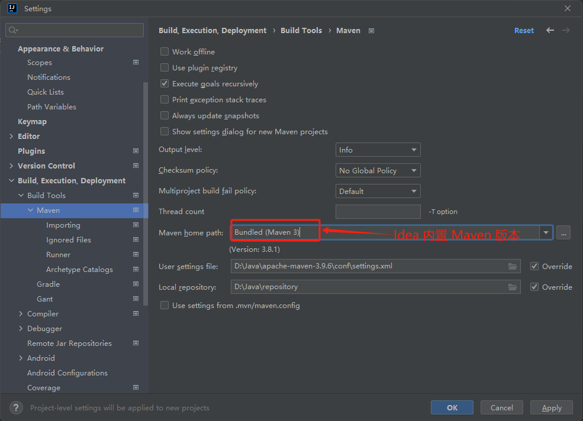

## Idea Maven 配置

### 全局设置

关闭项目，在以下页面中打开配置。

### Maven 配置页面

**Bundled (Maven 3)** 是指 IntelliJ IDEA 自带的 Maven 版本。在默认情况下，IDEA 会包含一个内置的 Maven 版本，这样你无需单独下载和安装 Maven。选择 "Bundled (Maven 3)" 表示 IDEA 将使用这个内置的 Maven 版本进行构建和项目管理。

### reload All Maven Projects 和 lifesyle 有什么区别

Reload All Maven Projects :   重新解析 `pom.xml` 文件，并更新项目的依赖和配置

Maven Lifecycle:  运行 Maven 构建生命周期的不同阶段。

## 第三方插件

### Maven Helper

[Maven Helper 插件](https://plugins.jetbrains.com/plugin/7179-maven-helper)提供功能有：

- **轻松分析和排除冲突的依赖**: 提供便捷的方式来识别和解决依赖冲突问题。
- **运行/调试 Maven 目标的操作**: 可以在包含当前文件的模块或根模块上运行或调试 Maven 目标。
- **在当前 Maven 模块路径打开终端的操作**: 快速打开终端并跳转到当前 Maven 模块所在的目录，方便进行进一步操作。
- **运行/调试当前测试文件的操作**: 提供一键操作来运行或调试当前测试文件，提升开发效率。

## 参考资料

[Maven | IntelliJ IDEA Documentation (jetbrains.com)](https://www.jetbrains.com/help/idea/2022.2/maven.html?reference.settings.dialog.project.maven)