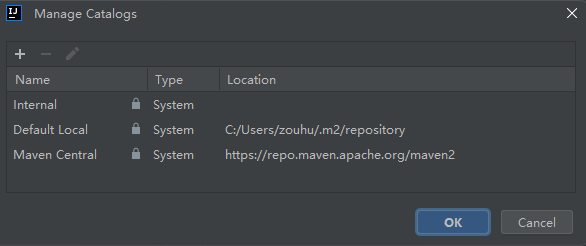
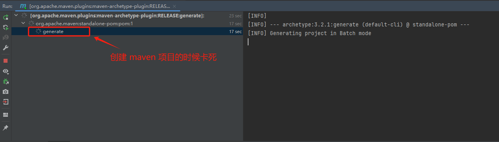
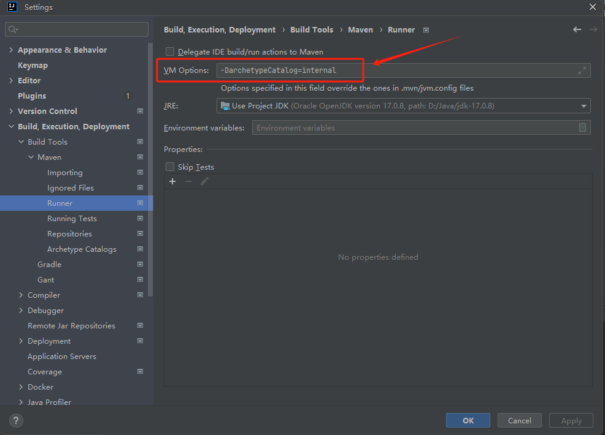

[TOC]

## 一、Archetype 和 Catalog

### 1.1 Archetype（原型）

**Archetype** 是用来创建项目的模板。它允许开发人员使用预定义的结构、配置和依赖项来生成新项目。使用 Archetype 有助于标准化项目并通过提供遵循特定设计的起点来实施最佳实践。

在 Maven 中，你可以使用 Archetype 创建一个新项目，如下所示：

```bash
mvn archetype:generate
```


### 1.2 Catalog（目录）

**Catalog** 在不同的上下文中指的是一个有组织的项目、实体或组件的集合。它通常用于结构化数据、项目或资源，以便于导航、发现和管理。

`archetype-catalog.xml` 就是存放 Archetype 数据的文件。Catalog 的默认路径有：

- Internal：maven-archetype-plugin 内置的原型
- local：mvn 会使用本地的原型数据来供你选择生成骨架原型
- remote：指向 maven 中央仓库的 Catalog 文件，具体路径为 https://repo.maven.apache.org/maven2/archetype-catalog.xml




### 1.3 自定义 Catalog

<font color="red">向 `C:\Users\zouhu\.m2\repository` 里面添加  `archetype-catalog.xml` 文件，并选择 Defalut Local 来创建项目</font>。

首先，我们从`https://repo1.maven.org/maven2/archetype-catalog.xml` 下载**archetype-catalog.xml**文件，然后将它放到 ~/.m2 目录下。以管理员身份打开 cmd，输入以下指令：

```bash
curl -o "C:\Users\zouhu\.m2\repository\archetype-catalog.xml" https://repo.maven.apache.org/maven2/archetype-catalog.xml
```

然后，我们可以指定 Catalog 为 Default Local，重新创建 maven 项目。


## 二、可能遇到的问题

### 2.1 问题描述

在使用 Internal 这种类型的 CataLog 的时候，maven-archetype-plugin 在 generate 项目模板的时候卡死。




### 2.2 原因分析

即使使用 Internal 创建项目，maven 插件依旧会自动获取 `archetype-catalog.xml` 文件。


### 2.3 解决方案

打开 `File->Settings->Build,Execution,Deployment-> Build Tools -> Maven ->Runner`， 在 VM Options 里面输入以下内容：

```bash
-DarchetypeCatalog=internal
```




## 参考资料

[Maven Archetype – About (apache.org)](https://maven.apache.org/archetype/index.html)

[Maven Archetype Plugin – Archetype Catalog (apache.org)](https://maven.apache.org/archetype/maven-archetype-plugin/specification/archetype-catalog.html)