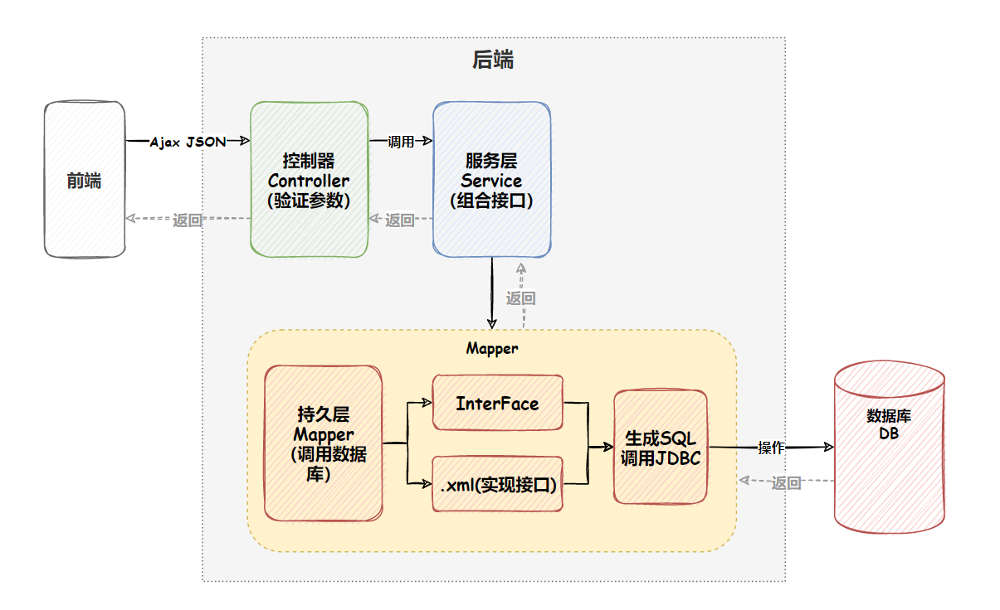
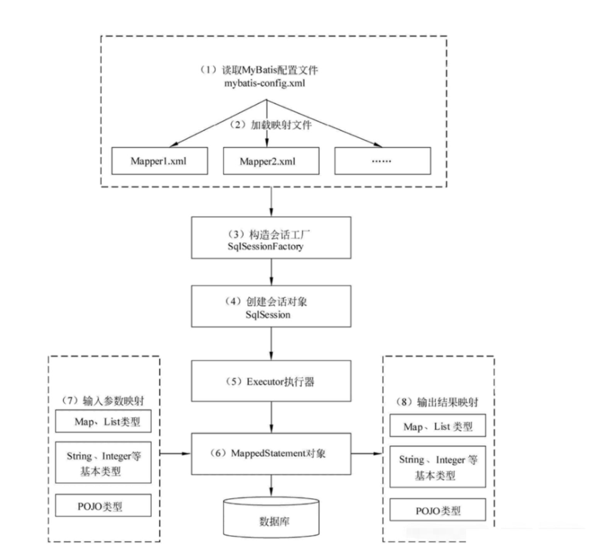

## MyBatis 框架概述

### 什么是 MyBatis

MyBatis 是一个半 ORM( Object-Relational Mapping)  框架，它支持自定义 SQL、存储过程以及高级映射。MyBatis 简化了与关系型数据库的交互，免除了几乎所有的 JDBC 代码以及设置参数和获取结果集的工作。

MyBatis 可以通过简单的 XML 或注解来配置和映射原始类型、接口和 Java POJO（Plain Old Java Objects，普通老式 Java 对象）为数据库中的记录。

### 什么是 ORM

ORM（Object Relational Mapping），对象关系映射，是一种为了解决关系型数据库数据与简单Java对象（POJO）的映射关系的技术。简单的说，ORM是通过使用描述对象和数据库之间映射的元数据，将程序中的对象自动持久化到关系型数据库中。

### 为什么 MyBatis 被称为“半 ORM”框架

**MyBatis**：MyBatis 提供了一定程度的对象关系映射功能，例如将查询结果映射为 Java 对象。但是，它没有完全的自动化映射功能，**开发者需要手动定义 SQL 和对象之间的关系**。特别是对于关联关系的处理（如一对一、一对多、多对多等），需要开发者自己编写复杂的 SQL 查询和映射配置。

**传统 ORM**：传统的 ORM 框架如 Hibernate 通常具备高度自动化的映射能力，支持复杂的对象关系（如实体类的继承、聚合、级联操作等），并通过注解或 XML 配置来定义这些关系。**框架会根据定义好的映射关系自动生成合适的 SQL**，并在数据库和对象之间自动转换数据。

### MyBatis 框架的优缺点

优点：

- 减少代码量

缺点：

- **SQL 语句编写工作量大**： 手动编写 SQL 增加了开发者的工作量，尤其是对于复杂的查询和数据操作场景，需要写大量的 SQL 和映射文件。
- **数据库移植性差**：因为 SQL 是手动编写的，并且不同的数据库在 SQL 语法和特性上存在差异（如分页语法、函数使用、锁机制等），所以 MyBatis 中编写的 SQL 语句往往会依赖于特定的数据库。

## MyBatis 框架

### MyBatis 框架交互流程图

MyBatis 可以通过简单的 XML 或注解来配置和映射原始类型、接口和 Java POJO（Plain Old Java Objects，普通老式 Java 对象）为数据库中的记录。

### Mybatis 框架的具体工作流程

## 预编译

DBMS：数据库管理系统(database management system)是一种操纵和管理数据库的大型软件，用于建立、使用和维护数zd据库，简称dbms。它对数据库进行统一的管理和控制，以保证数据库的安全性和完整性。用户通过dbms访问数据库中的数据，数据库管理员也通过dbms进行数据库的维护工作。它可使多个应用程序和用户用不同的方法在同时版或不同时刻去建立，修改和询问数据库。

SQL 预编译指的是数据库驱动在发送 SQL 语句和参数给 DBMS 之前对 SQL 语句进行编译，这样 DBMS 执行 SQL 时，就不需要重新编译。

### 参考资料

[mybatis – MyBatis 3 | 简介](https://mybatis.org/mybatis-3/zh_CN/index.html)

[Mybatis 框架的具体工作流程](https://blog.csdn.net/Wyxl990/article/details/136049772)

[【框架篇】MyBatis 介绍及使用（详细教程）_mybatis是干嘛用的怎么用-CSDN博客](https://blog.csdn.net/m0_64338546/article/details/132153390)