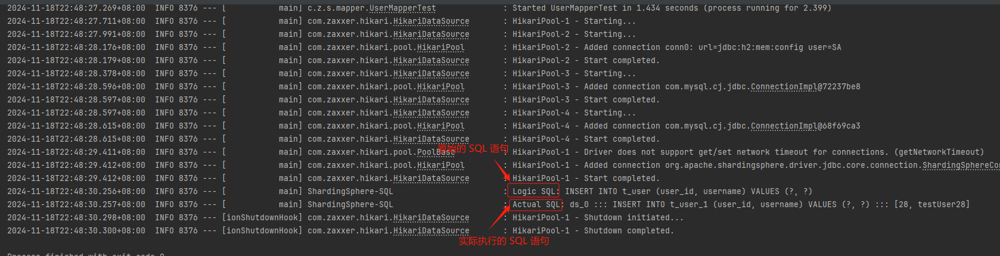

## 一、环境准备

### 1.1 启动 MySQL 数据库

```bash
$ docker run -d ^
    --name mysql-sharding ^
    -e MYSQL_ROOT_PASSWORD=root ^
    -p 3306:3306 ^
    mysql:5.7.36
```


### 1.2 创建数据

```sql
-- 创建数据库
CREATE DATABASE demo_ds0;
CREATE DATABASE demo_ds1;

-- 在 demo_ds0 数据库中创建表
USE demo_ds0;
CREATE TABLE t_user_0 (
    user_id INT NOT NULL,
    username VARCHAR(255) NOT NULL,
    PRIMARY KEY (user_id)
);
CREATE TABLE t_user_1 (
    user_id INT NOT NULL,
    username VARCHAR(255) NOT NULL,
    PRIMARY KEY (user_id)
);
-- 向 t_user_0 插入数据
INSERT INTO t_user_0 (user_id, username) VALUES (1, 'User_1');
INSERT INTO t_user_0 (user_id, username) VALUES (2, 'User_2');

-- 向 t_user_1 插入数据
INSERT INTO t_user_1 (user_id, username) VALUES (3, 'User_3');
INSERT INTO t_user_1 (user_id, username) VALUES (4, 'User_4');

-- 在 demo_ds1 数据库中创建表
USE demo_ds1;
CREATE TABLE t_user_0 (
    user_id INT NOT NULL,
    username VARCHAR(255) NOT NULL,
    PRIMARY KEY (user_id)
);
CREATE TABLE t_user_1 (
    user_id INT NOT NULL,
    username VARCHAR(255) NOT NULL,
    PRIMARY KEY (user_id)
);
-- 向 t_user_0 插入数据
INSERT INTO t_user_0 (user_id, username) VALUES (5, 'User_5');
INSERT INTO t_user_0 (user_id, username) VALUES (6, 'User_6');

-- 向 t_user_1 插入数据
INSERT INTO t_user_1 (user_id, username) VALUES (7, 'User_7');
INSERT INTO t_user_1 (user_id, username) VALUES (8, 'User_8');
```


## 二、项目实现

### 2.1 引入依赖

根据 [ShardingSphere-JDBC 教程](https://shardingsphere.apache.org/document/current/cn/quick-start/shardingsphere-jdbc-quick-start/) ，导入依赖。

```xml
<dependency>
    <groupId>org.apache.shardingsphere</groupId>
    <artifactId>shardingsphere-jdbc</artifactId>
    <version>5.3.2</version>
</dependency>
```

5.x.x 版本后，ShardingSphere-JDBC 的配置文件配置方式有了大的变化，**从之前和 Spring 耦合变更为完全解耦**，大家需要明确。


### 2.2 创建配置文件

以 `spring boot` 为例，编辑 `application.properties`

```yaml
server:
  port: 6060

spring:
  datasource:
    # 指定 ShardingSphere 自定义驱动类
    driver-class-name: org.apache.shardingsphere.driver.ShardingSphereDriver
    # 指定 ShardingSphere 自定义配置文件路径地址
    url: jdbc:shardingsphere:classpath:shardingsphere-config.yaml
```


### 2.3 定义 ShardingSphere 配置文件

根据[用户配置教程](https://shardingsphere.apache.org/document/current/cn/user-manual/shardingsphere-jdbc/yaml-config/rules/sharding/)，自定义分片配置文件 `shardingsphere-config.yaml`

```yaml
# ShardingSphere 数据源配置
dataSources:
  ds_0:
    dataSourceClassName: com.zaxxer.hikari.HikariDataSource
    driverClassName: com.mysql.cj.jdbc.Driver
    jdbcUrl: jdbc:mysql://127.0.0.1:3306/demo_ds0?useUnicode=true&characterEncoding=UTF-8&rewriteBatchedStatements=true&allowMultiQueries=true&serverTimezone=Asia/Shanghai
    username: root
    password: root

  ds_1:
    dataSourceClassName: com.zaxxer.hikari.HikariDataSource
    driverClassName: com.mysql.cj.jdbc.Driver
    jdbcUrl: jdbc:mysql://127.0.0.1:3306/demo_ds1?useUnicode=true&characterEncoding=UTF-8&rewriteBatchedStatements=true&allowMultiQueries=true&serverTimezone=Asia/Shanghai
    username: root
    password: root

# ShardingSphere 规则配置，包含：数据分片、数据加密、读写分离等
rules:
  - !SHARDING
    tables:
      t_user:   # 逻辑表名
        # 真实存在数据库的物理表集合
        actualDataNodes: ds_$->{0..1}.t_user_$->{0..1}
        # 分库策略，缺省表示使用默认分库策略
        databaseStrategy:
          standard:
            shardingColumn: username
            shardingAlgorithmName: user_database_hash_mod
        # 分表策略
        tableStrategy:
          standard:                                        # 用于单分片键的标准分片场景
            shardingColumn: username                       # 自定义分片字段
            shardingAlgorithmName: user_table_hash_mod     # 自定义分片算法名称

    # 数据分片算法定义
    shardingAlgorithms:
      user_database_hash_mod:
        type: CLASS_BASED
        props:
          sharding-count: 2
          table-sharding-count: 2
          strategy: standard
          algorithmClassName: com.zouhu.shardingspherejdbc.sharding.CustomDbHashModShardingAlgorithm
      user_table_hash_mod:
        type: HASH_MOD
        props:
          sharding-count: 2
      user_table_inline_algorithm:
        type: INLINE
        props:
          algorithm-expression: t_user_${(username.hashCode() & Integer.MAX_VALUE) % 2}

# 配置数据源的默认数据库连接池参数
props:
  # 是否打印 Logic SQL和 Actual SQL，开发测试环境建议开放，生产环境建议关闭
  sql-show: true
```


### 2.4 编写数据库 CRUD 代码

```java
/**
 * 用户信息
 */
@Data
@AllArgsConstructor
public class User implements Serializable {

    private static final long serialVersionUID = 1L;

    private int userId;

    private String username;
}

@Mapper
public interface UserMapper {
    @Insert("INSERT INTO t_user (user_id, username) VALUES (#{userId}, #{username})")
    void insertUser(User user);

    @Select("SELECT * FROM t_user WHERE user_id = #{userId}")
    User getUserByUserId(int userId);

    @Select("SELECT * FROM t_user")
    List<User> getAllUsers();
}
```


## 三、项目测试

### 3.1 编写测试代码

```java
@SpringBootTest
class UserMapperTest {

    @Autowired
    private UserMapper userMapper;

    @Test
    void insertUser() {
        // 插入数据
        int userID = 28;
        User user = new User(userID, "testUser28");
        userMapper.insertUser(user);
    }
}
```


### 3.2 运行效果

控制台相关输出日志如下：

```bash
2024-11-18T22:48:30.256+08:00  INFO 8376 --- [           main] ShardingSphere-SQL                       : Logic SQL: INSERT INTO t_user (user_id, username) VALUES (?, ?)
2024-11-18T22:48:30.257+08:00  INFO 8376 --- [           main] ShardingSphere-SQL                       : Actual SQL: ds_0 ::: INSERT INTO t_user_1 (user_id, username) VALUES (?, ?) ::: [28, testUser28]
```




## 参考资料

[核心概念 :: ShardingSphere](https://shardingsphere.apache.org/document/current/cn/features/sharding/concept/)

[SpringBoot整合ShardingSphere-JDBC 5.3.2 实现读写分离、分库分表。-CSDN博客](https://blog.csdn.net/weixin_43336075/article/details/136935720)

[看完这一篇，ShardingSphere-jdbc 实战再也不怕了 - 知乎](https://zhuanlan.zhihu.com/p/610182326)