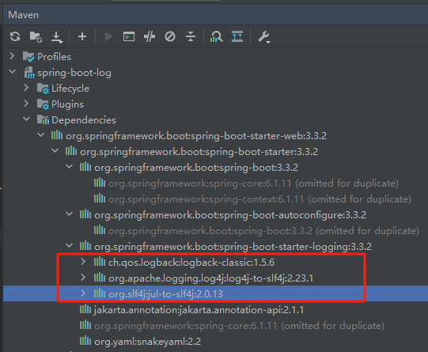

[TOC]

## 一、日志依赖

### 1.1 Spring 如何集成日志

从Spring Framework 5.0开始，Spring 在 spring-jcl 模块中实现了自己的 Commons Logging brige。其具体实现为：

- 检查类路径中是否存在Log4j 2. x API 和 SLF4J 1.7 API，并使用找到的第一个API作为日志实现。
- 如果Log4j 2.x和SLF4J都不可用，则回退到Java平台的核心日志工具（也称为JUL或java.util.log）。


### 1.2 SpringBoot 的默认日志门面和日志系统

Spring Boot 使用的日志门面是 **SLF4J** (Simple Logging Facade for Java)，而其默认的日志实现是 **Logback**。

在 `spring-boot-starter-web` 依赖里面，我们也可以看到日志框架的依赖。




## 二、日志配置

对于 logback 日志框架，日志配置文件主要有：

- **logback.xml** :   默认位置位于 classpath 下面
- **logback-spring.xml** :  可以使用 Spring boot 提供的扩展功能 ， 例如 `defaults.xml` 提供终端输出格式 `CONSOLE_LOG_PATTERN`


### 2.1 SpringBoot 日志配置方式

日志配置方式主要有：

- 如果日志配置需求比较简单，我们可以编辑 applacation.yaml 。例如：

  ```yaml
  # 日志配置
  logging:
    # 指定日志配置文件的位置，通常为logback.xml
    config: classpath:logback.xml
  
    # 配置日志级别
    level:
      # Spring Boot Web相关组件的日志级别设置为DEBUG
      org.springframework.web: "debug"
      # Hibernate相关组件的日志级别设置为ERROR
      org.hibernate: "error"
  ```

- 如果日志配置需求比较复杂，建议编写日志配置文件 logback-spring.xml

具体细节查看 [Logging :: Spring Boot](https://docs.spring.io/spring-boot/how-to/logging.html#howto.logging.logback)


### 2.2 SpringBoot 日志重定向到文件

在 `src/main/resources` 目录下，创建 logback-spring.xml 文件，内容如下：

```xml
<?xml version="1.0" encoding="UTF-8"?>
<configuration>
    <include resource="org/springframework/boot/logging/logback/defaults.xml" />
    <property name="LOG_FILE" value="./logs/spring.log"/>
    <include resource="org/springframework/boot/logging/logback/file-appender.xml" />
    <root level="INFO">
        <appender-ref ref="FILE" />
    </root>
</configuration>
```

其中，日志输出文件路径为 `./logs/spring.log`


## 参考资料

[Logging :: Spring Boot](https://docs.spring.io/spring-boot/how-to/logging.html#howto.logging.log4j.composite-configuration)

[Logging :: Spring Framework](https://docs.spring.io/spring-framework/reference/6.0/core/spring-jcl.html)

[SpringBoot系列(6)：SpringBoot集成slf4j日志配置_springboot @slf4j-CSDN博客](https://blog.csdn.net/qq_27706119/article/details/104977666)

[Spring Boot 输出日志到文件(简单配置或使用 logback.xml 文件)_springboot yml 只记录erro到文件里-CSDN博客](https://blog.csdn.net/qq_35077107/article/details/113700967)