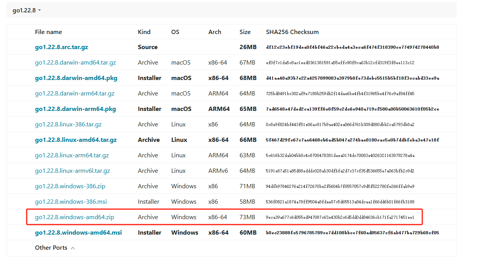
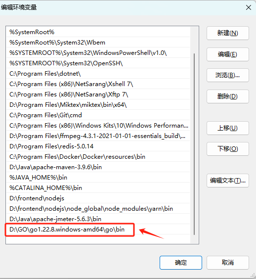

## 安装 Go 并配置环境变量

### 下载 Go 安装包

在[官网](https://golang.google.cn/dl/)下载合适的版本




###  配置环境变量

**（1）配置环境变量的原因**

为了在命令行中方便地运行特定工具或应用程序，而不需要每次都提供完整的路径。

**（2）配置环境变量**

配置环境变量的步骤为：

1. 解压 Go 压缩包到自定义目录里面。比如，我的安装目录为 `D:\GO\go1.22.8.windows-amd64\go`
2. 在 "系统变量" 部分，找到 `Path` 变量，点击编辑。在编辑窗口中，点击 "新建"，然后添加 go的 `bin` 目录路径，例如 `D:\GO\go1.22.8.windows-amd64\go\bin`。

如果以后想要更换 Go 的版本，只需要更改该环境变量的值即可。



**（3）验证配置是否成功**

配置完成后，打开命令提示符（Command Prompt）并运行以下命令：

```shell
# 查看 Go 版本
$ go version
go version go1.22.8 windows/amd64
```

如果环境变量正确配置，将显示 Java 和编译器的版本信息。


### 查看环境变量

可以使用 `go env` 查看环境变量。

```shell
# 查看 Go 环境变量
$ go env
set GO111MODULE=
set GOARCH=amd64
set GOBIN=
set GOCACHE=C:\Users\zouhu\AppData\Local\go-build
set GOENV=C:\Users\zouhu\AppData\Roaming\go\env
set GOEXE=.exe
set GOEXPERIMENT=
...
```


- `GOROOT`: Go 语言安装路径。另外，在编写程序时，package中的包为GOROOT（GO程序安装文件）的src目录里面的文件
- `GOPATH`: 若干工作区目录的路径。是我们自己定义的工作空间。在 Go Module 模式之前非常重要，现在基本上用来**存放使用 go get 命令获取的项目**
- `GOBIN`: Go 编译生成的程序的安装目录，比如通过 go install 命令，会把生成的 Go 程序放到该目录下，即可在终端使用


## 运行简单的 Go 项目

创建 `D:\GO\example\hello` 目录，使用  [`go mod init` command](https://golang.google.cn/ref/mod#go-mod-init) 创建 `go.mod` 文件，为您的代码启用依赖项跟踪

```shell
$ cd D:\GO\example\hello

$ go mod init example/hello
go: creating new go.mod: module example/hello
```

创建 `hello.go` 文件

```go
package main

import "fmt"

func main() {
    fmt.Println("Hello, World!")
}
```

使用 [`go run` ](https://golang.google.cn/cmd/go/#hdr-Compile_and_run_Go_program) 命令运行文件

```shell
$ go run .
Hello, World!
```


### 包的下载及安装

包通过go get会下载到自己设定的用户变量GOPATH的位置。我们可以查看高级系统变量来找到这个位置，一般都是`C:/User/用户名/go`


go文件夹下有两个子文件夹pkg和src。pkg是下载的包以.a的形式存储，src是这些包以正常文件形式存储

**如果我们想要修改s导入包中的内容时，要修改src中对应的文件。**


### 安装目录说明

[博客](https://blog.csdn.net/wohu1104/article/details/97966685)


### 参考资料

[Download and install - The Go Programming Language (google.cn)](https://golang.google.cn/doc/install)

