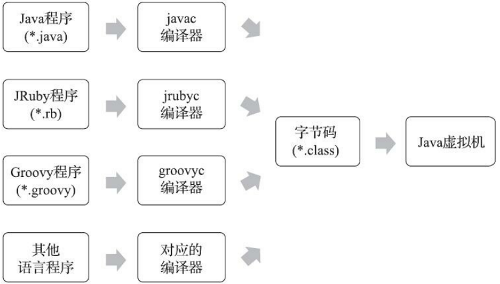
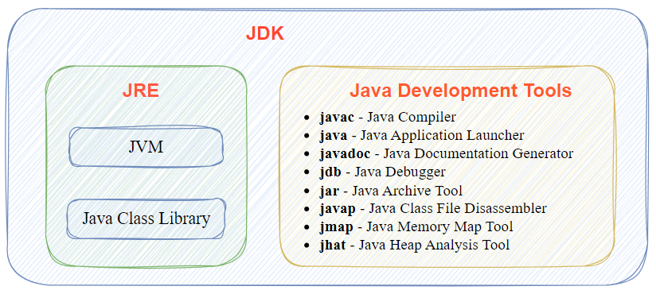

## 一、Java 基础概念

### 1.1 Java 语言的特点

- 平台无关性。
- 语言无关性
- 编译与解释共存

### 1.2 语言无关性

## 二、Java 软件组成

### 2.1 Java 平台

Java 平台由不同版本组成，分别支持各类应用程序和设备。主要包括以下几种版本：

- **Java SE (Standard Edition)**：基础版，提供通用的 Java 编程能力，用于开发桌面应用程序和基本服务。
- **Java EE (Enterprise Edition)**：企业版，基于 Java SE，专门用于企业级应用开发，支持分布式系统、Web 应用、企业级服务和 API。
- **Java ME (Micro Edition)**：微型版，适用于移动设备和嵌入式系统，提供精简的 Java 运行环境和专用 API，以便在资源受限的设备上开发高效应用。

### 2.2 Java 软件组件

Java 通常包含 JVM 、 JRE、JDK，其组成结构如下图所示。

#### 2.2.1  Java 虚拟机 (JVM)

**JVM（Java Virtual Machine）** 是 **Java程序运行的环境**，负责将 Java 字节码解释为平台相关的机器码，从而使 Java 程序能够跨平台运行，实现“一次编写，处处运行”的理念。

JVM 提供以下功能：

- **内存管理**：自动管理堆内存和栈内存。
- **垃圾回收 (GC)**：自动回收不再使用的对象，优化内存使用。
- **安全性**：提供沙盒机制，限制不安全代码的执行。

#### 2.2.2 Java 运行时环境 (JRE)

**JRE（Java Runtime Environment）** 是 Java 程序的运行环境，组成包括：

- **JVM**：用于执行 Java 字节码。

- **核心库**：提供 Java 应用程序所需的标准类库和 API。

#### 2.2.3 Java 开发工具包 (JDK)

**JDK（Java Development Kit）** 是 Java 的开发工具包，提供了 **开发、编译、调试、运行 Java 程序所需的全部工具和环境**。JDK 主要组成包括：

- **JRE**：提供运行环境。
- Java Development Tools：开发和调试 Java 程序的工具，例如编译器（javac）、调试器（jdb）、Java文档生成器（Javadoc）等开发工具。