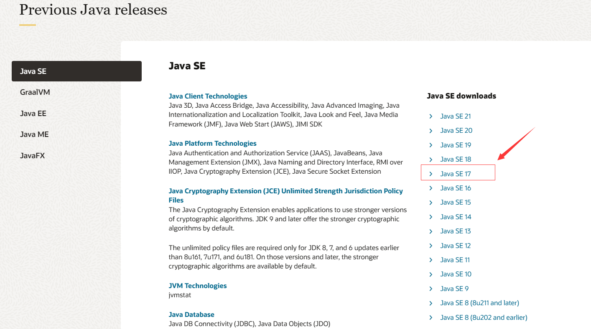
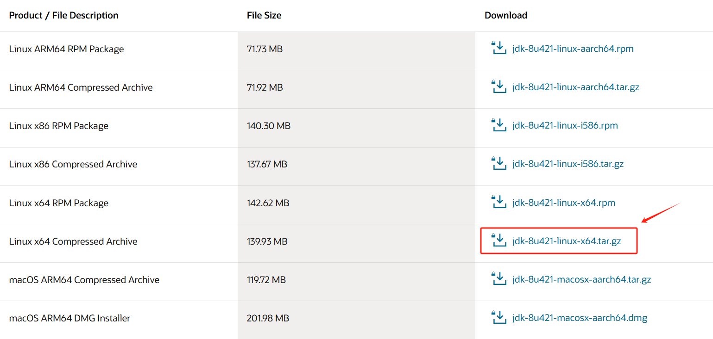

[TOC]

## 一、Windows 安装 JDK 及配置环境变量

### 1.1 JDK 版本说明

访问 Oracle 官方网站的 Java 下载页面[Java Archive | Oracle](https://www.oracle.com/java/technologies/downloads/archive/)。

在 "Java SE" 部分，选择要下载的java版本，例如 `Java SE 17`




 Java 平台的不同版本，用于支持不同类型的应用程序和设备。 Java 平台主要分为：

- **JavaSE**(J2SE)(Java2 Platform Standard Edition，java平台标准版)：Java SE 是 Java 平台的基础，提供了通用的 Java 编程能力

- **JavaEE**(J2EE)(Java 2 Platform,Enterprise Edition，java平台企业版)：Java EE 在 Java SE 的基础上提供了专门用于企业级应用开发的工具和服务。

- **JavaME**(J2ME)(Java 2 Platform Micro Edition，java平台微型版)：专门用于支持移动设备和嵌入式系统的开发。Java ME 提供了一个适用于资源受限设备的 Java 运行环境和相应的 API，以便于开发者在这些设备上创建小型、高效的 Java 应用程序。

  

### 1.2 下载 JDK

根据操作系统， 选择合适的 JDK（Java Development Kit）版本。因为它包含了 Java 运行时环境（JRE）以及用于开发 Java 应用程序的工具。


对于Windows系统，不同版本的JDK区别为：

- **Windows x64 Compressed Archive**： zip格式的压缩文件，适用于用户希望手动管理安装过程的情况，或者希望将软件安装到自定义目录。
- **Windows x64 Installer**： 安装程序通常会自动处理软件的安装和配置，无需用户手动解压缩或执行其他操作。适用于希望简化安装过程的用户，提供了用户友好的图形界面。
- **Windows x64 MSI Installer**： MSI（Microsoft Installer）是一种微软提供的安装包格式。适用于需要提供标准化的 Windows 安装体验，并希望与 Windows 系统的其他安装和管理工具集成的软件。


### 1.3 配置环境变量

**（1）配置环境变量的原因**

：**为了在命令行中方便地运行特定工具或应用程序，而不需要每次都提供完整的路径。**当安装 JDK 后，`javac.exe`（用于代码编译）和 `java.exe`（用于代码执行）这两个重要的执行文件位于 JDK 的 `bin` 目录下。然而，系统默认会在当前程序所在的文件夹目录下查找这两个执行文件，而不会自动到其他地方搜索。为了让系统能够在任何目录下找到 `javac.exe` 和 `java.exe`，我们需要配置系统的 `Path` 环境变量。通过将 JDK 的 `bin` 目录路径添加到 `Path` 变量中，系统就能够在任何位置找到这两个关键的执行文件，使得每次运行 Java 程序时不必手动指定完整路径。

**（2）配置环境变量**

配置环境变量的步骤为：

1. 解压 JDK 压缩包到自定义目录里面。比如，我的安装目录为 `D:\Java\jdk-17.0.8`
2. 在 "系统变量" 部分， 新建变量 `JAVA_HOME`  ， 变量值为 JDK 的安装路径（例如 `D:\Java\jdk-17.0.8`）。
3. 在 "系统变量" 部分，找到 `Path` 变量，点击编辑。在编辑窗口中，点击 "新建"，然后添加 JDK 的 `bin` 目录路径，例如 `%JAVA_HOME%\bin`。

如果以后想要更换 JDK 的版本，只需要更改变量 `JAVA_HOME`  的值即可

值得注意的是，在一些博客中，还会新建`CLASSPATH` 系统变量。`CLASSPATH` 主要与类的加载和运行有关，它告诉 JVM 在哪里找到类文件。在实际开发中，如果你使用现代的构建工具（如 Maven、Gradle），它们通常会自动处理依赖关系和类路径，而**不需要手动设置 `CLASSPATH`**。


### 1.4 验证配置是否成功

配置完成后，打开命令提示符（Command Prompt）并运行以下命令：

```
java -version
javac -version
```

如果环境变量正确配置，将显示 Java 和编译器的版本信息。


## 二、Linux 安装 JDK 及配置环境变量

本文仅展示手动下载并安装 Oracle JDK 的步骤，使用包管理器自动安装的教程查看 [Installation of the JDK on Linux Platforms (oracle.com)](https://docs.oracle.com/en/java/javase/17/install/installation-jdk-linux-platforms.html#GUID-4907E1A6-7B4B-4E98-9DA5-BF2A4D01AA57)。


### 2.1 下载 JDK

前往 [Oracle 下载页面](https://www.oracle.com/java/technologies/javase/javase8u211-later-archive-downloads.html#license-lightbox)，选择所需要的 JDK 版本。



将下载的 `.tar.gz` 文件解压到 `/usr/local/jdk` 目录下。

```shell
# 创建目录
$ sudo mkdir -p /usr/local/jdk

# 解压文件
$ sudo tar -xvzf jdk-8u421-linux-x64.tar.gz -C /usr/local/jdk

# 查看解压后的文件结构，确认解压是否成功
$ ls /usr/local/jdk
jdk1.8.0_421
```


### 2.2 配置

编辑环境变量文件 `/etc/profile`：

```shell
$ sudo vim /etc/profile
```

**按`i`键进行编辑模式，添加完成后按esc键输入 `:wq` 保存退出**。在文件末尾添加以下内容：

```
export JAVA_HOME=/usr/local/jdk/jdk1.8.0_421
export PATH=$JAVA_HOME/bin:$PATH
```

保存文件后，运行以下命令使更改生效：

```shell
$ source /etc/profile
```


### 2.3  验证配置是否成功

配置完成后，打开 cmd 并运行以下命令：

```shell
$ java -version
$ javac -version
```

如果环境变量正确配置，将显示 Java 和编译器的版本信息。


## 参考资料

[Overview of JDK Installation (oracle.com)](https://docs.oracle.com/en/java/javase/17/install/overview-jdk-installation.html#GUID-8677A77F-231A-40F7-98B9-1FD0B48C346A)

[Java详细安装配置教程(Windows)，从下载到配置——Java-1.8(jdk)安装_jre1.8.0-CSDN博客](https://blog.csdn.net/weixin_45710060/article/details/123315280)

