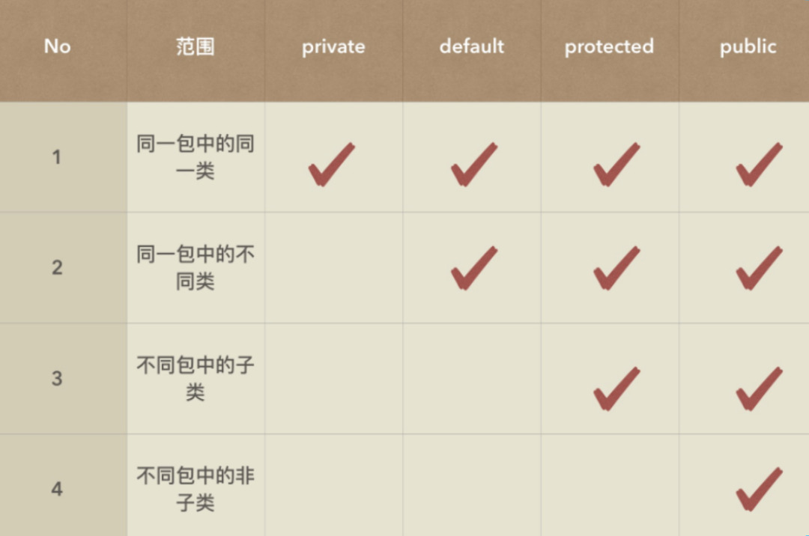

### 访问修饰符




当变量和方法前面没有修饰符，默认为包私有，即 default。


### 特殊案例

`private` 修饰符的访问限制仅在于 "类外不可访问"。类内部，`main` 方法是类的一部分，依旧可以直接访问类的私有成员。

```java
public class Main {
    // 非静态私有变量
    private String message = "Hello, Instance!";

    // 非静态私有方法
    private void printMessage() {
        System.out.println(message);
    }

    public static void main(String[] args) {
        // 创建类的实例
        Main test = new Main();

        // 访问非静态私有变量
        System.out.println("Accessing private variable: " + test.message);  // 输出：Accessing private variable: Hello, Instance!

        // 调用非静态私有方法
        test.printMessage();    // 输出：Hello, Instance!

    }
}
```

