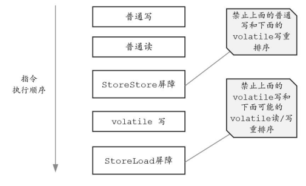

### 如何保证变量的可见性

如果我们将变量声明为 **`volatile`** ，这就指示 JVM，这个变量是共享且不稳定的，**每次使用它都到主存中进行读取**。

### 如何禁止指令重排序

**`volatile` 关键字** 可以防止 JVM 的指令重排序。

 如果我们将变量声明为 **`volatile`** ，在对这个变量进行读写操作的时候，会通过插入特定的 **内存屏障** 的方式来禁止指令重排序。

volatile（修饰的）变量的**写操作必须先行发生于对volatile变量的读操作**。

volatile写操作的内存屏障插入策略为：在每个volatile写操作前插入StoreStore（SS）屏障，在 写操作后面插入 StoreLoad 屏障

### 参考资料

[Java并发常见面试题总结（中） | JavaGuide](https://javaguide.cn/java/concurrent/java-concurrent-questions-02.html#如何保证变量的可见性)