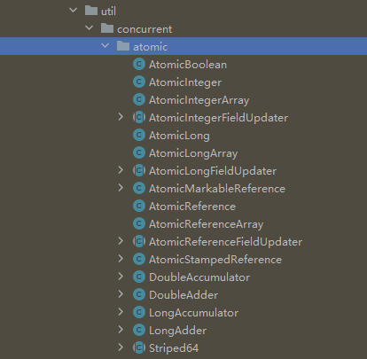

## 一、原子类概述

### 1.1 什么是 Atomic 原子类

Java中的原子类（Atomic Classes）是位于 `java.util.concurrent.atomic` 包中的一组类，这些类通过<font color="red">**提供原子操作来支持无锁并发编程**</font>。

原子类主要用于在多线程环境中进行线程安全的数值操作和引用更新，而不需要使用同步块或其他显式的锁机制。在多线程环境下，如果涉及基本数据类型的并发操作，不建议采用synchronized重量级锁进行 线程同步，而是建议优先使用基础原子类保障并发操作的线程安全性。

但是，在一些复杂的场景下，仍可能需要结合其他同步机制来保证线程安全。例如，多个原子操作的组合操作依然需要使用同步块来保证操作的原子性。

原子操作具备以下优势：

- **无锁并发**：原子类通过底层的CPU指令（如CAS操作）实现原子性，从而避免了传统锁机制带来的性能开销和线程阻塞。
- **线程安全**：原子类中的操作是原子的，即不可分割的操作，保证了多线程环境下的操作一致性和线程安全。


### 1.2 Atomic 原子类的适用场景

Atomic 原子类的常用场景有：

- **计数器**：如并发访问的计数统计。

- **唯一序列生成**：生成唯一ID或序列号。

- **状态管理**：如标记某个操作是否完成。

- **引用更新**：多线程环境下安全地更新对象引用。


### 1.3 简单案例

下面是一个简单的 AtomicInteger 使用示例，用于展示如何在多线程环境中安全地递增一个计数器：

```java
public class AtomicIntegerExample {
    private static final AtomicInteger counter = new AtomicInteger(0);

    public static void main(String[] args) throws InterruptedException {
        ExecutorService executor = Executors.newFixedThreadPool(10);
        for (int i = 0; i < 1000; i++) {
            executor.submit(() -> {
                int newValue = counter.incrementAndGet();
                System.out.println("New value: " + newValue);
            });
        }
        executor.shutdown();
        while (!executor.isTerminated()) ;
        System.out.println("Final value: " + counter.get());
    }
}
```

在这个例子中，我们创建了一个线程池，并提交了1000个任务，每个任务都会调用 `incrementAndGet()` 方法来递增计数器的值，并打印出新的值。由于 `AtomicInteger` 的线程安全性，我们可以确信最终的计数值将是准确的。其输出结果为：

```
...
New value: 985
New value: 984
New value: 982
New value: 979
New value: 978
New value: 977
New value: 968
New value: 997
New value: 995
Final value: 1000

Process finished with exit code 0
```


## 二、常见的原子类

在 `java.util.concurrent.atomic` ， 原子类主要有：




### 2.1 原子类的所有种类

基础的原子类型只能保证一个变量的原子操作，当需要对多个变量进行操作时，CAS 无法保证原子性操作，这时可以用 `AtomicReference`（原子引用类型）保证对象引用的原子性。简单来说，**如果需要同时保障对多个变量操作的原子性，就可以把多个变量放在一个对象中进行操作**。

| 类名                                | 描述                                                         |
| ----------------------------------- | ------------------------------------------------------------ |
| **基本数据类型原子类**              |                                                              |
| `AtomicInteger`                     | 对`int`类型进行原子操作                                      |
| `AtomicLong`                        | 对`long`类型进行原子操作                                     |
| `AtomicBoolean`                     | 对`boolean`类型进行原子操作                                  |
| **引用类型原子类**                  |                                                              |
| `AtomicReference<V>`                | 对引用类型进行原子操作                                       |
| `AtomicStampedReference<V>`         | 对引用类型进行原子操作，携带整数标记（stamp），解决 ABA 问题 |
| `AtomicMarkableReference<V>`        | 对引用类型进行原子操作，携带布尔标记（mark），解决 ABA 问题  |
| **数组类型原子类**                  |                                                              |
| `AtomicIntegerArray`                | 对`int`数组中的元素进行原子操作                              |
| `AtomicLongArray`                   | 对`long`数组中的元素进行原子操作                             |
| `AtomicReferenceArray<E>`           | 对引用类型数组中的元素进行原子操作                           |
| **对象属性更新原子类**              |                                                              |
| `AtomicIntegerFieldUpdater<U>`      | 对某个类中的`int`字段进行原子更新操作                        |
| `AtomicLongFieldUpdater<U>`         | 对某个类中的`long`字段进行原子更新操作                       |
| `AtomicReferenceFieldUpdater<U, W>` | 对某个类中的引用类型字段进行原子更新操作                     |

不同原子类的使用案例查看 [Atomic 原子类总结 | JavaGuide](https://javaguide.cn/java/concurrent/atomic-classes.html#引用类型原子类)


### 2.2 原子类的常用方法

以 AtomicInteger 为例， 以下是 `AtomicInteger` 的常用方法及其简要说明。

| 方法                                                         | 描述                                                   |
| ------------------------------------------------------------ | ------------------------------------------------------ |
| `int get()`                                                  | 获取当前的值。                                         |
| `void set(int newValue)`                                     | 设置为 `newValue`。                                    |
| `int getAndSet(int newValue)`                                | 获取当前的值，并设置为 `newValue`。                    |
| `boolean compareAndSet(int expect, int update)`              | 如果当前值为 `expect`，则设置为 `update`。             |
| `int getAndIncrement()`                                      | 获取当前的值，并递增。                                 |
| `int getAndDecrement()`                                      | 获取当前的值，并递减。                                 |
| `int getAndAdd(int delta)`                                   | 获取当前的值，并加上 `delta`。                         |
| `int incrementAndGet()`                                      | 递增，并获取递增后的值。                               |
| `int decrementAndGet()`                                      | 递减，并获取递减后的值。                               |
| `int addAndGet(int delta)`                                   | 加上 `delta`，并获取加后的值。                         |
| `int getAndUpdate(IntUnaryOperator updateFunction)`          | 获取当前的值，并应用更新函数 `updateFunction`。        |
| `int updateAndGet(IntUnaryOperator updateFunction)`          | 应用更新函数 `updateFunction`，并获取更新后的值。      |
| `int getAndAccumulate(int x, IntBinaryOperator accumulatorFunction)` | 获取当前的值，并应用累加函数 `accumulatorFunction`。   |
| `int accumulateAndGet(int x, IntBinaryOperator accumulatorFunction)` | 应用累加函数 `accumulatorFunction`，并获取累加后的值。 |


## 三、Atomic 原子类的实现原理

`Atomic` 类依赖于 CAS（Compare-And-Swap，比较并交换）乐观锁来保证其方法的原子性，而不需要使用传统的锁机制（如 `synchronized` 块或 `ReentrantLock`）。

具体细节查看 [Atomic 原子类总结 | JavaGuide](https://javaguide.cn/java/concurrent/atomic-classes.html)


## 参考资料

[Atomic 原子类总结 | JavaGuide](https://javaguide.cn/java/concurrent/atomic-classes.html#atomic-原子类介绍)

