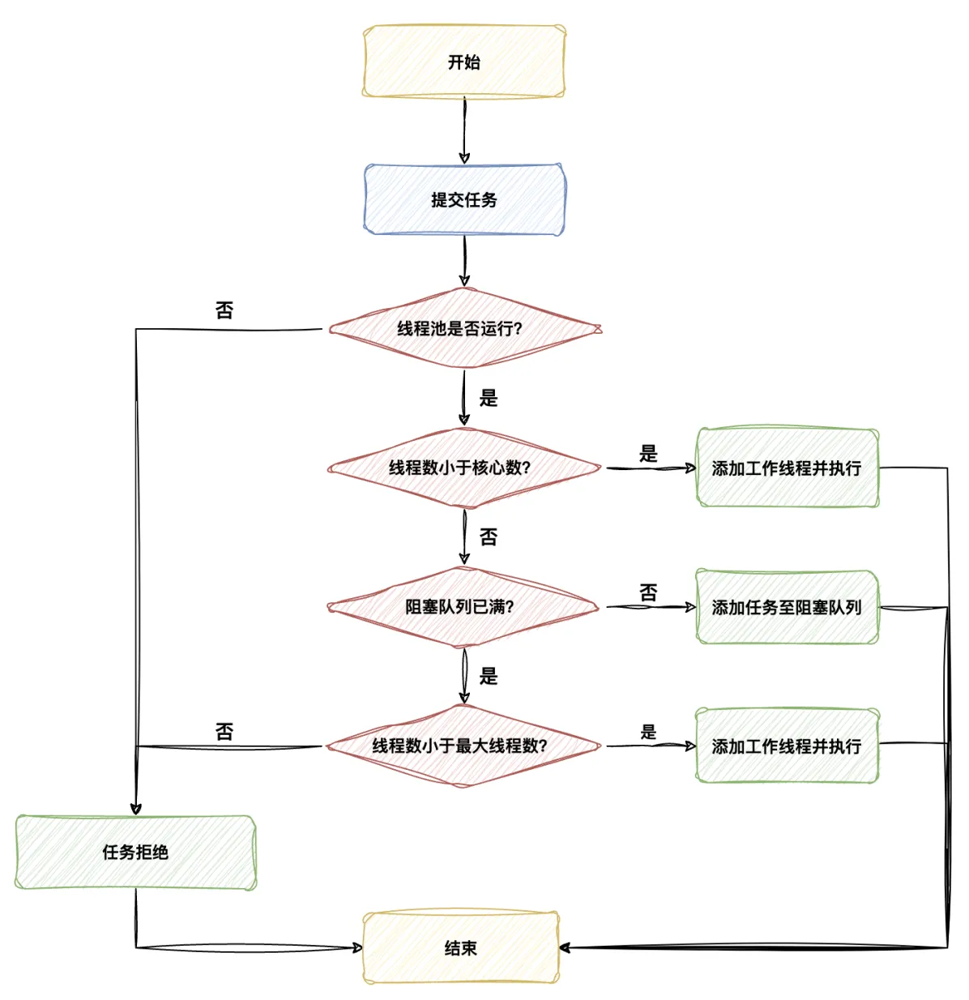

[TOC]


## 一、线程池参数

### 1.1 ThreadPoolExecutor 构造函数

 `ThreadPoolExecutor` 类的构造函数，用于创建一个具有指定参数的线程池。源代码为：

```java
public ThreadPoolExecutor(int corePoolSize,
                          int maximumPoolSize,
                          long keepAliveTime,
                          TimeUnit unit,
                          BlockingQueue<Runnable> workQueue,
                          ThreadFactory threadFactory,
                          RejectedExecutionHandler handler) {
    if (corePoolSize < 0 ||
        maximumPoolSize <= 0 ||
        maximumPoolSize < corePoolSize ||
        keepAliveTime < 0)
        throw new IllegalArgumentException();
    if (workQueue == null || threadFactory == null || handler == null)
        throw new NullPointerException();
    this.corePoolSize = corePoolSize;
    this.maximumPoolSize = maximumPoolSize;
    this.workQueue = workQueue;
    this.keepAliveTime = unit.toNanos(keepAliveTime);
    this.threadFactory = threadFactory;
    this.handler = handler;
}
```

参数具体解析为：

- **corePoolSize**：核心线程数，即线程池中始终保持活动的线程数量。
- **maximumPoolSize**：最大线程数，即线程池允许同时运行的最大线程数量。
- **keepAliveTime**：线程的闲置时间。当线程池中的线程数量超过核心线程数时，超过 `keepAliveTime` 未被使用的多余线程将被终止。
- **unit**：`keepAliveTime` 的时间单位。
- **workQueue**：任务队列，用于存储等待执行的任务。
- **threadFactory**：线程工厂，用于创建新线程。
- **handler**：拒绝执行处理器。当线程池和任务队列都已满时，用于处理新提交的任务。


### 1.2 最重要的3个参数

在 `ThreadPoolExecutor` 的构造函数中，以下几个参数尤为重要：

- **corePoolSize**：核心线程数。这是线程池中始终会保持的线程数量，即使这些线程处于空闲状态。选择合适的 `corePoolSize` 对于平衡资源利用率和响应时间至关重要。
- **maximumPoolSize**：最大线程数。它限制了线程池可以创建的线程的最大数量，有助于防止因过多的线程导致系统资源耗尽。
- **workQueue**：任务队列。当线程池中的线程正在执行任务时，新到达的任务会被放入此队列中等待执行。选择合适类型的 `BlockingQueue`（如 `ArrayBlockingQueue`、`LinkedBlockingQueue` 或 `SynchronousQueue`）对线程池的行为有重大影响。

<font color="red">**这三个参数直接决定了线程池的规模和行为模式**</font>，因此在配置线程池时需要特别关注。

其他参数，如 `keepAliveTime`、`threadFactory` 和 `RejectedExecutionHandler`，虽然也很重要，但它们更多地影响线程的生命周期管理和异常情况下的行为，而不是线程池的基本规模和性能特征。


### 1.3 不同参数之间的联系


### 1.4 线程池的任务调度流程

线程池的任务调度流程如下，涵盖了接收新任务和执行下一个任务的详细步骤：

1. **接收新任务时**：
   - 如果当前工作线程数量小于核心线程数 (`corePoolSize`)，线程池会优先创建一个新线程来执行任务，而不是从任务队列中获取空闲线程。
   - 如果当前工作线程数量已达到或超过**核心线程数**，新任务将被加入到阻塞队列中，直到阻塞队列满为止。在这种情况下，线程池不会创建新线程，而是等待空闲的核心线程来处理新任务。
2. **处理阻塞队列**：
   - 当任务完成后，线程池会优先从**阻塞队列**中获取下一个任务并立即开始执行，直到阻塞队列为空，即所有缓存的任务都已被取出并开始执行。
3. **处理新任务和阻塞队列满的情况**：
   - 如果核心线程数已满且阻塞队列也已满时，线程池会创建一个新线程（非核心线程）来执行新任务。此新线程会立即开始执行任务。
   - 如果线程池中的线程总数达到或超过**最大线程数** (`maximumPoolSize`)，线程池将拒绝接收新的任务。当新任务到来时，会执行预先定义的拒绝策略（如抛出异常、丢弃任务等）。




## 二、线程池操作流程

线程池的具体步骤主要包括：

1.  创建线程池
2. 提交任务到线程池
3. 显示关闭线程池

### 2.1 线程池创建方式

线程池创建方式主要有两种：

- **`Executors` 类**提供了一些工厂方法来创建不同类型的线程池。

  ```java
  ExecutorService fixedThreadPool = Executors.newFixedThreadPool(int nThreads);
  ```

- 使用 ThreadPoolExecutor 构造函数。

  ```java
  ThreadPoolExecutor threadPoolExecutor = new ThreadPoolExecutor(
      int corePoolSize,   // 核心线程数
      int maximumPoolSize, // 最大线程数
      long keepAliveTime,  // 空闲线程存活时间
      TimeUnit unit,       // 时间单位
      BlockingQueue<Runnable> workQueue,  // 任务队列
      ThreadFactory threadFactory,        // 线程工厂
      RejectedExecutionHandler handler    // 拒绝策略
  );
  ```


通常而言，**线程池必须手动通过 `ThreadPoolExecutor` 的构造函数来声明，避免使用`Executors` 类创建线程池**。


### 2.2 提交任务到线程池

`ExecutorService` 线程池**提交异步执行 target 目标任务的常用方法**主要为 **execute()** 和 **submit()** , 具体细节如下：

| 任务类型        | 方法                        | 说明                                             |
| --------------- | --------------------------- | ------------------------------------------------ |
| `Runnable` 任务 | `execute(Runnable command)` | 提交一个不返回结果的任务                         |
| `Callable` 任务 | `submit(Callable<T> task)`  | 提交一个有返回结果的任务，返回一个 `Future` 对象 |


### 2.3 关闭线程池

线程池提供了以下两个关闭线程池的方法：

| 方法            | 线程池状态变化              | 描述                                                 |      |
| --------------- | --------------------------- | ---------------------------------------------------- | ---- |
| `shutdown()`    | 线程池的状态变为 `SHUTDOWN` | 停止接受新任务，完成所有已提交的任务。               |      |
| `shutdownNow()` | 线程池的状态变为 `STOP`     | 尝试停止所有正在执行的任务并返回等待执行的任务列表。 |      |

这两个方法只是异步的通知线程池进行关闭处理。如果要同步等待线程池彻底关闭后才继续往下执行，需要调用  `awaitTermination`  方法进行同步等待。

```java
// ...
// 关闭线程池
executor.shutdown();
try {
    // 等待线程池关闭，最多等待5分钟
    if (!executor.awaitTermination(5, TimeUnit.MINUTES)) {
        // 如果等待超时，则打印日志
        System.err.println("线程池未能在5分钟内完全关闭");
    }
} catch (InterruptedException e) {
    // 异常处理
}
```


### 2.4 使用案例

```java
public class ThreadPoolThread {
    public static void main(String[] args) {
        /**
         *  1.直接使用构造函数创建线程池
         */
        ThreadPoolExecutor executor = new ThreadPoolExecutor(
                2, // 核心线程数
                4, // 最大线程数
                10, // 空闲线程存活时间
                TimeUnit.SECONDS, // 时间单位
                new ArrayBlockingQueue<>(3), // 任务队列
                Executors.defaultThreadFactory(), // 线程工厂
                new ThreadPoolExecutor.CallerRunsPolicy() // 拒绝策略
        );

        // 提交任务
        for (int i = 0; i < 10; i++) {
            final int taskId = i;
            executor.execute(() -> {
                System.out.println("Task ID: " + taskId + " is running on thread: " + Thread.currentThread().getName());
                try {
                    Thread.sleep(1000);
                } catch (InterruptedException e) {
                    Thread.currentThread().interrupt();
                }
            });
        }

        // 关闭线程池
        executor.shutdown();
   }
}
```


## 三、参数设置经验

线程数的配置与异步任务类型是分不开的，异步任务主要包括：

- **IO 密集型任务**： 主要是执行 IO 操作。由于执行 IO 操作的时间较长，导致 CPU 的利用率不高
- **CPU 密集型任务**： 主要是执行计算任务。由于响应时间很快，CPU 一直在运行，这种任务 CPU 的利用率很高。
- **混合型任务**：此类任务既要执行逻辑计算，又要进行 IO 操作（如 RPC 调用、数据库访问）。相对来说，由于执行 IO 操作的耗时较长（一次网络往返往往在数百毫秒级别），这类任务的 CPU 利用率也不是太高。Web 服务器的 HTTP 请求处理操作为此类任务的典型例子。

当 CPU 利用率高时，**并行的任务越多， 花在任务切换的时间就越多**，CPU执行任务的效率就越低。因此，针对不同类型的任务，线程池的 `corePoolSize`  设置情况如下：

- **IO 密集型任务**：  `corePoolSize` = CPU 核数 *  2
- **CPU 密集型任务**：  `corePoolSize` = CPU 核数  

- **混合型任务**： `corePoolSize` = CPU 核数  * （  （线程等待时间 + 线程 CPU 时间 ）/ 线程 CPU 时间 ）


## 参考资料

https://javaguide.cn/java/concurrent/java-thread-pool-best-practices.html