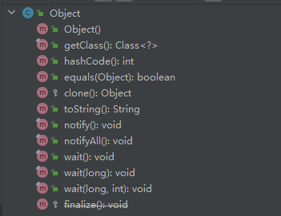

## 一、什么是 Object 类

`Object` 类是 Java 类层次结构的根类。所有类（包括数组）都是 `Object` 类的子类。


## 二、Object 类常见方法




### 2.1 toString() 方法

`toString()` 返回对象的字符串表示，默认实现返回对象的类名和哈希码（即 `ClassName@HashCode`）。

```java
public String toString() {
        return getClass().getName() + "@" + Integer.toHexString(hashCode());
}
```


### 2.2 equals(Object obj) 和 hashCode() 方法

equals(Object obj) 判断当前对象和另一个对象是否相等。**默认实现比较的是对象的内存地址（即引用是否相同，但通常会在子类中重写此方法来比较对象的内容**。

```java
public boolean equals(Object obj) {
	return (this == obj);
}
```

`hashCode()`  返回对象的哈希码，通常与 `equals()` 方法一起使用，用于集合（如 `HashSet` 和 `HashMap`）中判断对象的唯一性。

在 **`HashSet`** 中，判断对象是否已存在时，先通过 `hashCode()` 来定位对象的位置，然后再通过 `equals()` 来确认是否为相同的对象。


### 2.3 getClass() 方法

`getClass()` 返回当前对象的 `Class` 对象。

```java
 @IntrinsicCandidate
 public final native Class<?> getClass();
```


### 2.4 clone() 方法

`clone()` 创建并返回当前对象的一个副本。

此方法是浅拷贝，默认情况下是受保护的（`protected`），需要重写才能公开使用。

```java
 @IntrinsicCandidate
 protected native Object clone() throws CloneNotSupportedException;
```


### 2.5 wait() 和 notify() 方法

`wait()` 和 `notify()` 方法是用于线程间通信的工具方法。

```java
@IntrinsicCandidate
public final native void notify();

public final void wait() throws InterruptedException {
        wait(0L);
}
```


### 2.6 finalize()  方法

 `finalize()` 在垃圾回收器准备回收对象时调用。它是一个钩子方法，允许对象在被销毁之前执行清理操作，但不推荐过度使用该方法，因为垃圾回收过程不可靠。

```
@Deprecated(since="9")
protected void finalize() throws Throwable { }
```