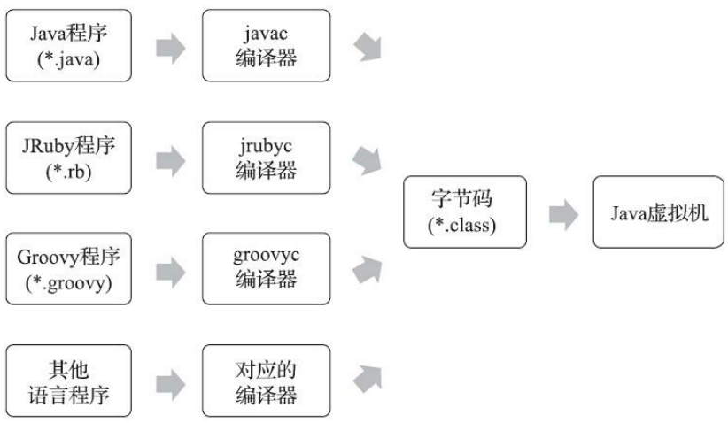

### 什么是 Class 类文件

Class 文件是 Java 源代码编译后生成的二进制字节码文件，包含了 Java 程序的字节码指令、符号表及其他相关信息。Java 源代码在编译时不是直接翻译成机器码，而是被编译成一种称为 Java 字节码的中间形式。这些字节码以二进制形式存储在 `.class` 文件中。

class 类文件具备以下特点：

-  **平台无关性**。它存储的不是操作系统可以直接识别的二进制本地机器码，而是**根据Java虚拟机规范所自定义的指令集、符号表和一些其他信息**。所以只要任何一个操作系统下开发有对应的Java虚拟机，开发者的Java程序就能跑起来。

- **结构稳定**：Class文件结构的稳定保证 Java 技术一直保持着良好的向后兼容性。

- **紧凑的二进制格式**：Class 文件是由以 8 个字节为基础单位的二进制流组成。所有数据按照严格的顺序排列，文件中没有任何分隔符或额外的填充字节，因此每个字节都为程序运行提供了必要的信息。当遇到需要占用8个字节以上空间的数据项时，则会按照高位在前的方式分割 成若干个8个字节进行存储。

### Class 文件的数据类型

### Class 文件的组成部分

Class 文件由多个数据项按照固定顺序排列而成，主要包括以下部分：

1. **魔数（Magic Number）**： Class 文件的前四个字节是魔数 `0xCAFEBABE`，用于标识该文件是一个 Java Class 文件。
2. **版本号**： 紧随魔数之后是 Class 文件的版本号，分别记录了主版本号和次版本号。
3. **常量池（Constant Pool）**： Class 文件包含一个常量池，它存储了编译时生成的各种常量信息，如类名、方法名、字符串、符号引用等。
4. **访问标志（Access Flags）**： 表示 Class 文件定义的类型是类还是接口，是否为 public 类，是否为 abstract 类等。
5. **类与父类信息**： 存储当前类的全限定名以及其父类的全限定名。
6. **接口表**： 列出当前类实现的所有接口的全限定名。
7. **字段表**： 包含类中定义的所有字段的描述信息（如字段名称、类型、访问修饰符等）。
8. **方法表**： 包含类中定义的所有方法的描述信息及其字节码实现。
9. **属性表**： 存储额外的元数据，如类的源码文件名称、方法的局部变量表、方法的字节码等。