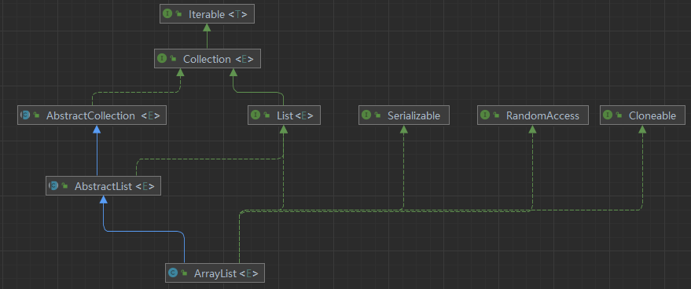

[TOC]

### ArrayList 类简介

 `ArrayList` 继承了 `AbstractList`，实现了 `List<E>`, `RandomAccess`, `Cloneable`, `java.io.Serializable` 接口。

```java
public class ArrayList<E> extends AbstractList<E>
        implements List<E>, RandomAccess, Cloneable, java.io.Serializable
{
	...
}
```




### 底层数据结构

`ArrayList` 的底层是数组队列，相当于动态数组，容量可以动态增长。`elementData[]` 数组存放着 ArrayList 的元素，具体源码如下：

```java
public class ArrayList<E> extends AbstractList<E>
        implements List<E>, RandomAccess, Cloneable, java.io.Serializable
{	
    
     /**
      * 默认初始化容量
      */
    private static final int DEFAULT_CAPACITY = 10;
    
    /**
      * 空的对象数组，用于创建默认大小的空ArrayList实例。
      */
    private static final Object[] DEFAULTCAPACITY_EMPTY_ELEMENTDATA = {};
    

	/**
     * ArrayList 的数组缓冲区，用于存储 ArrayList 的元素。
     * ArrayList 的容量就是这个数组缓冲区的长度。
     * 任何 elementData == DEFAULTCAPACITY_EMPTY_ELEMENTDATA 的空 ArrayList，
     * 在添加第一个元素时，都会扩展到 DEFAULT_CAPACITY。
     */
    transient Object[] elementData; // non-private to simplify nested class access

}
```


### ArrayList 扩容机制

当 `ArrayList` 中的元素数量超出其容量时，会触发自动扩容操作。具体流程主要有：

1. **初始容量**：当使用默认构造函数创建 `ArrayList` 时，初始容量为 10。也可以通过带参数的构造函数来指定初始容量。具体源码如下：

   ```java
   public class ArrayList<E> extends AbstractList<E>
           implements List<E>, RandomAccess, Cloneable, java.io.Serializable
   {	
       private static final int DEFAULT_CAPACITY = 10;
       
       private static final Object[] DEFAULTCAPACITY_EMPTY_ELEMENTDATA = {};
       
   
   	/**
        * ArrayList 的数组缓冲区，用于存储 ArrayList 的元素。
        * ArrayList 的容量就是这个数组缓冲区的长度。
        * 任何 elementData == DEFAULTCAPACITY_EMPTY_ELEMENTDATA 的空 ArrayList，
        * 在添加第一个元素时，都会扩展到 DEFAULT_CAPACITY。
        */
       transient Object[] elementData; // non-private to simplify nested class access
       
       /**
         *  默认构造函数
         */
       public ArrayList() {
           this.elementData = DEFAULTCAPACITY_EMPTY_ELEMENTDATA;
       }
       
       /**
         * 通过带参数的构造函数来指定初始容量
         */
       public ArrayList(int initialCapacity) {
           if (initialCapacity > 0) {
               this.elementData = new Object[initialCapacity];
           } else if (initialCapacity == 0) {
               this.elementData = EMPTY_ELEMENTDATA;
           } else {
               throw new IllegalArgumentException("Illegal Capacity: "+
                                                  initialCapacity);
           }
       }
   
   }
   ```

   

2. **添加元素时的检查**：每次往 `ArrayList` 中添加元素时，都会检查当前数组的容量是否足够容纳新的元素。如果足够，则直接添加；如果不够，则触发扩容操作。扩容检查的核心代码为：

   ```java
   /**
    * 添加新的元素
    */
   public boolean add(E e) {
       modCount++; // 修改计数器，记录 ArrayList 被修改的次数
       add(e, elementData, size); // 调用私有的 add 方法
       return true; // 添加成功后返回 true
   }
   
   /**
     * 添加元素并检查数组是否已满
     */
   private void add(E e, Object[] elementData, int s) {
       if (s == elementData.length) // 检查当前数组是否已满
           elementData = grow();    // 如果满了，则扩容
       elementData[s] = e;          // 将元素 e 添加到数组的下一个空位置（索引 s）
       size = s + 1;                // 更新 size，表示数组中有效元素的数量
   }
   
   ```

   

3. **扩容操作**：当需要扩容时，`ArrayList` 会将当前容量扩大为原来的 **1.5 倍**。扩容完成后，`ArrayList` 会创建一个新的、更大的数组，并将旧数组中的所有元素复制到新数组中。扩容的核心代码为：

   ```java
   /**
    * 动态增加数组容量以容纳更多元素
 */
   private Object[] grow(int minCapacity) {
       // 获取当前数组的容量（长度）
       int oldCapacity = elementData.length;
   
       // 如果当前容量大于 0 或者 elementData 不是一个空的默认数组
       if (oldCapacity > 0 || elementData != DEFAULTCAPACITY_EMPTY_ELEMENTDATA) {
           
           // 计算新的容量 newCapacity，扩大为原来的 1.5 倍
           int newCapacity = ArraysSupport.newLength(
               oldCapacity,              // 旧容量
               minCapacity - oldCapacity, // 最小增长量
               oldCapacity >> 1           // 预期增长量（旧容量的一半）
           );
           
           // 将旧数组中的所有元素复制到新数组中
           return elementData = Arrays.copyOf(elementData, newCapacity);
       
       } else {
           
           // 如果当前数组容量为 0 且是空数组，那么初始化为 DEFAULT_CAPACITY 或者 minCapacity（取较大者）
           return elementData = new Object[Math.max(DEFAULT_CAPACITY, minCapacity)];
       }
   }
   
   ```
   
   


### ensureCapacity() 方法

`ensureCapacity()` 方法主要用于在批量添加元素之前提前调整 `ArrayList` 的容量。这样可以避免在多次添加元素时频繁触发扩容，从而提高性能。具体源码为：

```java
/**
 * 如果有必要，增加此 {@code ArrayList} 实例的容量，
 * 以确保它至少可以容纳由 `minCapacity` 参数指定的元素数量。
 *
 * @param minCapacity 所需的最小容量
 */
public void ensureCapacity(int minCapacity) {
    // 如果所需的最小容量大于当前数组的长度，并且
    // 当前数组不是默认的空数组，或要求的容量大于默认容量
    if (minCapacity > elementData.length
        && !(elementData == DEFAULTCAPACITY_EMPTY_ELEMENTDATA
             && minCapacity <= DEFAULT_CAPACITY)) {
        
        // 更新修改计数器
        modCount++;
        
        // 扩容数组，确保容量至少为 minCapacity
        grow(minCapacity);
    }
}

```


### 参考资料

[ArrayList 源码分析 | JavaGuide](https://javaguide.cn/java/collection/arraylist-source-code.html#一步一步分析-arraylist-扩容机制)